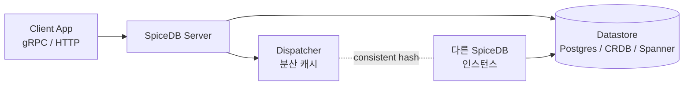
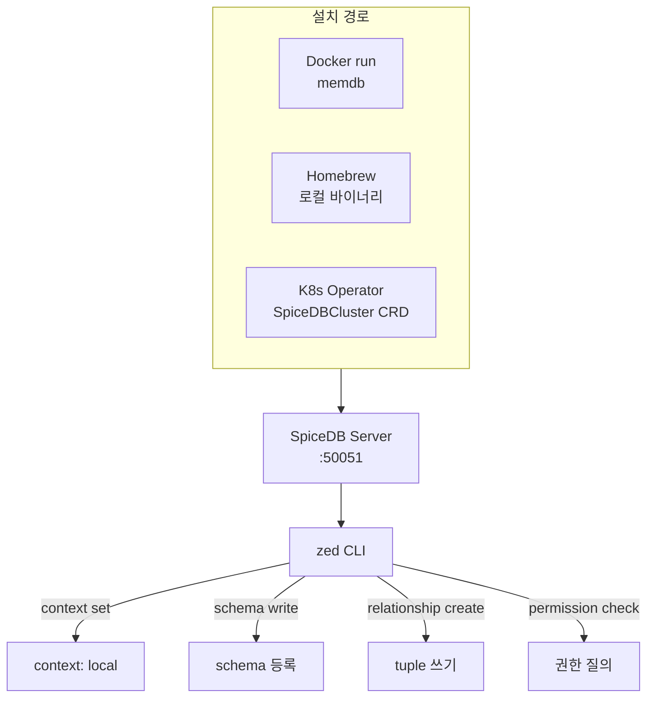

# CH1. SpiceDB 개요

## 학습 목표

- SpiceDB가 Zanzibar 논문을 어떻게 오픈소스로 구현했는지 이해한다.
- Zanzibar와 SpiceDB의 개념 매핑(namespace config ↔ Schema DSL, Zookie ↔ ZedToken)을 파악한다.
- Docker / Homebrew / Kubernetes 3가지 설치 경로를 알고, 로컬에 memdb로 띄울 수 있다.
- zed CLI로 context·schema·relationship·check를 직접 다룰 수 있다.
- Authzed 상용판(Serverless/Dedicated)과 OSS 구분을 세우고 선택 기준을 가진다.

## Zanzibar 개념 빠른 복습

이 스터디만 따로 읽을 독자를 위해 핵심만 짚는다. 제대로 파고들 생각이라면 [Zanzibar 스터디](/study/zanzibar/)를 먼저 보는 편이 낫다.

Zanzibar는 2019년 Google이 발표한 글로벌 권한 시스템이다. YouTube·Drive·Calendar 등 Google 제품 전반의 인가를 한 곳에서 처리한다. 핵심 개념은 셋이다.

**1. relation tuple — `object#relation@user`**

권한은 전부 이 3요소로 표현한다.

```
doc:readme#viewer@user:alice
doc:readme#parent@folder:root
group:eng#member@user:bob
```

왼쪽부터 "대상 객체, 그 객체에 대한 관계, 관계의 주체"다. 이 tuple들이 관계 그래프를 이룬다.

**2. namespace config의 userset rewrite**

단순 저장된 관계(`this`)만으로는 "편집자는 자동으로 뷰어다" 같은 규칙을 표현하지 못한다. namespace config에 집합 연산(union/intersection/exclusion)과 tuple-to-userset을 선언해 파생 권한을 계산한다.

```
"viewer": { union { this, editor, parent->viewer } }
```

**3. zookie(ZedToken)로 consistency 보장**

"방금 막 viewer 권한을 뺐다"는 변경이 권한 체크에 바로 반영돼야 할 때가 있다. Zanzibar는 쓰기 시점에 zookie라는 불투명 토큰을 돌려주고, 읽기 시점에 이 zookie를 같이 넣으면 "이 시점 이후 상태로 확인"을 보장한다. 뉴 에너블먼트 버그(newly-enabled permission leak)·스테일(stale) 응답 방지용이다.

SpiceDB는 이 세 가지를 거의 그대로 가져오되, 이름만 살짝 갈았다. namespace config는 **Schema DSL**이 되고, zookie는 **ZedToken**이 된다.

## SpiceDB란

**SpiceDB**는 Authzed가 Go로 구현한 Zanzibar 오픈소스다. Apache 2.0 라이선스로 공개돼 있고, "권한 데이터베이스(permission database)"라는 새로운 카테고리를 자칭한다.

Authzed는 SpiceDB 메인테이너 기업이자 상용판(Authzed Cloud)을 판매하는 스타트업이다. Zanzibar 공동 저자였던 엔지니어 일부가 창업에 참여했다. OSS → 상용 호스팅이라는 전형적인 오픈코어 모델이다.

"권한 DB"라는 표현이 중요하다. SpiceDB는 단순 라이브러리가 아니다. 별도 프로세스로 띄우는 서버이고, 전용 datastore에 관계 tuple을 저장하며, gRPC API로 권한을 질의한다. 애플리케이션에서 권한 로직을 뽑아내 별도 인프라로 격리하는 구조다.

## Zanzibar와의 차이

논문과 OSS 구현 사이에는 실무적으로 무시 못 할 간극이 있다.

| 항목 | Zanzibar (논문) | SpiceDB (OSS) |
|---|---|---|
| Datastore | Spanner 전제 | Postgres / CockroachDB / Spanner / MySQL / memdb |
| 배포 | Google 내부 전용 | OSS + Authzed Cloud 상용 |
| 권한 정의 | namespace config (protobuf) | Schema DSL (자체 문법) |
| Consistency 토큰 | Zookie | ZedToken |
| API | 내부 RPC | gRPC + HTTP gateway |

핵심만 짚으면 이렇다.

::: info 데이터스토어 선택권
Zanzibar는 Spanner라는 전역 일관성 DB를 전제한다. SpiceDB는 Postgres·CockroachDB·Spanner·MySQL·memdb를 고를 수 있게 추상화했다. 스타트업은 Postgres로 시작하고, 글로벌 규모로 가면 CRDB나 Spanner로 옮기는 경로가 일반적이다. memdb는 테스트·로컬 개발 전용이다.
:::

::: warning Schema DSL은 protobuf가 아니다
Zanzibar 논문의 namespace config는 protobuf 메시지로 표현된다. SpiceDB는 가독성을 이유로 자체 DSL(`.zed` 파일)을 설계했다. 문법은 CH2에서 본격적으로 다룬다.
:::

## 핵심 컴포넌트

SpiceDB 한 덩어리는 네 부분으로 나눌 수 있다.

- **SpiceDB server** — gRPC + HTTP gateway를 띄우는 메인 프로세스. 권한 질의·관계 쓰기·스키마 관리 API 전부 여기로 들어온다.
- **Datastore** — 관계 tuple과 스키마가 영속화되는 저장소. Postgres / CockroachDB / Spanner / MySQL / memdb 중 선택한다.
- **Dispatcher** — 권한 계산을 내부 RPC로 분할하고 결과를 캐시한다. 여러 SpiceDB 인스턴스로 확장하면 dispatcher끼리 consistent-hash로 작업을 분배해 중복 계산을 줄인다.
- **zed CLI** — 관리·개발 도구. context 관리, schema 쓰기·읽기, relationship CRUD, permission check·lookup, 백업·복원을 전부 이 하나로 처리한다.



<strong>Dispatcher</strong>는 SpiceDB를 수평 확장할 때 빛을 발한다. 권한 체크가 깊은 그래프 탐색을 유발해도, 중간 결과를 여러 인스턴스가 나눠 캐싱하므로 전체 부하가 균일하게 퍼진다.

## 설치 방법 3종

로컬에 띄우는 가장 빠른 길은 Docker + memdb 조합이다.

### Docker (가장 빠름)

```bash
docker run --rm -p 50051:50051 authzed/spicedb serve \
  --grpc-preshared-key "somerandomkeyhere" \
  --datastore-engine=memory
```

`--grpc-preshared-key`는 API 호출 시 인증에 쓰이는 정적 토큰이다. memdb이므로 프로세스 종료와 동시에 데이터가 날아간다. 테스트·튜토리얼 용도다.

### Homebrew (macOS 로컬 개발)

```bash
brew install authzed/tap/spicedb
brew install authzed/tap/zed
spicedb serve --grpc-preshared-key "somerandomkeyhere" --datastore-engine=memory
```

바이너리로 설치되므로 디버거 붙이기 편하다. zed CLI도 같이 설치된다.

### Kubernetes (프로덕션)

운영 환경은 공식 [authzed/spicedb-operator](https://github.com/authzed/spicedb-operator)를 쓴다. `SpiceDBCluster` CRD 한 장으로 Postgres·CRDB 커넥션, 이미지 버전, replica 수, dispatch 설정까지 선언적으로 관리한다.

```yaml
apiVersion: authzed.com/v1alpha1
kind: SpiceDBCluster
metadata:
  name: prod
spec:
  config:
    datastoreEngine: postgres
    replicas: 3
  secretName: prod-secrets
```

HA·업그레이드·마이그레이션은 CH11·CH14에서 따로 다룬다.

## zed CLI 기초

서버를 띄웠다면 zed로 연결한다.

**1. context 설정**

```bash
zed context set local localhost:50051 somerandomkeyhere --insecure
zed context use local
```

여러 환경(로컬/스테이징/프로덕션)을 context로 분리해 관리한다. `--insecure`는 TLS 없이 붙겠다는 뜻이다. 운영에선 쓰지 말 것.

**2. schema 쓰기·읽기**

```bash
# schema.zed 파일 작성 후
zed schema write schema.zed

# 현재 스키마 확인
zed schema read
```

**3. relationship 생성**

```bash
zed relationship create document:readme viewer user:alice
```

"document:readme에 대해 alice가 viewer 관계"라는 tuple이 하나 써진다.

**4. permission check**

```bash
zed permission check document:readme view user:alice
```

응답은 `PERMISSIONSHIP_HAS_PERMISSION` 또는 `PERMISSIONSHIP_NO_PERMISSION`이다. Caveat이 걸려 있으면 `PERMISSIONSHIP_CONDITIONAL_PERMISSION`이 돌아올 수도 있다(CH6).



## 상용 Authzed vs OSS

언제 상용판을 고려할 만한지 정리해 둔다.

::: details Authzed Cloud(상용)가 제공하는 것
- **Serverless 티어** — 인프라 운영 없이 바로 API endpoint 획득. 사이드 프로젝트·MVP에 적합.
- **Dedicated 티어** — 전용 클러스터. 데이터 격리, VPC peering, 커스텀 SLA.
- **관측성 대시보드** — 권한 체크 레이턴시, QPS, 캐시 히트율을 UI로 확인.
- **Playground 통합** — 스키마를 브라우저에서 테스트·공유.
- **SLO** — 99.95% uptime SLA 계약.
:::

OSS만으로도 운영은 충분히 가능하다. 다만 다음 중 둘 이상에 해당한다면 상용을 검토할 만하다.

- Postgres·CRDB HA를 직접 운영할 팀 여력이 없다.
- 권한 시스템 장애에 대한 금전적 SLA가 필요하다.
- 관측성·백업·업그레이드 자동화를 곧바로 원한다.

반대로 아래 경우라면 OSS가 맞다.

- 데이터 주권이나 온프레미스 요건이 있다.
- Postgres·K8s 운영 역량이 이미 있다.
- 커스텀 미들웨어·플러그인을 붙여야 한다.

## 핵심 정리

::: tip 핵심 정리
- **SpiceDB = Zanzibar의 Go 오픈소스 구현**. Authzed가 Apache 2.0으로 공개, Authzed Cloud 상용판도 존재.
- **Zanzibar 대비 핵심 차이**: Spanner 전제 → 멀티 datastore / protobuf config → Schema DSL / Zookie → ZedToken.
- **컴포넌트 4개**: server · datastore · dispatcher(분산 캐시) · zed CLI.
- **설치 경로 3개**: Docker(memdb 테스트) · Homebrew(로컬) · spicedb-operator(프로덕션 K8s).
- **zed CLI 워크플로**: `context set` → `schema write` → `relationship create` → `permission check`.
- **상용 vs OSS 기준**: HA 운영 여력, SLA 요구, 관측성 필요도 3축으로 판단.
:::

## 다음 챕터

CH2에서는 SpiceDB의 Schema DSL을 본격적으로 뜯는다. `definition`·`relation`·`permission` 3요소, arrow(`->`) 연산자, 집합 연산자, Caveat 문법까지 스키마 한 장을 완성한다.
