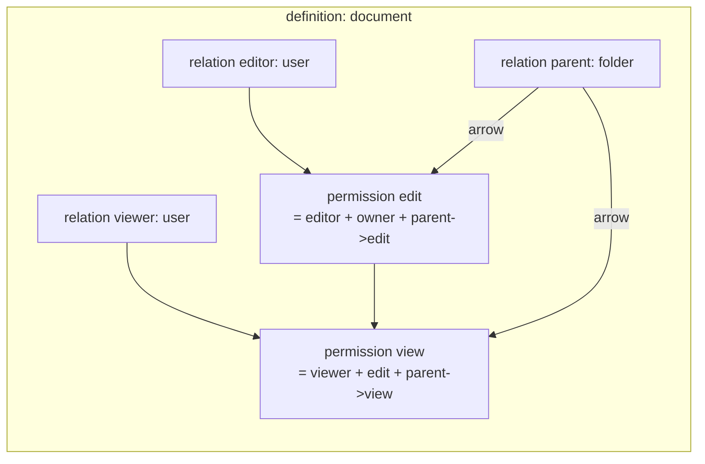

# CH2. Schema 언어

## 학습 목표

- Schema DSL이 Zanzibar namespace config의 어떤 역할을 대체하는지 이해한다.
- `definition` · `relation` · `permission` 3요소를 정확히 구분한다.
- arrow(`->`) 연산자로 부모-자식 상속을 표현할 수 있다.
- 집합 연산자(`+`, `&`, `-`)와 subject 타입 옵션(wildcard·subject relation)을 다룬다.
- Caveat 기본 문법을 파악해 ReBAC+ABAC 결합의 첫 감각을 잡는다.

## Schema의 역할

Schema는 Zanzibar의 **namespace config**에 정확히 대응한다. "어떤 object가 존재하고, 어떤 관계를 가질 수 있고, 그 관계로부터 어떤 권한이 파생되는지"를 선언하는 문서다.

::: info Schema = API 계약
Schema는 단순 설정 파일이 아니다. 클라이언트 애플리케이션은 Schema에 선언된 object type·relation·permission 이름에 의존해 API를 호출한다. 즉 Schema는 **권한 시스템의 공개 계약**이다. 한 번 배포되면 호환성을 지켜야 하고, 변경은 마이그레이션 절차를 타야 한다(CH10).
:::

SpiceDB는 Schema를 `.zed` 확장자의 DSL 파일로 작성한다. protobuf보다 선언형에 가깝고, 권한 규칙을 거의 자연어에 가깝게 읽을 수 있다.

## 3가지 구성요소

Schema 파일은 세 종류의 블록으로 이뤄진다.

- **`definition`** — object type 선언. 블록의 뿌리. `user`, `document`, `folder`, `organization`처럼 "무엇에 대한 권한인가"를 정의한다.
- **`relation`** — 직접 저장되는 관계. Zanzibar의 `this`에 해당한다. `relation editor: user`라면 "이 object에 대해 user가 editor라는 관계를 가질 수 있다"는 뜻.
- **`permission`** — 계산되는 권한. relation들과 집합 연산·arrow로 조합한 파생 결과다. 저장되지 않고 요청 시점마다 계산된다.

한 줄로 줄이면 이렇다.

> **relation은 저장(tuple), permission은 계산(userset rewrite).**

## 기본 예제

실제 사례에 가까운 doc/folder 구조를 예로 든다.

```
definition user {}

definition folder {
  relation owner: user
  relation editor: user | folder#editor
  relation viewer: user | folder#viewer

  permission view = viewer + editor + owner
}

definition document {
  relation parent: folder
  relation owner: user
  relation editor: user
  relation viewer: user

  permission edit = editor + owner + parent->edit
  permission view = viewer + edit + parent->view
}
```

블록별로 뜯어보자.

### `definition user {}`

내용이 비어 있는 user 정의. "user라는 object type이 존재한다"는 것만 선언한다. SpiceDB에서 user도 하나의 object type이라 이렇게 명시적으로 선언해야 한다.

### `definition folder`

```
relation owner: user
relation editor: user | folder#editor
relation viewer: user | folder#viewer
```

folder에 대해 owner·editor·viewer 관계를 선언했다. `editor: user | folder#editor`의 `|`는 "이 관계의 subject가 될 수 있는 타입들"을 나열한다. 즉 "folder의 editor는 user 한 명일 수도, 다른 folder의 editor 전체일 수도 있다". 조직도처럼 관계를 상속시킬 때 쓴다.

```
permission view = viewer + editor + owner
```

folder의 view 권한은 viewer·editor·owner 중 하나라도 해당하면 된다는 합집합.

### `definition document`

```
relation parent: folder
```

document가 folder 밑에 속한다는 상속 관계를 tuple로 저장할 수 있게 한다.

```
permission edit = editor + owner + parent->edit
permission view = viewer + edit + parent->view
```

여기가 핵심이다. `parent->edit`은 "이 document의 parent(folder)의 edit 권한을 가진 자"를 의미한다. 즉 folder의 편집자는 자동으로 그 안의 document 편집자가 된다.

`permission view = viewer + edit + parent->view`도 같은 패턴이다. document의 뷰어는 (직접 뷰어) + (document 편집자라면 자동으로) + (folder 뷰어).

## Arrow(`->`) 연산자

`->`는 Zanzibar의 **tuple-to-userset(TTU)** 그 자체다. 계층 상속을 표현하는 가장 강력한 도구다.

문법은 `relation_name -> permission_or_relation_name`. 왼쪽 relation이 가리키는 object로 이동한 뒤, 그 object의 permission/relation을 계산한다.

```
permission view = viewer + parent->view
```

이 줄 하나로 "자기 자신의 viewer이거나, 부모의 view 권한자면 OK"가 된다. 부모가 또 부모를 가지면 재귀적으로 타고 올라간다. folder 계층이 10단계 깊어도 Schema는 그대로다.

::: warning Arrow의 오른쪽은 permission/relation 이름만 올 수 있다
arrow 오른쪽에 집합 연산이나 또 다른 arrow는 못 온다. `parent->(view + edit)` 같은 식은 문법 오류. 필요하면 해당 정의 쪽에 별도 permission을 하나 더 만들어 이름을 붙여야 한다.
:::



위 그림은 `definition document` 한 블록 안에서 relation(저장)과 permission(계산)이 어떤 경로로 얽히는지 보여준다. relation은 입력, permission은 출력이다.

## 집합 연산자

permission 표현식은 세 가지 이항 연산자를 쓴다.

- **`+`** 합집합(union). "A 또는 B". 가장 흔하다.
- **`&`** 교집합(intersection). "A 그리고 B". "조직 멤버이면서 프로젝트 참여자여야"처럼 AND 조건.
- **`-`** 차집합(exclusion). "A이면서 B는 아닌". 차단 목록 모델링에 쓴다.

```
definition document {
  relation viewer: user
  relation banned: user
  relation org: organization

  permission view = (viewer + org->member) - banned
}
```

"viewer이거나 org의 member이지만, banned된 사람은 제외". 실무에서 `-`는 audit·moderation 용도로 자주 등장한다.

::: warning 연산 우선순위는 명시적 괄호로
`+`, `&`, `-`의 우선순위는 명시돼 있지만 기억에 의존하면 실수한다. 괄호로 명확히 묶어서 쓰자. `(a + b) - c`는 되지만 `a + b - c`는 읽는 사람을 헷갈리게 한다.
:::

## Relation의 subject 타입

relation 오른쪽에 `|`로 나열하는 subject 타입 옵션이 여러 개 있다.

**1. 단일 타입**
```
relation owner: user
```
user만 이 관계의 subject가 될 수 있다.

**2. 복수 타입**
```
relation member: user | serviceaccount
```
user 또는 serviceaccount. 머신 아이덴티티를 섞을 때 쓴다.

**3. Wildcard**
```
relation viewer: user | user:*
```
`user:*`는 "모든 user". tuple `document:public#viewer@user:*` 하나만 쓰면 모든 user가 viewer가 된다. 공개 문서(public share) 모델링의 정석.

**4. Subject relation**
```
relation editor: user | group#member
```
`group#member`는 "해당 group의 member들 집합"이다. `group:eng#member`를 editor로 연결하면 그 group의 전체 멤버가 한 번에 편집자가 된다. 팀 단위 권한 부여에 필수.

::: info wildcard는 "공개"의 의미
`user:*`를 만나면 "이 관계는 어떤 user에게도 열려 있다"는 뜻이다. 공개 링크·게스트 접근 같은 유스케이스에 쓴다. 다만 상용 환경에선 감사 추적이 어려워질 수 있어서, 명시적 `guest` relation으로 대체하는 설계도 흔하다.
:::

## Caveat 문법 소개

Caveat은 relation tuple에 **조건**을 붙여 "특정 조건이 만족될 때만 이 관계가 성립"을 표현한다. ReBAC에 ABAC를 결합하는 지점이다.

```
caveat ip_allowlist(user_ip ipaddress, allowed_range ipaddress) {
  user_ip.in_cidr(allowed_range)
}

definition document {
  relation viewer: user with ip_allowlist
}
```

핵심은 세 부분이다.

- **`caveat` 블록** — 이름과 매개변수 타입을 정의하고, CEL(Common Expression Language)로 평가식을 쓴다.
- **`relation ... with caveat_name`** — 해당 relation에 caveat을 달 수 있게 허용한다.
- **권한 체크 시 context 전달** — 클라이언트가 `CheckPermission` 호출 시 `{user_ip: "10.0.0.5"}`를 같이 넘긴다. SpiceDB는 caveat 식을 평가해 조건부 허용 여부를 결정한다.

응답이 `PERMISSIONSHIP_HAS_PERMISSION` / `PERMISSIONSHIP_NO_PERMISSION` 말고도 `PERMISSIONSHIP_CONDITIONAL_PERMISSION`이 나올 수 있다. "context를 더 줬으면 yes/no가 결정됐을 것"이라는 신호다.

::: tip Caveat의 실전 쓰임
시간 제한(만료 일시), IP 화이트리스트, 지역 제한, feature flag 기반 접근 같은 동적 조건을 ReBAC 그래프 위에 얹는다. 상세 문법·최적화·context hinting은 CH6에서 본격적으로 다룬다.
:::

## Schema 쓰기·버저닝

작성한 `.zed` 파일은 zed CLI로 반영한다.

```bash
zed schema write schema.zed
zed schema read
```

`zed schema write`는 전체 스키마를 원자적으로 교체한다. 부분 수정이 아니라 "이 파일이 새 스키마 전문"으로 덮어쓰는 방식이다. 실수로 definition 하나를 빠뜨리면 해당 object type 관련 tuple이 전부 무효화된다.

스키마 버저닝·마이그레이션 전략(relation 이름 변경, definition 삭제, 점진적 배포)은 [CH10. 스키마 마이그레이션](/study/spicedb/10-schema-migration)에서 별도로 다룬다. 프로덕션에서 Schema를 바꿀 땐 반드시 그 절차를 따라야 한다.

## 핵심 정리

::: tip 핵심 정리
- **Schema = Zanzibar namespace config의 DSL 버전**. 권한 시스템의 공개 API 계약.
- **3요소**: `definition`(object type) · `relation`(저장 tuple) · `permission`(계산 결과).
- **`->` arrow 연산자**: Zanzibar TTU 그대로. 부모-자식 상속의 핵심.
- **집합 연산자**: `+` union, `&` intersection, `-` exclusion. 괄호로 명시적으로 묶자.
- **Subject 타입**: 단일/복수/`user:*` wildcard/`group#member` subject relation.
- **Caveat**: `with caveat_name`으로 relation에 조건 부착. CEL로 동적 ABAC 결합(CH6).
- **스키마 쓰기**: `zed schema write`는 원자적 전체 교체. 부분 수정 아님 — 마이그레이션 전략은 CH10.
:::

## 다음 챕터

CH3에서는 지금까지 선언만 해본 relation tuple을 실제로 쓰고 읽는 법을 다룬다. `WriteRelationships` API, 배치·트랜잭션 처리, 그리고 권한 체크의 핵심 API 세트(`CheckPermission`, `ExpandPermissionTree`, `LookupResources`, `LookupSubjects`)를 실습과 함께 본다.
