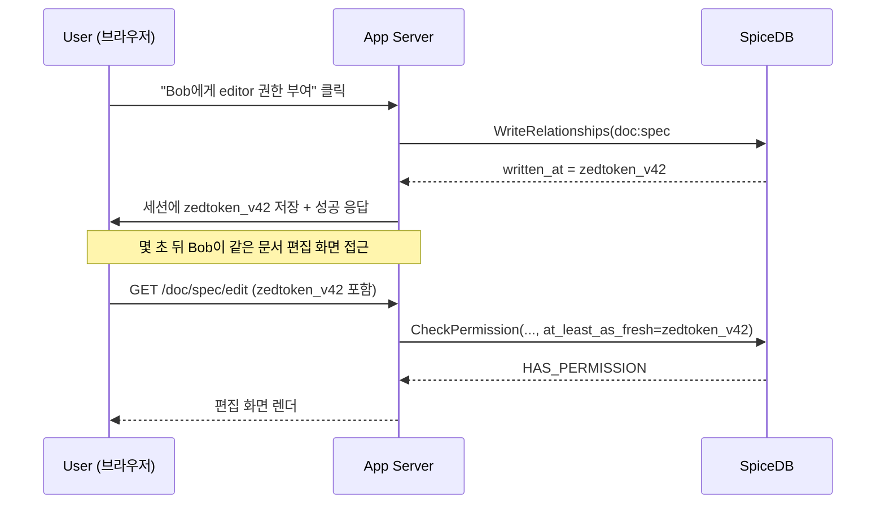
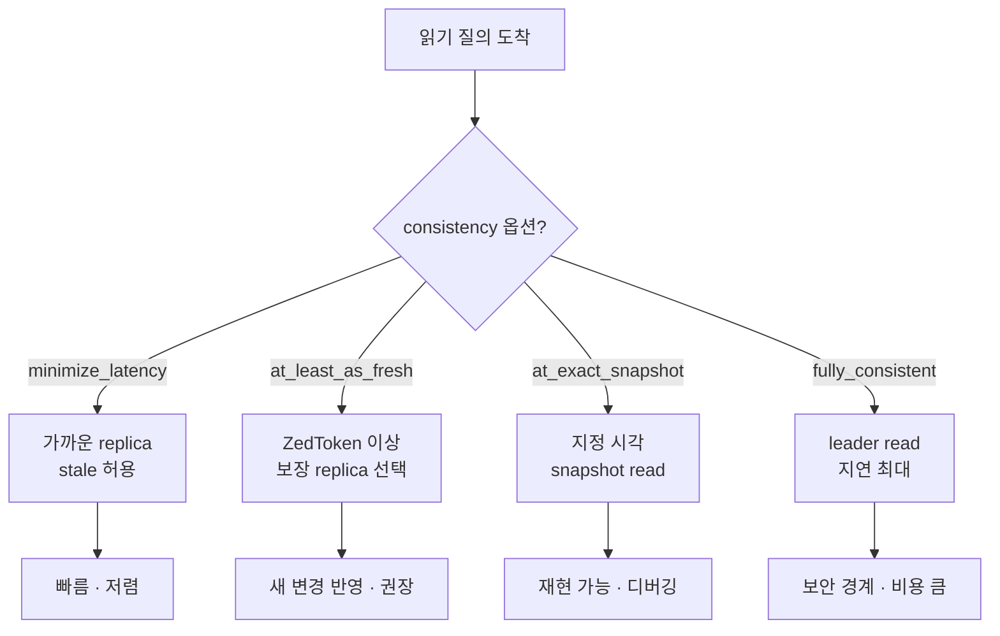

# CH3. Relationship과 ZedToken

## 학습 목표

- SpiceDB에 relationship(tuple)을 쓰고 읽는 기본 RPC의 모양을 익힌다.
- Precondition을 이용한 optimistic locking 패턴을 구분한다.
- ZedToken이 왜 필요한지, Zanzibar의 Zookie와 어떤 관계인지 이해한다.
- Check 시의 consistency 옵션 4가지를 비교하고, 상황별로 어느 것을 고르는지 판단한다.
- Bulk Import / Bulk Export의 용도와 운영 시 주의점을 짚는다.

## Relationship, 다시 확인하기

SpiceDB에서 권한 상태는 전부 relationship의 집합이다. 하나의 relationship은 Zanzibar의 tuple과 같은 구조를 갖는다.

```
document:readme#viewer@user:alice
```

`document:readme`는 resource, `viewer`는 relation, `user:alice`는 subject다. [CH2. Schema 언어](/study/spicedb/02-schema)에서 정의한 relation/permission을 이 relationship들이 채워 넣는다.

Schema가 가능한 관계의 **모양**을 정의한다면, relationship은 실제로 존재하는 관계의 **인스턴스**다. Check/Expand/Lookup 같은 질의는 모두 이 relationship 집합 위에서 평가된다.

## Relationship 쓰기

쓰기는 `WriteRelationships` RPC로 한다. 하나의 호출에 여러 업데이트를 묶을 수 있고, 업데이트마다 연산 종류를 고른다.

- `CREATE` — 이미 있으면 에러. 새로 만들 때만 성공.
- `TOUCH` — 있으면 그대로 두고 없으면 생성. 멱등.
- `DELETE` — 있으면 지우고 없으면 no-op.

zed CLI로는 한 줄로 쓴다.

```bash
zed relationship create document:readme viewer user:alice
zed relationship touch  document:readme editor user:bob
zed relationship delete document:readme viewer user:alice
```

Go SDK에서는 `WriteRelationshipsRequest`로 감싸 보낸다.

```go
resp, err := client.WriteRelationships(ctx, &pb.WriteRelationshipsRequest{
    Updates: []*pb.RelationshipUpdate{
        {
            Operation: pb.RelationshipUpdate_OPERATION_TOUCH,
            Relationship: &pb.Relationship{
                Resource: &pb.ObjectReference{ObjectType: "document", ObjectId: "readme"},
                Relation: "viewer",
                Subject: &pb.SubjectReference{
                    Object: &pb.ObjectReference{ObjectType: "user", ObjectId: "alice"},
                },
            },
        },
    },
})
// resp.WrittenAt 은 ZedToken
```

Python SDK도 구조는 같다.

```python
from authzed.api.v1 import (
    Client, WriteRelationshipsRequest, RelationshipUpdate,
    Relationship, ObjectReference, SubjectReference,
)

resp = client.WriteRelationships(WriteRelationshipsRequest(
    updates=[RelationshipUpdate(
        operation=RelationshipUpdate.Operation.OPERATION_TOUCH,
        relationship=Relationship(
            resource=ObjectReference(object_type="document", object_id="readme"),
            relation="viewer",
            subject=SubjectReference(
                object=ObjectReference(object_type="user", object_id="alice"),
            ),
        ),
    )],
))
zed_token = resp.written_at.token
```

응답에는 항상 `written_at` ZedToken이 포함된다. 이게 "이 쓰기가 반영된 시점"을 가리키는 논리 시각이다.

::: tip CREATE vs TOUCH, 어느 걸 쓸까
기본은 TOUCH가 안전하다. 멱등이라 재시도해도 같은 결과가 나오고, 네트워크 타임아웃 후 재전송으로 인한 에러를 피할 수 있다. CREATE는 "이 관계를 처음 만드는 것인지 확인하고 싶을 때"만 쓴다. 예를 들어 초대장을 만들 때 같은 초대가 이미 있는지 감지하려면 CREATE가 맞다.
:::

## Precondition — optimistic locking

`WriteRelationships`에는 precondition을 붙일 수 있다. "지금 이 tuple이 반드시 있어야 / 없어야 쓰기가 성공한다"는 조건부 쓰기다.

```go
_, err := client.WriteRelationships(ctx, &pb.WriteRelationshipsRequest{
    OptionalPreconditions: []*pb.Precondition{
        {
            Operation: pb.Precondition_OPERATION_MUST_MATCH,
            Filter: &pb.RelationshipFilter{
                ResourceType:       "document",
                OptionalResourceId: "readme",
                OptionalRelation:   "owner",
                OptionalSubjectFilter: &pb.SubjectFilter{
                    SubjectType:       "user",
                    OptionalSubjectId: "alice",
                },
            },
        },
    },
    Updates: updates,
})
```

이 호출은 "Alice가 readme의 owner인 경우에만" Updates를 적용한다. Alice가 이미 owner 권한을 잃었다면 전체 write가 실패한다.

쓰임새는 분명하다.

- 권한 위임 — "내가 아직 owner일 때만 다른 사람에게 editor를 준다"
- 초대 수락 — "초대가 아직 pending 상태일 때만 member로 전환"
- 상태 전이 — "pending → active 같은 single-transition을 race-free하게"

`MUST_MATCH` / `MUST_NOT_MATCH` 두 가지가 있다. 여러 개를 한꺼번에 걸 수도 있고, 모두 만족해야 Updates가 커밋된다.

## Relationship 읽기

저장된 tuple을 그대로 조회하려면 `ReadRelationships`를 쓴다. 필터로 resource type, resource id, relation, subject를 지정할 수 있고, 결과는 스트림으로 돌아온다.

```bash
zed relationship read document:readme
zed relationship read document:readme viewer
```

Go에서도 filter 기반이다.

```go
stream, _ := client.ReadRelationships(ctx, &pb.ReadRelationshipsRequest{
    RelationshipFilter: &pb.RelationshipFilter{
        ResourceType:       "document",
        OptionalResourceId: "readme",
    },
})
for {
    resp, err := stream.Recv()
    if err == io.EOF { break }
    // resp.Relationship 을 처리
}
```

::: warning ReadRelationships는 Check의 대체가 아니다
ReadRelationships는 **저장된 raw tuple**을 돌려준다. Schema의 permission 규칙(`->`, union, intersection, exclusion)은 적용되지 않는다. "Alice가 readme를 볼 수 있나"를 물으려면 Check를 써야 하고, ReadRelationships는 관리/디버깅/동기화 용도라고 생각하면 된다.
:::

## ZedToken의 역할

Zanzibar에는 Zookie라는 개념이 있었다. [Zanzibar CH5. Consistency와 Zookie](/study/zanzibar/05-consistency-zookie)에서 다룬 것처럼, "이 쓰기가 반영된 시점"을 가리키는 opaque token이다. 클라이언트가 보기에는 불투명한 문자열이지만, 서버는 이걸로 읽기 시 어떤 snapshot을 잡을지 결정한다.

SpiceDB의 ZedToken은 정확히 Zookie의 역할이다.

- 모든 쓰기 응답(`WriteRelationships`, `DeleteRelationships`, `WriteSchema`)이 ZedToken을 반환한다.
- Check / Expand / Lookup 류 호출에 ZedToken을 넘기면, 그 시점 이후의 상태로 평가하도록 강제할 수 있다.
- 그래서 "새 권한이 막 반영된 사용자에게도 stale한 응답을 주지 않는" 것이 가능하다.

new-enemy problem(해제된 권한이 잠시 살아있어 보이는 현상)을 막는 표준적인 방법이 바로 이 token을 들고 다니는 것이다.



## Consistency 옵션 4가지

Check/Expand/Lookup 계열 API는 `consistency` 필드를 받는다. 옵션은 네 개다.

- `minimize_latency` — 가장 빠른 읽기. 캐시와 가까운 replica를 적극적으로 쓴다. 약간의 stale이 허용된다.
- `at_least_as_fresh` — 지정한 ZedToken 이상의 freshness를 보장한다. 보통 가장 많이 쓰는 옵션.
- `at_exact_snapshot` — 지정한 ZedToken 시점의 상태로 정확히 평가한다. 재현/디버깅용.
- `fully_consistent` — 항상 최신 상태로 평가한다. 지연이 가장 크고 비용도 가장 크다.

| 옵션 | 지연 | staleness | 주 사용처 |
| --- | --- | --- | --- |
| minimize_latency | 가장 짧음 | 허용 | 대량 목록 조회, 검색 결과 필터 |
| at_least_as_fresh | 짧음 | ZedToken 이상 보장 | **기본값으로 쓸 만한 옵션** |
| at_exact_snapshot | 중간 | 정확 고정 | 감사 로그 재현, 버그 리포트 재현 |
| fully_consistent | 가장 김 | 없음 | 보안 경계 판단(금융 이체 등) |

::: info 기본은 at_least_as_fresh
새로 권한을 부여/회수한 직후에는 해당 요청의 응답 ZedToken을 세션이나 쿠키에 저장해 두고, 이후 Check에서 같이 보낸다. "내가 바꾼 변경은 최소한 반영된 상태"가 보장되므로 UI가 갑자기 거꾸로 보이는 일이 생기지 않는다. 다른 사용자가 동시에 한 변경까지 즉시 보는 것은 보장되지 않지만, 대부분의 UX에서 충분하다.
:::



## 실전 플로우 한 장

전형적인 문서 공유 시나리오를 ZedToken과 함께 정리하면 이렇게 된다.

1. 사용자 A가 문서에 B를 `editor`로 추가한다.
2. 백엔드가 `WriteRelationships`를 호출하고 응답의 `written_at` ZedToken을 세션/쿠키/클라이언트 state에 저장한다.
3. 그 후 같은 사용자가 만드는 Check / Lookup 호출에는 이 ZedToken을 `at_least_as_fresh`로 넘긴다.
4. 다른 화면(목록, 권한 패널 등)을 렌더할 때도 이 ZedToken을 들고 다닌다.
5. 시간이 충분히 지나면 ZedToken의 효용은 줄어든다(어차피 replica들이 이 시점을 훨씬 넘겼다). 장기 보관은 의미가 없으므로 세션 단위로만 가지고 있으면 된다.

## Bulk Import — 초기 적재

RBAC/LDAP 같은 기존 시스템에서 SpiceDB로 이관할 때, 수백만 tuple을 한 번에 싣는 경로가 필요하다. 일반 `WriteRelationships`는 트랜잭션 크기 제약이 있어 수천 건 단위 배치가 한계다. 대량 초기 적재용으로 `BulkImportRelationships` 스트리밍 RPC가 따로 있다.

zed CLI의 `zed import`가 래핑해 준다. 입력은 relationship 한 줄씩의 텍스트 또는 NDJSON이다.

```bash
zed import --schema-file schema.zed relationships.zed
```

Go로 직접 스트림을 쓴다면 다음과 같은 형태다.

```go
stream, _ := client.BulkImportRelationships(ctx)
for _, batch := range batches {
    stream.Send(&pb.BulkImportRelationshipsRequest{Relationships: batch})
}
resp, _ := stream.CloseAndRecv()
// resp.NumLoaded 로 적재 건수 확인
```

이관 실전 팁은 아래 정도로 추릴 수 있다.

- Schema를 먼저 쓰고, 그 다음 tuple을 싣는다. 반대 순서면 schema 검증에서 다 실패한다.
- 한 batch는 수백 ~ 수천 건 수준으로 나눈다. 너무 크면 gRPC 메시지 크기 제한에 걸린다.
- CockroachDB/Spanner 같은 datastore는 단일 큰 트랜잭션보다 작게 쪼갠 다수의 트랜잭션이 유리하다.
- 이관 스크립트는 idempotent하게 설계한다. 중간에 실패했을 때 이미 적재된 건을 다시 시도해도 안전해야 한다.
- 가능하면 업무 시간 밖에서 돌린다. Bulk Import는 datastore에 큰 쓰기 부하를 준다.

## Bulk Export — 운영 snapshot

반대로 현재 상태를 덤프해야 할 때는 `BulkExportRelationships`를 쓴다. 주요 용도는 다음과 같다.

- 별도 환경(스테이징, DR)으로 상태 복제.
- 주기적 감사용 snapshot 보관(관계 변화 감사).
- 외부 분석(예: BI 도구에서 "유저별 resource 수" 분석).

Watch API(CH4에서 다룬다)가 실시간 변경 스트림이라면, Bulk Export는 어느 시점의 전체 스냅샷이다. 둘을 조합해 "스냅샷 + 이후 변경"을 외부에 동기화하는 패턴이 많이 쓰인다.

## 흔한 함정

::: warning 함정 모음
- Caveat이 걸린 relation에 context 없이 쓰면, 실제 Check 시 해당 조건을 평가할 수 없다. Caveat 상세는 [CH6. Caveats 실전](/study/spicedb/06-caveats)에서 다룬다.
- CREATE와 TOUCH를 혼동해 재시도 로직이 깨지는 경우가 많다. 기본은 TOUCH, 의도적 충돌 감지가 필요할 때만 CREATE.
- ZedToken을 잃어버리면 새로 쓴 변경이 잠시 안 보일 수 있다. 서버 측 세션/캐시에 끼워 두자.
- `fully_consistent`를 hot path(예: 문서 열기)에 그냥 박아 두면 지연이 크게 늘어난다. 정말 필요한 경로에만 붙인다.
- Bulk Import 중에 일반 쓰기를 병행하면 datastore가 과부하에 빠지기 쉽다. 마이그레이션 구간을 명확히 분리하자.
:::

## 핵심 정리

::: tip 핵심 정리
- relationship 쓰기는 `WriteRelationships` RPC로 하며 CREATE/TOUCH/DELETE 세 연산을 지원한다. 기본은 멱등한 TOUCH가 안전하다.
- Precondition으로 optimistic locking(있으면/없으면 쓰기)이 가능하고, 권한 위임·초대 수락 같은 race-free 전이에 쓴다.
- `ReadRelationships`는 저장된 raw tuple 조회 전용이다. permission 규칙은 평가되지 않으므로 Check의 대체가 아니다.
- ZedToken은 Zanzibar Zookie의 SpiceDB 이름이다. 쓰기 응답으로 받아 두고, 이후 읽기에 같이 보내면 "내 변경 이상" 최신성이 보장된다.
- consistency 네 옵션 중 `at_least_as_fresh`가 사실상 기본값이다. `fully_consistent`는 진짜 필요한 경계에만, `at_exact_snapshot`은 재현/디버깅용.
- 초기 이관은 `BulkImportRelationships` 스트리밍, 운영 중 전체 스냅샷은 `BulkExportRelationships`. 실시간 변경 스트림은 다음 챕터의 Watch가 맡는다.
:::

## 다음 챕터

지금까지는 쓰기와 그 consistency만 다뤘다. 다음 챕터에서는 SpiceDB가 제공하는 읽기 API 5개(Check/Expand/LookupResources/LookupSubjects/Watch)를 모두 훑는다. 어떤 질문이 어떤 API로 환원되는지 한 장으로 정리한다.

- [CH4. API 전체](/study/spicedb/04-api)
