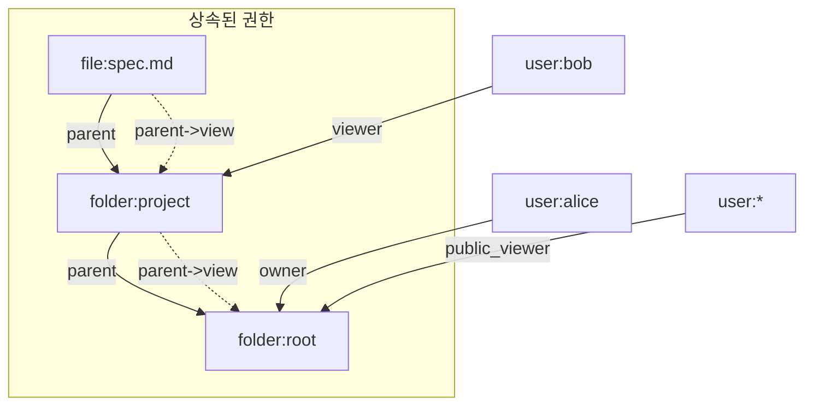
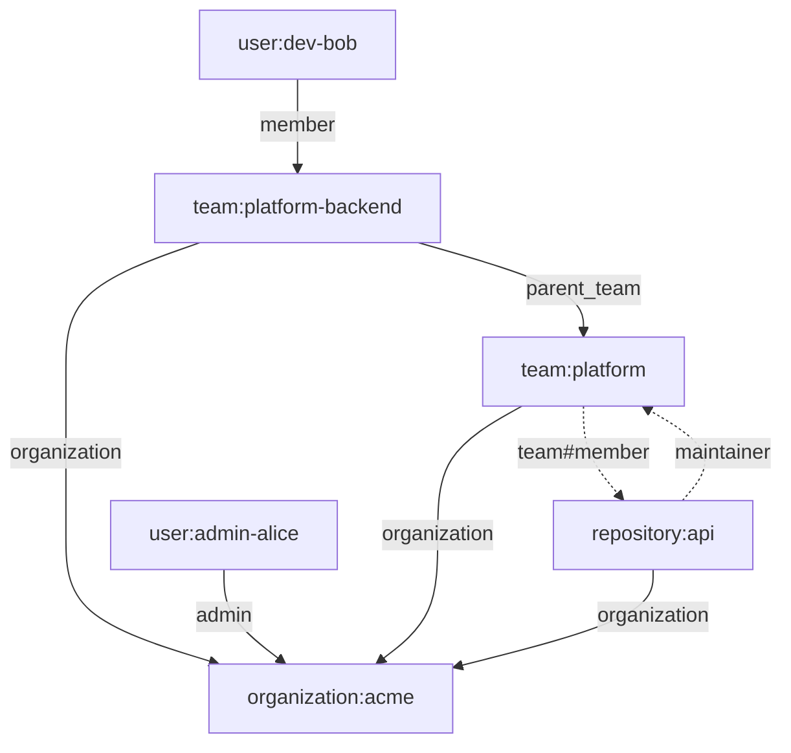

# CH5. 모델링 패턴

## 학습 목표

- Schema를 설계할 때 relation과 permission을 나누는 기준을 세운다.
- Google Drive 스타일의 폴더 상속·공유 링크 모델을 SpiceDB Schema로 옮긴다.
- GitHub 스타일의 조직·팀·저장소 계층을 subject relation과 arrow로 표현한다.
- SaaS 멀티테넌시 3가지 전략(relation 필터 / prefix / 인스턴스 분리)을 비교하고 선택 기준을 잡는다.
- assertions/validation YAML로 schema 회귀 테스트를 돌리는 감각을 익힌다.

## 모델링의 일반 원칙

Schema 설계가 처음이라면 세 문장만 머리에 박아 두면 된다. "관계를 먼저 찾고, permission은 그 조합으로", "저장 가능한 건 `relation`, 계산되는 건 `permission`", "상속은 arrow(`->`)와 parent 관계로 표현한다".

제품 요구사항을 받았을 때 가장 먼저 할 일은 "어떤 객체가 있고, 누가 누구와 어떤 이름으로 엮이는지"를 나열하는 것이다. 이 단계에서 나오는 단어가 전부 relation 후보다. 예를 들어 "폴더 소유자", "저장소 관리자", "팀 멤버"는 모두 relation이다.

그다음 "이 관계가 있으면 할 수 있는 행동"을 정리하면 그게 permission이다. `edit`·`view`·`push`·`admin` 같은 동사 중심 이름이 자연스럽다. 여기서 실수하기 쉬운 게 "relation도 permission도 가능한 경우"인데, 규칙은 단순하다. 사람이 직접 쓰기(writeRelationship) 가능한 건 relation, 스키마가 스스로 계산하는 건 permission이다.

상속은 거의 항상 arrow로 푼다. 폴더 안의 파일이 폴더의 뷰어를 자동 상속한다면, 파일 쪽에 `parent` relation을 두고 `permission view = viewer + parent->view`로 적는다. `parent->view`는 "parent(folder)의 view permission을 소환해서 합친다"는 뜻이다.

조직·팀·그룹처럼 "주체 쪽이 집합"인 경우는 subject relation으로 표현한다. `relation member: user | team#member`라고 쓰면, member에는 사용자 개인이 들어갈 수도 있고 "다른 팀의 member 전체"가 들어갈 수도 있다. 이 `team#member` 문법이 Zanzibar의 userset rewrite를 그대로 물려받은 부분이다.

::: info relation 이름은 역할이 아니라 관계로
`admin` 같은 역할 이름과 `owner`·`editor` 같은 관계 이름이 섞이기 쉽다. 일관성을 위해 "소유/관리/편집" 같이 관계로 읽을 수 있는 명사를 쓰고, "할 수 있는 것"은 permission 이름으로 분리한다. 예컨대 `relation admin`은 관계, `permission manage`는 행동.
:::

## 패턴 1: Google Drive 스타일

Google Drive는 "폴더 안에 폴더, 폴더 안에 파일"이라는 계층과 상속이 핵심이다. 요구사항을 조금 더 구체적으로 풀어 보자.

- 폴더는 다른 폴더의 자식이 될 수 있다(폴더 트리).
- 폴더의 viewer·editor 권한은 그 안의 파일·하위 폴더에 상속된다.
- "링크 있는 누구나 보기" 같은 공개 공유가 가능해야 한다.
- 개별 사용자에게 폴더·파일 단위로 직접 공유할 수 있어야 한다.

이걸 스키마로 옮기면 다음과 같다.

```zed
definition user {}

definition folder {
  relation parent: folder
  relation owner: user
  relation editor: user | folder#editor
  relation viewer: user | folder#viewer
  relation public_viewer: user:*
  permission edit = owner + editor + parent->edit
  permission view = viewer + edit + public_viewer + parent->view
}

definition file {
  relation parent: folder
  relation owner: user
  relation editor: user
  relation viewer: user
  permission edit = owner + editor + parent->edit
  permission view = viewer + edit + parent->view
}
```

핵심 포인트를 짚어 보자.

첫째, `parent: folder`가 폴더 트리를 만든다. `permission edit = ... + parent->edit`는 "내 부모 폴더의 edit 권한이 있으면 나도 edit 가능"이라는 재귀적 정의다. SpiceDB는 이걸 arrow 재귀로 풀어내면서 순환이 없도록 탐색한다.

둘째, `editor: user | folder#editor`에서 `folder#editor` 부분은 "다른 폴더의 editor 전원"을 subject로 받는 문법이다. "이 공유 폴더의 editor는 팀 공용 폴더의 editor와 동일" 같은 위임 관계를 만들 때 쓴다.

셋째, `public_viewer: user:*`가 바로 "링크 있는 누구나"를 표현하는 wildcard다. 공개용 relation을 `viewer`와 분리해 두면 `folder:shared#public_viewer@user:*`처럼 공개 공유 의도가 이름에서 드러나고, 스키마 리뷰·감사 단계에서 실수로 전원 공개가 되는 사고를 줄인다.

넷째, 파일의 `permission view = viewer + edit + parent->view` 순서가 중요하다. `edit`이 먼저 들어가면, 개별 파일 edit 권한이 있는 사람은 자동으로 view도 받는다. `parent->view`는 폴더의 뷰어 상속이다.

::: warning user:\* wildcard는 검토가 두 번 필요하다
`user:*`는 편하지만 실수로 공개 공유가 되기 쉽다. Schema 리뷰와 relationship 쓰기 양쪽에서 공개 의도가 맞는지 반드시 확인한다. 가능하면 공개용 relation은 별도 이름(예: `public_viewer`)으로 분리해서 눈에 띄게 만드는 편이 안전하다.
:::



이 그래프로 보면 "root의 owner인 alice는 parent 체인을 타고 spec.md의 edit까지 얻고, root의 `public_viewer`에 들어간 누구나도 view로 접근"되는 흐름이 한눈에 들어온다.

## 패턴 2: GitHub 스타일 조직·팀·저장소

GitHub의 권한 모델은 세 계층이다. organization 아래 team이 있고, team은 다시 상위 팀을 가질 수 있다. repository는 organization에 속하면서 개별 사용자나 팀에 권한을 부여한다. 팀에 권한을 주면 그 팀의 모든 멤버가 권한을 받는다.

```zed
definition user {}

definition organization {
  relation admin: user
  relation member: user
}

definition team {
  relation organization: organization
  relation parent_team: team
  relation member: user | team#member
  permission join = member + parent_team->member + organization->admin
}

definition repository {
  relation organization: organization
  relation admin: user | team#member
  relation maintainer: user | team#member
  relation reader: user | team#member
  permission push = admin + maintainer
  permission read = reader + push + organization->admin
}
```

여기서 `team#member`가 다시 등장한다. repository의 `admin: user | team#member`는 "이 저장소 admin에 사용자 개인도 들어가지만, 팀 자체를 넣어도 된다"는 뜻이다. 팀을 넣으면 해당 팀의 member 전원이 repository admin이 된다.

`team` 쪽의 `permission join = member + parent_team->member + organization->admin`이 계층 상속을 보여준다. 조직의 admin은 자동으로 모든 팀에 join 가능하고, 상위 팀의 멤버는 하위 팀에도 속한다. GitHub가 실제로 "nested team은 상위 팀 권한을 상속한다"고 문서화한 규칙 그대로다.

repository의 `permission read = reader + push + organization->admin`에서 `organization->admin`도 같은 패턴이다. 조직 admin이면 모든 저장소에 자동 read 권한이 붙는다. "slash-and-burn admin" 같은 실수 방지를 위해 조직 admin은 최소 인원만 부여하는 운영 규칙이 별도로 필요하다.



alice는 조직 admin이라 모든 repository의 read를 자동 획득하고, bob은 platform-backend 멤버이자 그 상위 팀 platform을 통해 repository:api의 maintainer가 된다. 스키마 한 장이 이 흐름 전부를 표현한다.

## 패턴 3: SaaS 멀티테넌시

하나의 SpiceDB 인스턴스가 여러 테넌트(고객사)의 데이터를 담아야 할 때 격리 전략을 잘못 잡으면 "A사 사용자가 B사 프로젝트를 조회"하는 사고가 난다. 실전에서 쓰는 방법은 크게 세 가지다.

<strong>방법 A</strong> — 모든 object에 `tenant` relation을 포함하고, 권한 규칙에 tenant 소속을 필수 조건으로 건다.

```zed
definition tenant {
  relation admin: user
  relation member: user
}

definition project {
  relation tenant: tenant
  relation owner: user
  permission view = owner + tenant->member
}
```

이 방식은 "project:123은 tenant:acme에 속한다"는 관계를 명시적으로 두고, `permission view`가 `tenant->member`를 통해 테넌트 소속을 검증한다. 한 인스턴스·한 스키마·한 DB로 운영 가능하지만, 관계를 쓸 때 tenant 연결을 빠뜨리면 격리가 뚫린다.

<strong>방법 B</strong> — object id에 prefix를 붙여 namespacing한다. 예: `project:acme-123`, `project:beta-456`. 스키마는 그대로, id 규칙만 테넌트별로 구분한다.

구현은 가장 가볍지만 격리는 가장 느슨하다. id prefix는 관례일 뿐 엔진이 강제하지 못하므로 운영 실수가 곧 격리 사고다. 내부 관리 도구처럼 신뢰 경계가 느슨한 상황에서만 고려할 만하다.

<strong>방법 C</strong> — 테넌트별로 SpiceDB 인스턴스(또는 datastore schema)를 분리한다. 완전한 물리적 격리이고 감사·규제 대응도 쉽지만, 운영 비용·배포 복잡도가 크게 는다.

선택 기준을 표로 정리하면 이렇다.

| 기준 | 방법 A (tenant relation) | 방법 B (id prefix) | 방법 C (인스턴스 분리) |
|---|---|---|---|
| 격리 강도 | 논리적 (스키마 규칙) | 관례적 (id 규칙) | 물리적 (별도 인프라) |
| 운영 비용 | 낮음 | 가장 낮음 | 가장 높음 |
| 테넌트 수 | 많음 가능 | 많음 가능 | 수십~수백 제한적 |
| 규제 대응 | 중간 (설계로 입증) | 어려움 | 쉬움 (물리 격리) |
| 크로스 테넌트 공유 | 쉬움 | 쉬움 | 어려움 (instance 간 호출 필요) |

::: tip 실전 선택
대부분의 SaaS는 <strong>방법 A</strong>에서 시작하고, 규제가 강한 특정 고객 전용 배포가 필요해지면 그 고객만 <strong>방법 C</strong>로 옮긴다. <strong>방법 B</strong>는 권장하지 않는다.
:::

## Schema 리팩토링 팁

Schema는 코드처럼 자란다. 초기엔 깔끔하지만 요구사항이 늘면 지저분해지기 마련이다. 몇 가지 규칙만 지켜도 관리 비용이 확 줄어든다.

- permission 이름은 제품 전역에서 일관되게 쓴다. 한쪽은 `view`인데 다른 definition은 `read`라고 쓰면 application 코드에서 매번 분기해야 한다.
- relation 이름은 소문자 단수형을 쓴다. `members`·`Admins`가 섞이면 schema diff가 지저분해진다.
- 공개용 relation과 내부용 relation을 이름으로 구분한다. `viewer`와 `public_viewer`처럼.
- `user:*` 사용 지점에는 주석으로 의도를 남긴다. 스키마 리뷰 때 눈에 띄어야 한다.
- 사용하지 않는 relation을 오래 방치하지 않는다. CH10에서 다루는 마이그레이션 절차를 밟아 제거한다.

## 테스트 — assertions / validation YAML

SpiceDB는 스키마 회귀 테스트를 위한 YAML 포맷을 제공한다. 스키마 변경 PR에 이 파일을 함께 수정·실행하는 게 사실상 표준이다. 간단 예시.

```yaml
schema: |-
  definition user {}
  definition document {
    relation viewer: user
    permission view = viewer
  }

relationships: |-
  document:readme#viewer@user:alice

assertions:
  assertTrue:
    - "document:readme#view@user:alice"
  assertFalse:
    - "document:readme#view@user:bob"

validation:
  document:readme#view:
    - "[user:alice] is <document:readme#viewer>"
```

`zed validate schema.yaml` 한 줄로 검증한다. `assertions`는 "참이어야 한다/거짓이어야 한다"는 단언, `validation`은 "이 권한이 왜 성립하는지 풀어서 표시"한다. CI에 붙여 두면 스키마 회귀를 자동으로 잡는다.

::: info 실전 워크플로우
스키마를 바꿀 땐 보통 ① validation YAML에 "지금 시나리오"를 먼저 박고 → ② 스키마 수정 → ③ 테스트 돌려 기존이 깨지지 않는지 확인 → ④ 새 시나리오 assertion 추가 순으로 간다. 애플리케이션 테스트 전에 이 단계에서 실수 대부분이 걸린다.
:::

## 핵심 정리

::: tip 핵심 정리
- <strong>relation은 저장되는 관계, permission은 계산되는 규칙</strong>. 상속은 arrow(`->`)와 parent relation으로 표현한다.
- <strong>Google Drive 모델</strong>: folder trees는 `parent: folder`, 파일의 상속은 `parent->view`, 공개 링크는 `user:*` wildcard.
- <strong>GitHub 모델</strong>: `team#member` subject relation으로 "팀 단위 권한 부여"를 구현한다. 부모 팀 상속·조직 admin 자동 권한도 arrow 한 줄.
- <strong>멀티테넌시 3가지</strong>: tenant relation(기본) · id prefix(비권장) · 인스턴스 분리(규제 대응). 시작은 A, 필요시 C로.
- <strong>테스트는 YAML</strong>: assertions·validation으로 스키마 회귀를 CI에서 자동 검증한다.
- <strong>리팩토링 원칙</strong>: 이름 일관성, 공개/내부 relation 구분, `user:*` 주석, 사용하지 않는 relation은 제거.
:::

## 다음 챕터

CH6에서는 Caveats를 본격적으로 다룬다. "관계가 있고 + 업무시간이고 + 회사 네트워크 안이면"처럼 관계 그래프만으로는 표현하지 못하는 조건부 권한을 CEL 표현식과 partial evaluation으로 풀어낸다.
