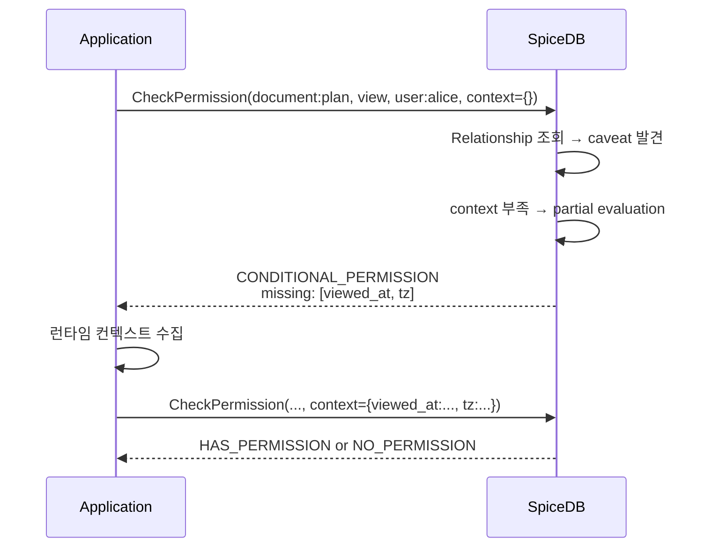
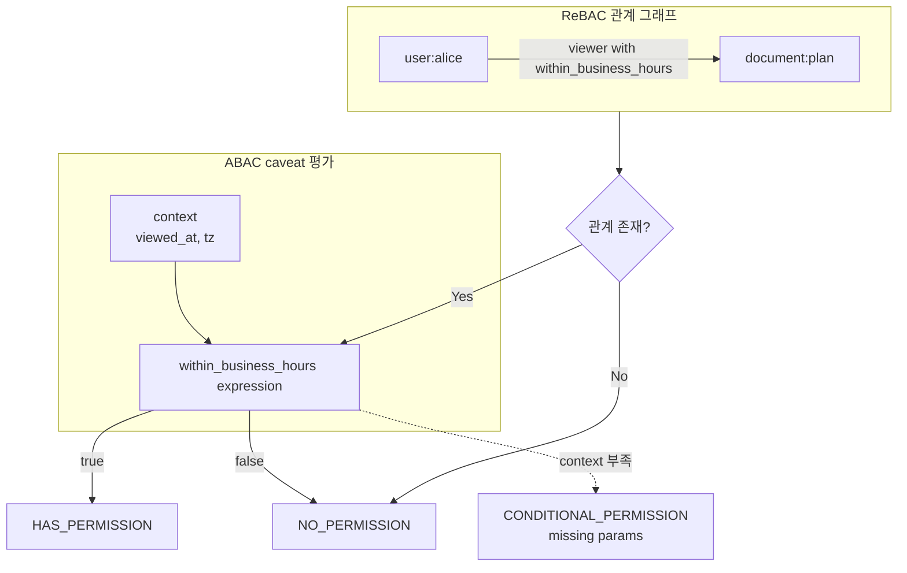

# CH6. Caveats 실전

## 학습 목표

- Caveat이 ReBAC의 한계(관계 유무만 평가)를 어떻게 보완하는지 이해한다.
- Caveat의 3요소(정의·파라미터·CEL 표현식)와 3단계 사용 흐름(schema → relationship → check)을 체득한다.
- 시간 창, IP 대역, 사용자 등급, 만료 토큰 4가지 실전 패턴을 스키마로 옮긴다.
- Partial evaluation과 `CONDITIONAL_PERMISSION` 응답을 다루는 애플리케이션 쪽 설계를 잡는다.
- Caveat 안티패턴(비즈니스 로직 전체 이식)을 피하는 감을 잡는다.

## Caveat이 해결하는 문제

ReBAC은 "관계가 있는가, 없는가"만 평가한다. `alice`가 `document:readme`의 viewer라면 항상 읽을 수 있고, 아니면 못 읽는다. 하지만 실전 요구사항은 이렇게 단순하지 않다.

- "업무시간(9~18시)에만 접근 허용"
- "회사 네트워크(10.0.0.0/8) 안에서만 접근"
- "사용자 clearance가 문서의 기밀 등급 이상일 때만 접근"
- "토큰 만료 전까지만 유효"

이런 규칙은 "누가 무엇과 어떤 관계"라는 ReBAC 축만으로는 표현되지 않는다. 이게 ABAC(Attribute-Based Access Control)의 영역이다. 속성값과 그 조합을 런타임에 평가해야 한다.

SpiceDB는 이 둘을 <strong>Caveat</strong>이라는 이름으로 결합한다. 관계 그래프는 그대로 두되, 특정 relation 끝에 "이 관계는 이러이러한 조건이 참일 때만 성립"이라는 런타임 검사를 붙인다. ReBAC의 정확성을 유지하면서 ABAC 유연성을 얹는 구조다.

::: info Caveat = "단서, 조건, 유보"
영어 caveat은 "단서 조항"이라는 뜻이다. SpiceDB 맥락에서는 관계에 붙는 "이 조건이 만족될 때만"이라는 단서를 말한다.
:::

## Caveat의 구조 3요소

Caveat을 정의할 때 필요한 건 세 가지다.

<strong>정의(definition)</strong>은 schema에 쓰는 `caveat` 블록이다. 이름과 파라미터, 표현식으로 구성된다.

```zed
caveat within_business_hours(viewed_at timestamp, tz string) {
  viewed_at.getHours(tz) >= 9 && viewed_at.getHours(tz) < 18
}
```

<strong>파라미터(parameters)</strong>는 타입이 있는 변수 목록이다. SpiceDB가 지원하는 CEL 타입은 다음과 같다.

| 타입 | 설명 |
|---|---|
| string, int, uint, double, bool | 기본 스칼라 |
| duration, timestamp | 시간 / 기간 |
| bytes | 바이너리 |
| list, map | 컬렉션 |
| ipaddress | IP 전용(CIDR 매칭 내장) |

<strong>표현식(expression)</strong>은 CEL(Common Expression Language)로 쓰는 boolean 식이다. CEL은 Google이 설계한 안전·제한적 표현식 언어로, 무한 루프·I/O·임의 함수 호출이 불가능하다. 엔진 안에서 빠르고 안전하게 평가하기 좋다.

## Caveat 사용의 두 축

Caveat은 세 곳에 흩어져 등장한다. 헷갈리기 쉬우니 흐름을 명확히 잡아야 한다.

첫째, <strong>Schema 선언</strong>에서 `with <caveat>`으로 "이 relation에는 이 caveat이 붙는다"는 걸 표시한다.

```zed
definition document {
  relation viewer: user with within_business_hours
}
```

둘째, <strong>Relationship 생성</strong> 시 caveat context를 함께 넘긴다. 생성 시점에 확정 가능한 값(예: 허용 CIDR 대역)을 여기서 고정한다. 검사 시점에 필요한 값(예: 실제 요청 IP)은 비워 둔다.

```
document:plan#viewer@user:alice[within_business_hours:{"tz":"Asia/Seoul"}]
```

셋째, <strong>Check 요청</strong> 시 request context를 같이 넘긴다. 이 시점에야 알 수 있는 런타임 값(현재 시각, 요청 IP 등)이 여기 들어간다. SpiceDB는 relationship context와 request context를 합쳐 caveat expression을 평가한다.

::: tip 어디에 무슨 값을 넣을지 감 잡기
"공유 설정할 때 아는 값"은 relationship context, "요청이 들어온 순간에만 아는 값"은 request context다. 시간대(tz)는 전자, 현재 시각(viewed_at)은 후자.
:::

## 패턴 1: 시간 창 (업무시간만 접근)

근무 시간에만 민감 문서를 조회할 수 있도록 제한하고 싶다. 시간대는 relationship 생성 시 고정하고, 실제 조회 시각은 request로 받는다.

```zed
caveat within_business_hours(viewed_at timestamp, tz string) {
  viewed_at.getHours(tz) >= 9 && viewed_at.getHours(tz) < 18
}

definition document {
  relation viewer: user with within_business_hours
}
```

Relationship 생성:

```
document:plan#viewer@user:alice[within_business_hours:{"tz":"Asia/Seoul"}]
```

Check 요청 시 context:

```json
{"viewed_at": "2026-04-20T10:30:00Z", "tz": "Asia/Seoul"}
```

`getHours(tz)`는 해당 timezone 기준으로 시각을 뽑는 CEL 메서드다. UTC로 오는 timestamp를 그대로 비교하면 시차 버그가 난다. caveat 쪽에서 tz를 받아 변환하는 게 안전하다.

## 패턴 2: IP 대역 제한

회사 네트워크 안에서만 접근을 허용한다. 허용 CIDR은 relationship 생성 시 결정되고, 실제 요청 IP는 런타임에 들어온다.

```zed
caveat ip_in_range(user_ip ipaddress, allowed_cidr ipaddress) {
  user_ip.in_cidr(allowed_cidr)
}

definition document {
  relation viewer: user with ip_in_range
}
```

Relationship 생성:

```
document:internal#viewer@user:alice[ip_in_range:{"allowed_cidr":"10.0.0.0/8"}]
```

Check context:

```json
{"user_ip": "10.1.2.3"}
```

`ipaddress` 타입은 CIDR 비교(`in_cidr`)가 내장돼 있어 직접 문자열을 비교하는 것보다 안전하고 빠르다. IPv4·IPv6를 모두 지원한다.

## 패턴 3: 동적 속성 — clearance 기반 접근

문서에 기밀 등급이 있고, 사용자 clearance가 그 이상일 때만 열람을 허용한다. 등급은 정수로 표현.

```zed
caveat clearance_required(user_clearance int, required int) {
  user_clearance >= required
}

definition document {
  relation viewer: user with clearance_required
}
```

Relationship 쪽에서 문서마다 `required`를 고정하고, check 시 `user_clearance`를 넘긴다. 조직 전체 등급 정책이 바뀌면 relationship의 `required` 값만 업데이트하면 되므로 변경 범위가 좁다.

## 패턴 4: 일회용 / 만료 토큰

공유 링크가 일정 시간 후 만료되는 유스케이스. 만료 시각은 relationship에 박고, 현재 시각은 request로 받는다.

```zed
caveat valid_until(current timestamp, expires timestamp) {
  current < expires
}

definition document {
  relation viewer: user with valid_until
}
```

Relationship:

```
document:share-xyz#viewer@user:*[valid_until:{"expires":"2026-05-20T00:00:00Z"}]
```

만료된 뒤에는 relationship을 삭제하지 않아도 caveat이 false를 반환해 접근이 차단된다. 다만 쓰레기 relationship이 누적되니 주기적 청소 배치는 별도로 운영해야 한다.

## Partial evaluation — 불완전한 context 다루기

Check 요청 시 caveat이 필요한 값 일부만 넘겼다면 SpiceDB는 곧바로 fail하지 않는다. 대신 <strong>PERMISSIONSHIP_CONDITIONAL_PERMISSION</strong>을 돌려주고, "이 조건이 남았다"는 힌트를 응답에 담는다.



설계 의도가 중요하다. SpiceDB는 "관계 그래프는 자기가 안다. ABAC 속성은 애플리케이션이 더 잘 안다"는 역할 분담을 전제한다. partial evaluation 덕분에 SpiceDB에 민감한 값(사용자 IP 같은)을 보내지 않고, 결과적으로 ABAC 평가를 애플리케이션에서 마치는 2단계 구성도 가능하다.

## ReBAC + ABAC 결합 흐름



관계가 있어야 caveat 평가로 넘어가고, caveat이 true일 때만 최종 HAS_PERMISSION이다. 두 축이 AND로 엮이는 구조라 "관계가 없으면 속성 아무리 맞아도 불가", "관계 있어도 속성이 틀리면 불가"가 자동으로 보장된다.

## 실전 팁

::: info 운영 원칙
- <strong>context는 최대한 작게</strong>. 매 check 요청마다 전송되니 큰 map·list는 레이턴시에 불리하다.
- <strong>caveat 로직은 단순하게</strong>. 복잡한 분기·중첩이 들어가면 정책 리뷰가 지옥이 된다.
- <strong>평가 결과를 감사 로그에 남긴다</strong>. "왜 거부됐는가"를 재현하려면 어떤 context로 평가했는지 함께 기록해야 한다.
- <strong>caveat 이름은 읽히도록</strong>. `within_business_hours`, `ip_in_range`처럼 조건 자체가 이름에서 드러나야 스키마가 읽힌다.
:::

## 안티패턴: 비즈니스 로직 전체를 caveat으로 옮기기

"이 기능이 지금 결제 플랜의 한도 안에 있나? 이 사용자가 오늘 할당량을 쓰지 않았나? 이 요청이 feature flag 대상인가?" 같은 비즈니스 로직을 caveat으로 몰아넣고 싶은 유혹이 온다. 안 하는 게 좋다.

그런 로직은 다음 성질을 가진다. ① 자주 바뀐다. ② A/B 테스트·점진 배포가 필요하다. ③ 관측·디버깅을 위해 상세 로그가 필요하다. Caveat은 이 셋 모두에 약하다. 스키마 변경은 CH10에서 다루듯이 무중단 배포가 까다롭고, CEL 표현식은 중단점·로깅이 제한적이다.

권한의 정확한 경계(누가 읽을 수 있는가)는 caveat으로, 기능의 가용성(이 사용자가 이 기능을 쓸 수 있는가)은 애플리케이션·feature flag 서비스로 나눠야 한다. 두 관심사를 분리하면 양쪽이 독립적으로 진화할 수 있다.

::: warning Caveat은 양념, 메인은 관계
Caveat이 모든 정책을 표현할 수 있다는 사실과, 모든 정책을 Caveat으로 표현해야 한다는 주장은 다르다. ReBAC 관계로 풀 수 있는 건 관계로, 관계로 풀 수 없는 축만 caveat으로 넘긴다는 감각이 운영을 살린다.
:::

## 핵심 정리

::: tip 핵심 정리
- <strong>Caveat = ReBAC에 붙는 런타임 조건</strong>. 관계 유무 위에 속성·시간·IP 같은 동적 평가를 얹는 ABAC 결합 방식.
- <strong>3요소</strong>: `caveat` 블록 정의, 타입 있는 파라미터, CEL boolean 표현식.
- <strong>3단계 사용</strong>: schema에 `with <caveat>` → relationship 생성 시 context 고정 → check 시 런타임 context 전달.
- <strong>핵심 타입</strong>: timestamp·duration·ipaddress가 실전에서 빛난다(시간대 처리, CIDR 매칭 내장).
- <strong>Partial evaluation</strong>: context 부족 시 `CONDITIONAL_PERMISSION` 반환. 애플리케이션에서 마저 평가해 민감값을 SpiceDB에 보내지 않는 설계도 가능.
- <strong>안티패턴</strong>: 비즈니스 로직 전체 이식, 과도한 중첩 표현식, 큰 context 전송. 정책은 단순하게, 로직은 애플리케이션으로.
:::

## 다음 챕터

CH7에서는 배포 토폴로지를 다룬다. datastore(Postgres / CockroachDB / Spanner / MySQL) 선택 기준, dispatch cluster로 권한 계산을 분산하는 방법, consistent hashing의 역할, 그리고 백업/DR 전략까지 운영 관점에서 깊게 들어간다.
