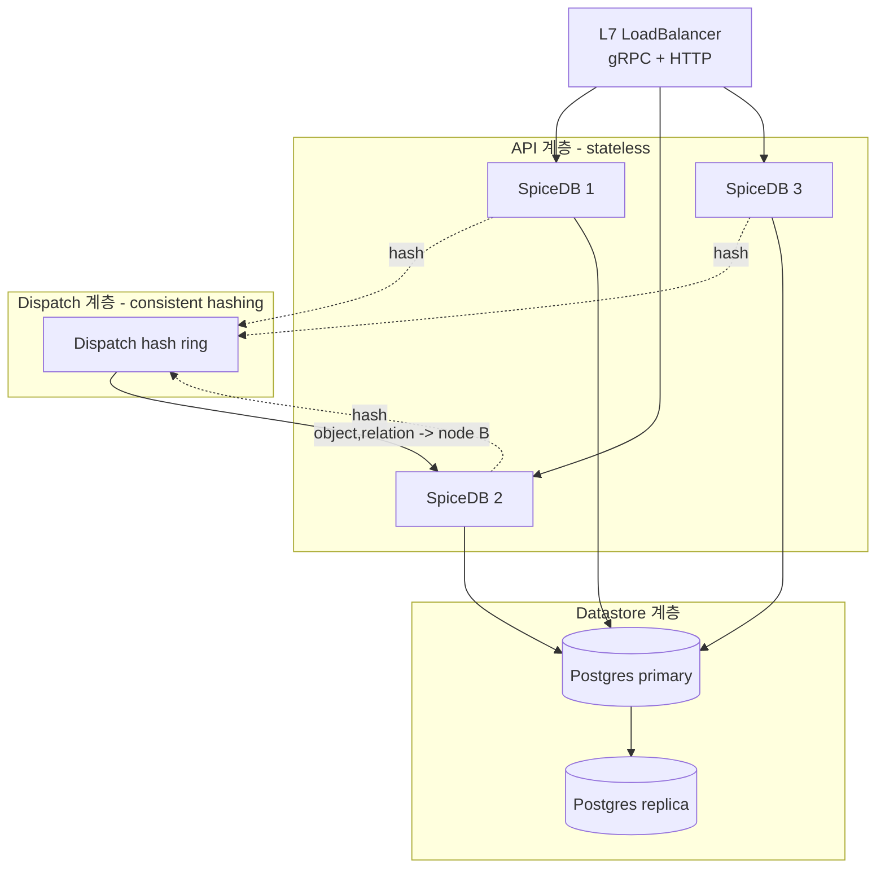
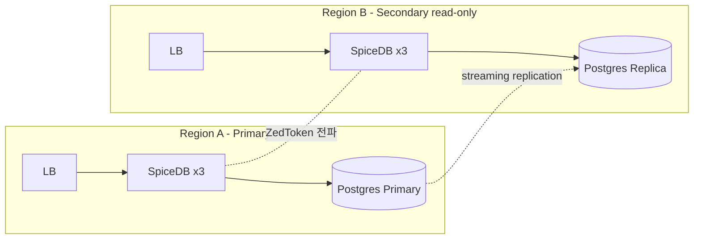

# CH7. 배포 토폴로지

## 학습 목표

- SpiceDB 배포를 <strong>API · Dispatch · Datastore</strong> 세 계층으로 분리해 설계할 수 있다.
- 5개 datastore(Postgres / CockroachDB / Spanner / MySQL / memdb)의 특성과 선택 기준을 안다.
- Dispatch cluster와 consistent hashing이 왜 cache hit rate를 지배하는지 설명한다.
- 백업·DR 계획을 RPO/RTO 관점에서 설계하고, 정기 복구 훈련 절차를 세운다.
- 멀티 리전 Active-Passive / Active-Active 토폴로지의 조건과 한계를 구분한다.

## SpiceDB 배포의 세 계층

SpiceDB는 "프로세스 하나 + DB 하나"로도 돌아가지만, 실전 배포는 반드시 세 계층으로 나눠 생각해야 한다. 각 계층의 확장 축과 장애 도메인이 전혀 다르기 때문이다.

**1. API 계층 — stateless SpiceDB 인스턴스들**

gRPC(:50051)와 HTTP gateway(:8443)를 외부에 노출한다. 인스턴스 자체는 완전 stateless다. 로드밸런서 뒤에 N개 붙이고, 필요하면 HPA로 늘렸다 줄였다 한다. 인증(`--grpc-preshared-key` 또는 OIDC), TLS 종료도 이 계층의 책임이다.

**2. Dispatch 계층 — 인스턴스 간 consistent hashing**

같은 API 계층 인스턴스들이 내부적으로 서로를 호출한다. 권한 체크가 중간에 수많은 sub-check로 분해될 때, 각 sub-check를 "이 (object, relation) 조합이면 항상 B 노드로" 같은 식으로 고정 라우팅한다. 이렇게 해야 B 노드의 메모리 캐시가 히트한다. 이 계층은 Headless Service + DNS 디스커버리로 엮는다.

**3. Datastore 계층 — 영속화**

관계 tuple과 스키마가 저장된다. 선택지는 Postgres / CockroachDB / Spanner / MySQL / memdb. 여기가 SpiceDB의 <strong>내구성·가용성 바닥</strong>이다. datastore가 죽으면 권한 시스템 전체가 죽는다.



## Datastore 선택

### Postgres — 가장 흔한 선택

중규모 단일 리전 서비스라면 고민 없이 Postgres다. 운영 경험이 쌓인 팀이 많고, 도구 생태계(pgBackRest, PgBouncer, pg_stat_statements)가 압도적이다. ReplicaSet 구성 + PgBouncer로 커넥션 풀링하면 수백만 tuple까지 편안하게 서비스한다.

단점은 <strong>단일 리전</strong>이다. 멀티 리전 writes가 필요해지는 순간 한계가 온다.

### CockroachDB — 멀티 리전 · 수평 확장

처음부터 글로벌하게 갈 서비스라면 CRDB가 답이다. Postgres wire protocol 호환이라 마이그레이션 장벽이 낮다. SpiceDB 쪽도 CRDB를 1st class로 지원한다.

단, 분산 트랜잭션이 배경에 깔리면서 <strong>transaction retry</strong>가 자주 발생한다. SpiceDB는 내부적으로 재시도하지만, retry budget과 latency tail이 Postgres보다 길어진다. 운영 난이도도 Postgres보다 한 단계 위다.

### Spanner — 구글 원본에 가장 가까움

Zanzibar 논문이 가정한 DB가 Spanner다. SpiceDB on Spanner는 의미상 "진짜 Zanzibar"에 가장 근접한다. TrueTime 기반 외부 일관성, 멀티 리전 쓰기, 최상급 SLA.

대신 GCP 종속이고 비용이 높다. 그리고 node/PU(Processing Unit) 단가를 관리하지 않으면 청구서가 폭발한다.

### MySQL — 제약 있음

이미 MySQL 표준 환경이라 유지비용 때문에 Postgres로 못 가는 조직에만 추천한다. MySQL datastore는 Watch API가 지원되긴 하지만 CockroachDB/Postgres 대비 <strong>checkpoint 간격이 크고 이벤트 지연이 크다</strong>. 새 프로젝트를 MySQL로 시작할 이유는 없다.

### memdb — 테스트·개발 전용

프로세스 메모리에 올리는 in-memory datastore. CI나 로컬 튜토리얼 전용이다. 재시작 시 전부 사라진다. <strong>프로덕션 금지</strong>.

### 선택 기준 한눈에

| Datastore | Scale | Region | Cost | 운영 난이도 | 용도 |
|---|---|---|---|---|---|
| Postgres | 중 (수백만~천만 tuple) | 단일 | 낮음 | 낮음 | 대부분의 초기~중견 |
| CockroachDB | 고 | 멀티 | 중 | 중상 | 글로벌, HA 우선 |
| Spanner | 최고 | 멀티 | 높음 | 중 (운영은 Google) | GCP 대규모, 최상위 SLA |
| MySQL | 중 | 단일 | 낮음 | 낮음 | MySQL 고정 환경만 |
| memdb | - | - | 0 | - | 테스트 전용 |

## Datastore별 주의점

::: warning Postgres — max_connections와 PgBouncer
SpiceDB 인스턴스가 늘수록 DB 커넥션이 선형으로 증가한다. 반드시 <strong>PgBouncer</strong>를 앞에 두고 `pool_mode=transaction`을 쓴다. session 모드로 돌리면 pool이 금방 고갈된다. Postgres 쪽 `max_connections`는 PgBouncer의 `default_pool_size`와 짝을 맞춘다.
:::

::: warning CockroachDB — retry budget
분산 트랜잭션 특성상 `RETRY_SERIALIZABLE`이 빈번하게 올라온다. SpiceDB는 기본 재시도를 하지만, 상위 애플리케이션 쪽에서도 <strong>DEADLINE_EXCEEDED + exponential backoff</strong> retry budget을 확보해야 한다. 레이턴시 p99 목표는 Postgres보다 여유 있게 잡는다.
:::

::: info Spanner — node/PU 비용
Spanner는 provisioned capacity(node 또는 PU)에 비례해 과금한다. Check QPS가 변동이 크다면 <strong>autoscaling</strong>을 설정한다. TrueTime 관련 별도 설정은 필요 없다. GCP가 전부 숨긴다.
:::

## Dispatch Cluster

Zanzibar 논문의 <strong>aclserver dispatch</strong>에 해당한다. SpiceDB 인스턴스가 권한 체크를 받으면 그 체크를 sub-check들로 분해하고, 각 sub-check를 "어떤 인스턴스가 처리할지"를 해시로 결정해 내부 RPC로 전달한다.

왜 해시로 고정하느냐. <strong>cache locality</strong>다. 같은 `(object, relation, subject)`에 대한 sub-check는 항상 같은 노드로 가야, 그 노드의 메모리 캐시가 hit할 확률이 극대화된다. 라운드로빈으로 뿌리면 캐시가 N분의 1로 쪼개진다.

단순 consistent hashing만 쓰면 노드 간 부하 불균형이 생길 수 있어, SpiceDB는 <strong>bounded-load consistent hashing</strong>(Google 2016 논문 방식)을 쓴다. 한 노드가 평균 부하의 일정 배수를 넘지 않도록 제한하면서 리밸런싱 비용도 최소화한다.

### Kubernetes 구성

Headless Service로 모든 Pod의 IP를 노출하고, DNS SRV 레코드로 피어를 찾는다. spicedb-operator를 쓰면 이 구성이 자동이다.

```yaml
# 간단 구성 예 (수동 배포 시)
apiVersion: v1
kind: Service
metadata:
  name: spicedb-dispatch
spec:
  clusterIP: None  # headless
  selector:
    app: spicedb
  ports:
    - name: dispatch
      port: 50053
---
# SpiceDB 기동 옵션
# --dispatch-cluster-enabled
# --dispatch-upstream-addr=dns:///spicedb-dispatch.default.svc.cluster.local:50053
# --dispatch-cluster-cache-max-cost=70%
```

인스턴스 N개를 띄우면 dispatch 캐시 총량도 N배로 늘어난다. 메모리 가용분이 곧 캐시 크기다.

::: tip dispatch는 언제 켜는가
인스턴스가 1개뿐이라면 dispatch는 꺼도 된다(로컬 캐시만 쓴다). 2개 이상으로 늘리는 순간 dispatch를 켜야 cache hit rate가 유지된다. 기본 권장은 "항상 켜라"다.
:::

## 백업과 DR

SpiceDB 장애 중 가장 피해가 큰 건 <strong>tuple 손실</strong>이다. tuple 한 줄이 곧 누군가의 권한 한 줄이다. 복구 불가능한 권한 손실이 발생하면 서비스 전체의 신뢰가 무너진다.

### 백업 경로 두 가지

**1. Datastore 자체 백업** — 표준 경로다.
- Postgres: `pg_dump` + `pgBackRest`로 PITR(Point-in-Time Recovery)
- CRDB: `BACKUP INTO ... AS OF SYSTEM TIME` 증분 백업
- Spanner: Google Cloud Console의 managed Backup

**2. Bulk Export** — SpiceDB API 수준.

`ExportBulkRelationships` gRPC로 현재 시점 스냅샷을 NDJSON으로 뽑는다. datastore 엔진이 다른 환경으로 마이그레이션할 때 유용하고, schema + tuples 묶음을 버전 관리 저장소에 밀어 넣기도 쉽다.

### RPO / RTO 설계

| 지표 | 권장값 | 수단 |
|---|---|---|
| RPO (허용 데이터 손실) | ≤ 5분 | PITR, WAL archiving |
| RTO (복구까지 시간) | ≤ 30분 | standby promotion, DR 리허설 |

권한 데이터는 <strong>PITR을 기본값으로 깔아라</strong>. 일일 스냅샷만으로는 부족하다.

### DR 리허설

백업을 만들어도 복구해보지 않으면 의미가 없다. 정기 절차는 이렇게 잡는다.

1. 분기 1회, staging에 프로덕션 백업을 복원한다.
2. 복원된 SpiceDB에 <strong>zed validate</strong>와 스키마 회귀 테스트(Assertion YAML)를 돌린다.
3. 애플리케이션 쪽 주요 권한 시나리오 10개를 Check해서 예상값과 대조한다.
4. 걸린 시간·실패 원인을 기록해 RTO 추정치를 업데이트한다.

::: tip DR 과정에 스키마 검증을 섞어라
datastore만 복원하고 끝내지 말 것. <strong>스키마와 실제 권한 모델이 일치하는지</strong>를 Assertion YAML로 함께 검증해야 "복원은 됐는데 권한이 바뀌어 있더라" 같은 사고를 막는다.
:::

## 멀티 리전 패턴

### Active-Passive

primary region에서만 write를 받고, secondary region은 read-only replica로 둔다. secondary의 읽기는 <strong>bounded staleness</strong> 모드(최근 X초 이내 데이터면 OK)로 처리하면 ZedToken 없이도 쓸 만한 레이턴시를 뽑는다. Postgres 스트리밍 복제 + SpiceDB 인스턴스 분리로 대부분의 사례에 충분하다.

### Active-Active

양쪽 리전에서 동시에 write를 받는 구성은 <strong>CRDB나 Spanner가 아니면 현실적이지 않다</strong>. Postgres 다중 마스터는 SpiceDB가 기대하는 단조 증가 revision을 깨뜨린다. 반드시 CRDB(multi-region 테이블) 또는 Spanner로 가야 한다.



::: info ZedToken은 리전 간에도 유효하다
ZedToken은 불투명 문자열이지만 내부에 revision이 인코딩돼 있다. primary에서 write 후 받은 ZedToken을 그대로 secondary region에서 Check에 넣으면, secondary가 "그 revision이 복제될 때까지 기다리거나" "도달했음을 확인 후 응답"한다. 리전을 넘어도 consistency semantics가 유지된다.
:::

## 용량 계획 간단 공식

실제 프로비저닝 전에 뽑아볼 세 가지 숫자다.

**1. Tuple 저장 용량**

```
row당 평균 크기 ≈ 200 bytes (Postgres 기준, 인덱스 포함)
총 tuple 수 × 200 bytes × 1.5 (여유분)
```

1천만 tuple이면 ≈ 3GB. 부담스러운 수치가 전혀 아니다.

**2. Check QPS와 CPU**

```
SpiceDB 인스턴스 1개 (2 vCPU / 4GB RAM) ≈ 1000~3000 QPS
캐시 히트율 80% 가정, 그래프 깊이 3~5 기준
```

복잡도가 높으면 (arrow + set op 다수) 이 숫자가 절반으로 떨어질 수 있다. 반드시 실제 스키마로 부하 테스트하라.

**3. Dispatch 캐시 메모리**

```
--dispatch-cluster-cache-max-cost=70%  # 인스턴스 메모리의 70%를 dispatch 캐시로
--dispatch-cache-max-cost=30%          # 로컬 dispatch 캐시 비율
```

SpiceDB 캐시는 Ristretto 기반이라 엔트리 수가 아니라 <strong>메모리 비용(바이트 or 메모리 비율)</strong>으로 한도를 설정한다. 인스턴스 수가 늘어날수록 총 캐시가 커지므로, 수평 확장이 곧 캐시 확장이다.

## 핵심 정리

::: tip 핵심 정리
- <strong>배포는 3계층</strong>: stateless API / consistent-hashing Dispatch / 영속 Datastore. 각자 확장 축이 다르다.
- <strong>Datastore 기본값은 Postgres</strong>. 멀티 리전·글로벌 규모는 CRDB나 Spanner로. MySQL은 기존 고정 환경만, memdb는 테스트 전용.
- <strong>Dispatch는 cache locality가 전부</strong>. 같은 (object, relation)이 항상 같은 노드로 가야 한다. bounded-load consistent hashing이 그걸 보장한다.
- <strong>백업은 PITR + ExportBulkRelationships 이중화</strong>. RPO ≤ 5분, RTO ≤ 30분을 목표로 <strong>정기 DR 리허설</strong>과 스키마 회귀 테스트를 함께 돌린다.
- <strong>멀티 리전</strong>: Active-Passive는 Postgres로도 가능. Active-Active는 CRDB/Spanner만 현실적. ZedToken은 리전을 넘어서도 consistency를 유지한다.
- <strong>용량 계획</strong>: tuple은 생각보다 작다(~200B). 진짜 비싼 건 <strong>캐시 메모리와 CPU</strong>. 인스턴스 수 = 캐시 총량.
:::

## 다음 챕터

CH8에서는 배포 위에 얹는 <strong>캐싱과 성능 튜닝</strong>을 다룬다. 다단 캐시 계층, request hedging, 재시도 전략, LookupResources 성능 함정까지 p99 레이턴시를 잡기 위한 실전 레버를 정리한다.
