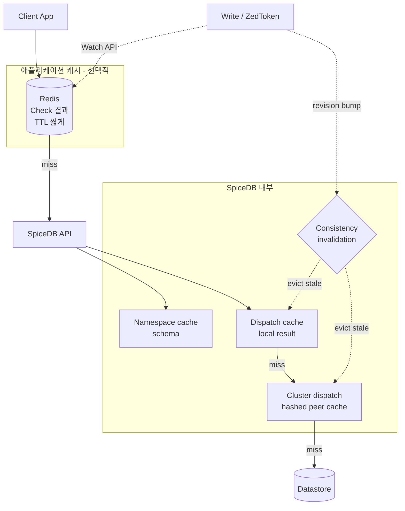
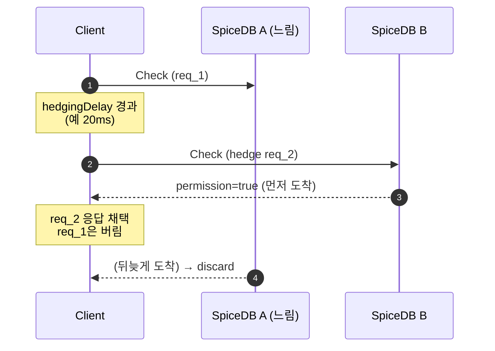

# CH8. 캐싱과 성능

## 학습 목표

- SpiceDB의 <strong>4계층 캐시</strong>(namespace / dispatch / cluster dispatch / consistency-aware invalidation)를 구분하고 설정할 수 있다.
- Request hedging을 클라이언트·서버 양쪽에서 적용해 tail latency를 깎는다.
- gRPC 재시도 전략(무엇을 재시도할지, 무엇은 하면 안 되는지)을 원칙으로 세운다.
- 애플리케이션 측 read-through cache를 안전하게 설계하고, 언제 쓰면 안 되는지 안다.
- LookupResources의 성능 함정과 anti-pattern을 피해 p99 목표를 방어한다.

## SpiceDB의 캐시 계층

SpiceDB가 초당 수천~수만 Check를 2자리 ms 이내에 소화하는 비결은 <strong>캐시</strong>다. 실전 측정에서 cache hit rate가 80%를 넘는 게 일반적이고, 튜닝 잘 한 환경은 95%까지 올라간다. 캐시가 망가지면 레이턴시와 DB 부하가 동시에 폭주한다.

**1. Namespace cache — 스키마 in-memory**

Schema(Definition 목록, relation/permission 정의)를 SpiceDB 프로세스 메모리에 통째로 올린다. 스키마는 자주 안 바뀌고, 바뀔 땐 전체 flush로 처리한다. 읽기 비용이 거의 0이라 Check 경로에서 스키마 lookup은 완전히 무시할 수 있다.

**2. Dispatch cache — Check 결과 메모이제이션**

같은 `(resource, permission, subject)` Check 결과를 노드 로컬 메모리에 캐시한다. consistent hashing으로 같은 튜플은 항상 같은 노드로 들어오므로 반복 Check가 메모리 hit로 끝난다.

**3. Cluster dispatch cache — 노드 간 공유**

API 요청이 특정 노드로 들어와도, 내부 dispatch는 해시에 따라 다른 노드로 포워딩된다. 결과적으로 캐시가 <strong>클러스터 전체에 퍼져</strong> 있으면서도 어느 쿼리든 단 한 노드만 검사하면 된다.

**4. Consistency-aware invalidation**

ZedToken이 이 캐시를 안전하게 만든다. 관계가 쓰여서 revision이 올라가면, 오래된 캐시 엔트리는 조용히 evict된다. stale 응답은 기본적으로 허용되지 않는다(`minimize_latency` 모드만 제외).



## 캐시 관련 설정

```bash
spicedb serve \
  --namespace-cache-max-cost=32MiB \
  --dispatch-cache-max-cost=30% \
  --dispatch-cluster-cache-max-cost=70%
```

SpiceDB 캐시는 내부적으로 <strong>Ristretto</strong>를 쓰기 때문에, 한도는 엔트리 수가 아니라 <strong>메모리 비용(바이트 단위 또는 인스턴스 메모리 비율)</strong>으로 지정한다. 엔트리 수에 해당하는 `--dispatch-cache-num-counters`도 있지만, 운영 튜닝의 핵심 레버는 `max-cost` 쪽이다.

| 설정 | 의미 | 권장값 |
|---|---|---|
| `--namespace-cache-max-cost` | 스키마 캐시 메모리 한도 (절대값) | 32MiB 정도로 충분 |
| `--dispatch-cache-max-cost` | 로컬 dispatch 결과 캐시 비율 | 인스턴스 메모리의 30% |
| `--dispatch-cluster-cache-max-cost` | 클러스터 dispatch 캐시 비율 | 인스턴스 메모리의 70% |

인스턴스 메모리의 30~70%를 캐시에 할당하는 비율 관점으로 조정한다. OOM을 보기보다는 <strong>비율을 넉넉히 주고</strong> 모니터링으로 실제 사용량·히트율을 추적하는 게 안전하다.

::: tip 캐시 크기는 "너무 작게"가 가장 위험하다
캐시가 LRU로 계속 쫓겨나면 hit rate가 급락하면서 DB QPS가 폭증한다. 차라리 메모리를 더 주고 90%+ hit rate를 유지하는 편이 훨씬 싸다. DB 비용 한 단위가 SpiceDB RAM 비용보다 비싼 경우가 많다.
:::

## Request Hedging

p99 latency를 잡는 가장 강력한 레버다. 아이디어는 단순하다.

> "요청 A를 보냈는데 p95 시간이 지나도록 응답이 없으면, <strong>동일 요청을 하나 더</strong>(hedge) 발사하고 먼저 온 응답을 채택한다."

한 요청이 느린 경로(콜드 캐시, GC pause, 네트워크 지연)를 탔을 때 그 tail을 잘라낸다. 전체 추가 부하는 매우 작다. 임계값을 p95로 잡으면 전체의 5%만 여분 요청이 나가기 때문이다.

### 서버 측 (내부 dispatch)

SpiceDB 내부 dispatch에는 이미 재시도·타임아웃 계층이 있다. 클러스터 내 특정 노드가 느려지면 다른 노드로 넘어가는 로직이 자동이다. 별도 설정보다는 <strong>`--dispatch-upstream-timeout` 튜닝</strong>이 포인트다.

### 클라이언트 측 — 짧은 예

Go gRPC 클라이언트라면 hedging은 service config로 활성화한다.

```go
// service config (JSON)의 hedgingPolicy
const sc = `{
  "methodConfig": [{
    "name": [{"service": "authzed.api.v1.PermissionsService"}],
    "hedgingPolicy": {
      "maxAttempts": 2,
      "hedgingDelay": "0.020s",
      "nonFatalStatusCodes": ["UNAVAILABLE", "DEADLINE_EXCEEDED"]
    }
  }]
}`

conn, _ := grpc.Dial(
    addr,
    grpc.WithDefaultServiceConfig(sc),
    grpc.WithTransportCredentials(creds),
)
```

`hedgingDelay`는 첫 요청의 p95 latency 근처로 잡는다. <strong>2회 시도 정도가 스윗 스팟</strong>이다. 3회 이상 가면 여분 부하가 급증하지만 tail은 별로 안 줄어든다.



::: warning hedging은 멱등 연산에만
Check, LookupResources 같은 <strong>읽기</strong>는 안전하다. Write는 precondition이 걸려 있지 않으면 중복 적용 위험이 있다. service config에서 write 메서드는 명시적으로 제외하라.
:::

## 재시도 전략

gRPC 재시도는 의외로 까다롭다. 원칙을 정리한다.

### 재시도해야 하는 것

- `UNAVAILABLE` — 서버 일시 불가, 로드밸런서 reconnect. 거의 항상 재시도 OK.
- `DEADLINE_EXCEEDED` — 타임아웃. 재시도 가치 있음(hedging으로 대체 가능).
- `RESOURCE_EXHAUSTED` — 레이트 리밋. <strong>반드시 backoff</strong> 두고 재시도.

### 재시도하면 안 되는 것

- `INVALID_ARGUMENT`, `FAILED_PRECONDITION`, `NOT_FOUND` — 다시 보내도 결과 같다. 에러 로깅하고 상위로 올린다.
- `PERMISSION_DENIED`, `UNAUTHENTICATED` — 자격 문제. 재시도로 해결 안 된다.

### 지수 백오프 + 지터

```
wait = min(maxWait, baseWait * 2^attempt) * (0.5 + rand() * 0.5)
```

baseWait 50ms, maxWait 2s, 최대 3회 정도가 일반적. <strong>지터</strong>(±50%)를 반드시 섞어 thundering herd를 막는다.

### Write는 precondition이 필수

```
WriteRelationships {
  preconditions: [{
    operation: MUST_MATCH,
    filter: { resource_type: "document", optional_resource_id: "readme",
              optional_relation: "viewer", optional_subject_filter: "user:alice" }
  }],
  updates: [...]
}
```

precondition 없이 Write를 재시도하면 중복 tuple이 써질 수 있다(동일 tuple은 upsert지만, delete→create 패턴은 레이스 난다). <strong>preconditions로 멱등성을 강제</strong>한 뒤 재시도하라.

## Read-through Cache 패턴 (애플리케이션 측)

아주 뜨거운 Check(예: 홈피드 feed item 1000개에 대한 view 권한)는 애플리케이션 레벨 Redis 캐시를 한 겹 더 얹는 게 실전 효과가 크다. 단, <strong>안전 장치</strong>가 따라붙어야 한다.

### 기본 패턴

```python
def can_view(user_id, doc_id):
    key = f"perm:view:{doc_id}:{user_id}"
    cached = redis.get(key)
    if cached is not None:
        return cached == "1"

    zed_token = get_latest_zedtoken()  # 애플리케이션이 추적
    resp = spicedb.check_permission(
        resource=f"document:{doc_id}",
        permission="view",
        subject=f"user:{user_id}",
        consistency=at_least_as_fresh(zed_token),
    )
    redis.setex(key, 60, "1" if resp.has_permission else "0")
    return resp.has_permission
```

### Watch API로 invalidate

관련 tuple이 바뀌면 Redis 키를 즉시 지운다.

```python
for update in spicedb.watch(
    object_types=["document"],
    optional_start_cursor=last_cursor,
):
    # update에서 affected (resource, subject) 추출
    redis.delete(f"perm:view:{update.resource_id}:*")
```

### 짧은 TTL은 보험

Watch 구독이 끊겼거나 이벤트를 놓쳤을 때를 대비해 <strong>TTL을 짧게</strong> 잡는다(보통 30~120초). 민감 리소스는 더 짧게, 혹은 캐시 자체를 금지한다.

::: warning 민감 권한은 캐시하지 마라
결제·관리자 권한·개인정보 열람 같이 <strong>한 번 잘못 허용되면 돌이킬 수 없는 권한</strong>은 애플리케이션 캐시 대상에서 제외해야 한다. stale 허용을 절대 두면 안 된다. SpiceDB 내부 캐시는 ZedToken 기반 invalidation이 있지만, Redis는 그게 없으므로 책임이 애플리케이션에 있다.
:::

## LookupResources 성능 함정

<strong>LookupResources</strong>(한 사용자가 접근할 수 있는 리소스 전부 나열)는 본질적으로 비싸다. Check가 정방향 하나의 질의라면, Lookup은 역방향으로 그래프를 전부 훑어야 한다.

### 피해야 할 패턴

```
# 사용자의 모든 문서를 한번에 가져오기
lookup_resources(resource="document", permission="view", subject="user:alice")
# → alice가 뷰어인 문서 10만 개가 돌아옴. 응답 크고 느림.
```

### 개선 전략

**1. 페이지네이션**

```python
cursor = None
while True:
    resp = lookup_resources(
        resource="document", permission="view", subject="user:alice",
        limit=100,
        cursor=cursor,
    )
    for item in resp.items:
        ...
    cursor = resp.cursor
    if not cursor:
        break
```

**2. DB 질의 + Check post-filter**

더 일반적으로는 <strong>애플리케이션 DB에서 후보를 좁힌 뒤</strong>, 수십 개 단위의 Check(CheckBulkPermissions)로 필터링한다.

```python
candidates = db.query("SELECT id FROM documents WHERE workspace_id=? LIMIT 100", ws)
results = spicedb.check_bulk(
    items=[(f"document:{id}", "view", f"user:{user_id}") for id in candidates],
)
visible = [id for id, r in zip(candidates, results) if r.has_permission]
```

페이지 하나당 Check 100개면 충분히 빠르다. Lookup으로 10만 개 긁는 것보다 압도적으로 낫다.

## 성능 지표 베이스라인

단일 Postgres + SpiceDB 3 인스턴스(2 vCPU / 4GB RAM) 표준 구성 기준이다.

| 지표 | 목표값 | 비고 |
|---|---|---|
| Check p50 | 1~3 ms | 캐시 hit 기준 |
| Check p99 | ≤ 10 ms | 80%+ hit rate |
| CheckBulkPermissions (100개) | ≤ 30 ms | 병렬 처리 |
| Cache hit rate | ≥ 80% | metrics 지속 관찰 |
| 1000 QPS 기준 CPU | 인스턴스당 40~60% | 여유 두고 스케일아웃 |

이 숫자가 안 나온다면 거의 대부분 원인은 <strong>캐시 hit rate 저하</strong>다. dispatch 설정, hash ring, cache size를 먼저 본다.

## Anti-pattern 목록

::: danger 이것들은 하지 마라
- <strong>매 요청 fully_consistent</strong> — 모든 Check에 최신 consistency를 요구하면 캐시가 통째로 무의미해진다. 상태 변경 직후에만 ZedToken `at_least_as_fresh`를 쓰고, 나머지 경로는 `minimize_latency`로 기본 설정한다. `at_exact_snapshot`은 특정 ZedToken 시점을 고정하는 옵션이라 주기적 갱신용이 아니라 <strong>재현·디버깅이 필요할 때만</strong> 쓴다.
- <strong>고루틴 대량 병렬 Check</strong> — 1000개 Check를 무제한 고루틴으로 뿌리면 connection/concurrency 폭발. 반드시 `CheckBulkPermissions`나 semaphore로 동시성 제한.
- <strong>LookupResources로 UI 목록 만들기</strong> — 목록은 애플리케이션 DB 기본, 권한은 Check로 post-filter.
- <strong>재시도 타임아웃 중첩</strong> — 클라이언트 타임아웃 5s, 서버 재시도 3번×2s = 실제 대기 더 길어짐. budget을 전체 관점에서 설계.
- <strong>Redis 캐시에 TTL 없이 저장</strong> — Watch 누락 시 stale이 영구. 반드시 안전장치 TTL을 깔 것.
:::

## 핵심 정리

::: tip 핵심 정리
- <strong>캐시가 80%+ hit해야 SpiceDB가 싸진다</strong>. namespace / dispatch / cluster dispatch / consistency invalidation 4계층이 함께 돌아간다.
- <strong>cache size는 아끼지 마라</strong>. 인스턴스당 수백 MB를 허용하고 실제 사용량으로 튜닝. 캐시 부족이 DB 비용을 몇 배로 튀긴다.
- <strong>Hedging</strong>으로 tail latency를 자른다. 임계값 = p95, maxAttempts = 2. 읽기에만 적용.
- <strong>재시도는 UNAVAILABLE / DEADLINE_EXCEEDED / RESOURCE_EXHAUSTED만</strong>, exponential backoff + jitter. Write는 precondition으로 멱등성 확보.
- <strong>애플리케이션 read-through 캐시</strong>는 Watch API 구독 + 짧은 TTL로만 안전. 민감 권한은 캐시 금지.
- <strong>LookupResources 함정</strong>: 역방향 질의는 비싸다. 페이지네이션, DB 후보 + CheckBulkPermissions post-filter로 우회.
- <strong>베이스라인</strong>: Check p50 1~3ms, p99 ≤ 10ms, cache hit ≥ 80%. 못 맞추면 캐시 설정부터 점검.
:::

## 다음 챕터

CH9에서는 성능을 넘어 <strong>관측성</strong>을 다룬다. OpenTelemetry 트레이싱, Prometheus 메트릭, 디버그 도구(zed permission debug)로 "느린 Check가 대체 어디서 느린지"를 실시간으로 추적하는 방법을 정리한다.
