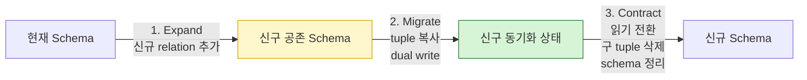
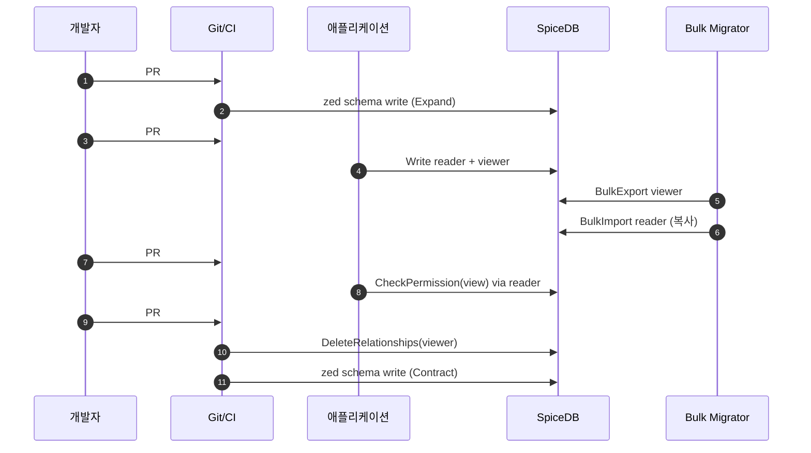

# CH10. 스키마 마이그레이션

## 학습 목표

- Schema가 단순한 구조 선언이 아니라 "저장된 tuple의 의미 계약"임을 이해한다.
- Additive·Destructive 변경을 구분하고, Expand → Migrate → Contract 3단계 패턴으로 무중단 전환한다.
- `viewer` → `reader` 같은 실전 rename 시나리오를 코드와 tuple 마이그레이션까지 연결해 본다.
- Schema를 Git으로 버전 관리하고, CI에서 validation·assertion으로 회귀 테스트를 돌린다.

## 왜 Schema 마이그레이션은 어려운가

Schema는 SpiceDB에 저장된 모든 tuple의 "해석 규칙"이다. `document:readme#viewer@user:alice` 같은 tuple이 있어도, schema에서 `document` 타입의 `viewer` relation이 사라지면 그 tuple은 순간 해석 불가능한 쓰레기가 된다. 애플리케이션 코드의 상수를 바꾸는 것과는 결이 다르다. 수천·수만 개의 저장된 관계가 동시에 의미를 잃기 때문이다.

그래서 Schema 변경은 코드 배포보다는 데이터베이스 마이그레이션에 가깝다. 한번 깨지면 복구가 어렵고, 그동안 모든 Check는 false로 떨어진다. 권한 시스템에서 false는 "접근 불가"다. 사용자 입장에서는 전면 장애와 구분되지 않는다.

## 기본 원칙 — Additive는 안전, Destructive는 3단계

변경을 두 종류로 분류해 두면 사고가 줄어든다.

**Additive 변경**은 "기존 의미를 유지한 채 무언가를 추가"하는 것이다. 새로운 definition 추가, 새로운 relation 추가, 새로운 permission 추가가 여기 속한다. 기존 tuple은 그대로 해석 가능하고, 새 기능만 붙는다. 대부분 바로 올려도 된다.

**Destructive 변경**은 기존 의미를 "재정의·삭제·변경"하는 것이다. relation 이름 변경, relation 타입 변경, permission 식 축소, Caveat 추가가 여기 속한다. 기존 tuple이 그대로는 더 이상 유효하지 않거나 다르게 해석된다. 반드시 3단계 패턴을 쓴다.

Schema는 반드시 Git으로 버전 관리한다. `schema/schema.zed` 파일을 저장소에 두고, 모든 변경은 PR·리뷰·CI 검증을 거친다. 프로덕션 적용은 `zed schema write`를 사람이 직접 치지 않고, 관리된 배포 파이프라인이 승인 후 수행한다.

## Zero-Downtime 3단계 패턴: Expand → Migrate → Contract

데이터베이스 스키마 마이그레이션의 expand-contract 패턴과 이름이 같고 철학도 같다. 중간에 "신구 모두 유효한 상태"를 일부러 만들고 안전하게 건너간다.

**1단계: Expand**

신규 relation·permission을 schema에 추가한다. 기존은 건드리지 않는다. 이 시점에 schema write는 끝나지만 실제 사용은 아직 아무도 안 한다.

**2단계: Migrate**

기존 tuple을 신규 relation으로 복사한다. `BulkExport` → 필터링 → `BulkImport` 조합이나 Watch API 기반 실시간 마이그레이터를 쓴다. 동시에 애플리케이션의 쓰기 경로는 "양쪽 모두에 기록"(dual write)하도록 배포한다. 읽기는 아직 기존 쪽. 이 단계가 가장 길고, 며칠~몇 주 걸린다.

**3단계: Contract**

애플리케이션 읽기를 신규 relation으로 전환한다. 충분한 검증 후 기존 tuple을 삭제하고, 마지막으로 schema에서 기존 relation을 제거한다.



## 예시 시나리오: `viewer` → `reader` rename

간단해 보이지만 아주 흔한 실수다. "이름만 바꾸면 되지"라고 schema만 업데이트하면 기존 모든 tuple이 끊어진다. 올바른 절차는 다음과 같다.

**Step 1. Expand**

```
definition document {
    relation viewer: user       // 기존 유지
    relation reader: user       // 신규 추가
    relation editor: user

    permission view = viewer + reader + editor
}
```

`view`는 이제 `viewer`와 `reader` 둘 다 허용한다. 기존 사용자도, 신규 tuple을 가진 사용자도 접근 가능하다.

**Step 2. Migrate**

```go
// 기존 viewer tuple을 모두 읽어 reader로 복사
cursor := ""
for {
    resp, _ := spicedb.BulkExportRelationships(ctx, &pb.BulkExportRelationshipsRequest{
        RelationshipFilter: &pb.RelationshipFilter{
            ResourceType:     "document",
            OptionalRelation: "viewer",
        },
        Cursor: cursor,
    })
    var newRels []*pb.Relationship
    for _, r := range resp.Relationships {
        copied := *r
        copied.Relation = "reader"
        newRels = append(newRels, &copied)
    }
    spicedb.BulkImportRelationships(ctx, &pb.BulkImportRelationshipsRequest{
        Relationships: newRels,
    })
    if resp.AfterResultCursor == "" { break }
    cursor = resp.AfterResultCursor
}
```

동시에 애플리케이션 쓰기 경로를 배포한다. 새 공유가 발생하면 `reader`에 기록. 기존 `viewer`는 점진적으로 소멸한다. 신중을 기한다면 과도기 동안 dual write(양쪽 기록)로 가고, 충분한 기간 후 `reader`만으로 전환한다.

**Step 3. Contract**

애플리케이션이 완전히 `reader`만 쓰고 있는지 확인한 뒤, `viewer` tuple을 bulk delete하고 schema에서 `viewer`를 제거한다.

```
definition document {
    relation reader: user
    relation editor: user

    permission view = reader + editor
}
```



총 4개의 PR이 필요하다. 각 PR은 이전 배포가 안정된 뒤에 다음 단계로 넘어간다. 성급함은 금물.

## Permission 재정의 (상속 경로 변경)

Relation은 그대로 두고 permission 식만 바꾸는 경우도 많다. 예컨대 `view = viewer + edit`에 폴더 상속을 추가해 `view = viewer + edit + parent->view`로 바꾼다고 하자.

이 변경의 영향을 먼저 예측해야 한다. 새 식은 기존 식을 **확장**한다. 즉 view가 true였던 사용자는 여전히 true이고, 추가로 folder viewer인 사용자가 document view도 얻는다. 확장 방향은 일반적으로 "사용자 안전"이다(누군가 못 보던 것을 보게 되는 것은 서비스 정책 이슈이지만 시스템 장애는 아니다).

반대로 `view = viewer + edit`를 `view = viewer`로 좁히면 edit만 있는 사용자가 순간 view를 잃는다. 이건 파급이 크다. 애플리케이션 UI가 갑자기 "읽기 거부"를 뿌리게 된다. 좁히는 방향의 변경은 사용자 공지·마이그레이션 윈도우가 필요하다.

어떤 방향이든 validation YAML에 기존 schema에서의 동작과 신규 schema에서의 동작을 모두 assertion으로 박아두고 CI에서 돌린다. "예상한 변화만 일어났는가"를 기계적으로 증명할 수 있어야 한다.

## Caveat 추가·제거

Caveat를 기존 relation에 더하는 것은 `relation viewer: user`를 `relation viewer: user with ip_allowlist`로 바꾸는 것이다. 문제는 기존 tuple에 context가 없다는 점이다. context 없는 tuple은 Caveat 평가에서 `unknown`이 되거나 실패한다.

해결책은 tuple을 모두 재생성하는 것이다. 기존 `viewer` tuple을 BulkExport로 꺼내 Caveat context를 붙여 BulkImport로 다시 넣는다. 초기 context는 보수적으로 "모든 IP 허용" 같은 기본값을 주고, 이후 실제 정책을 점진 반영한다. 대규모 tuple에서는 이 과정이 며칠이 걸리므로 반드시 점진 배포다.

::: warning Caveat 도입은 Destructive 변경이다
Caveat 추가를 "안전한 Additive"로 착각하기 쉽지만 아니다. 기존 tuple의 해석이 바뀌므로 Expand-Migrate-Contract를 따라야 한다. 신규 `viewer_v2` relation을 만들어 마이그레이션하는 편이 깔끔한 경우가 많다.
:::

## Schema 버저닝 전략

```
repo/
  schema/
    schema.zed            # 현재 schema
    validation.yaml       # assertion 테스트
    changelog.md          # 변경 이력
  .github/workflows/
    schema-ci.yml         # zed validate + assertion
  deploy/
    schema-apply.sh       # 승인된 배포만 zed schema write
```

Git에 schema를 두면 코드 리뷰 문화를 그대로 적용할 수 있다. PR에는 "이 변경이 Additive인가 Destructive인가", "Expand/Migrate/Contract 중 어느 단계인가"를 템플릿으로 강제한다. CI는 `zed validate schema.zed`와 `zed validate --schema schema.zed validation.yaml`을 돌려 회귀를 막는다.

프로덕션 적용은 사람이 직접 `zed schema write`를 하는 것을 금지하고, 승인 파이프라인에서만 실행되도록 한다. 실수 한 번에 전체 권한이 날아갈 수 있기 때문이다.

## 관측성과 롤백

Schema 배포 직후에 반드시 봐야 하는 지표가 있다. **Check 성공률(allowed 비율)**과 **Check latency**다. 성공률이 갑자기 떨어지면 새 permission 식이 기존 tuple과 맞지 않아 거부가 늘어난 것이고, latency가 튀면 새로운 arrow가 깊이를 키웠다는 신호다. 둘 중 하나라도 이상하면 즉시 롤백.

롤백은 "이전 schema를 다시 write"하는 것만으로 끝나지 않는다. Migrate 단계에서 신규 relation에 tuple이 쌓였다면 그걸 정리해야 한다. 그래서 Expand-Migrate-Contract 중 Migrate 이전에 문제를 잡는 것이 최선이다. Expand 단계는 부담이 거의 없으므로 일찍 배포하고 충분히 관찰한다.

## 흔한 함정

::: warning 원자성 확인
`zed schema write`는 서버 내부에서 원자적으로 적용되지만, 네트워크 타임아웃·중간 실패 시 클라이언트는 확신하기 어렵다. 반드시 `ReadSchema`로 최종 상태를 재확인하는 검증 스텝을 파이프라인에 넣는다.
:::

::: warning Dual write 기간의 Watch 이중 처리
Watch API로 relationship 변경을 구독하는 외부 consumer(검색 인덱스·감사·캐시)는 dual write 기간 동안 같은 논리적 이벤트를 두 번 받을 수 있다. consumer는 반드시 멱등해야 하고, `(resource, relation, subject)` 튜플 수준의 dedup 로직이 있어야 한다.
:::

::: info Schema 변경의 의사결정 체크리스트
1. 이 변경은 Additive인가 Destructive인가?
2. 신구 식의 view 범위는 넓어지는가, 좁아지는가?
3. Validation YAML에 기존·신규 assertion이 모두 있는가?
4. Migrate 단계에서 dual write가 필요한가?
5. 롤백 시나리오와 데이터 정리 계획이 있는가?
6. Check 성공률·latency 대시보드가 준비됐는가?
:::

## 다음 챕터

[CH11. Keycloak/OAuth 경계](/study/spicedb/11-keycloak-integration)에서는 인증(Keycloak)과 인가(SpiceDB)의 역할을 분리하고, JWT의 Subject를 SpiceDB user로 매핑하는 실전 패턴을 다룬다.

::: tip 핵심 정리
- Schema는 저장된 tuple의 의미 계약이다. 변경은 코드 배포보다 DB 마이그레이션에 가깝다.
- Additive(추가)는 안전, Destructive(변경·삭제)는 Expand → Migrate → Contract 3단계를 지킨다.
- Relation rename, permission 재정의, Caveat 도입 모두 Destructive다. "간단해 보이는 변경"이 가장 위험하다.
- Schema는 Git으로 관리하고, CI에서 `zed validate` + validation YAML로 회귀 테스트를 강제한다.
- 배포 후에는 Check 성공률과 latency를 본다. Migrate 이전 단계에서 이상을 잡는 것이 최선의 안전장치다.
:::
