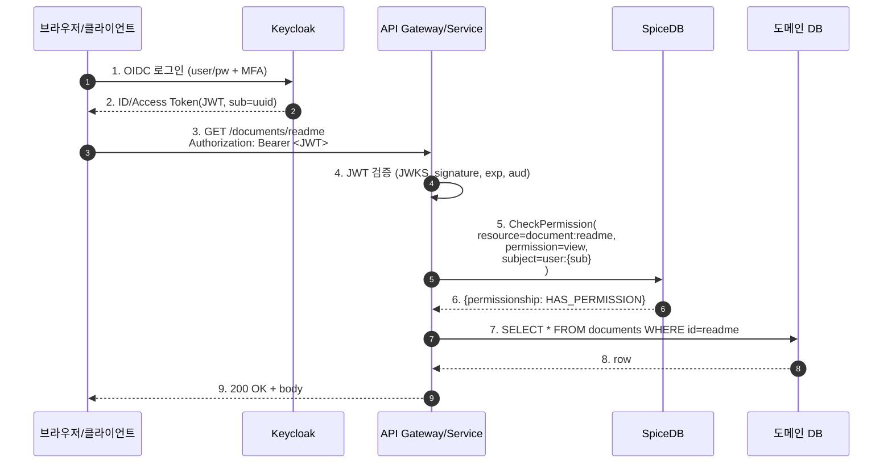

# CH11. Keycloak/OAuth 경계

## 학습 목표

- AuthN(Keycloak)과 AuthZ(SpiceDB)의 경계를 명확히 긋고 두 시스템을 섞지 않는다.
- JWT의 `sub` 클레임을 SpiceDB Subject로 매핑하는 3가지 전략(UUID / email / 내부 userId)을 비교한다.
- Keycloak Group을 SpiceDB `organization#member` tuple로 sync하는 이벤트 기반 아키텍처를 설계한다.
- Fail-open/Fail-close 선택 기준과 JWT 수명 주기가 권한 변경 반영에 미치는 영향을 파악한다.

## 역할 분리 원칙

Keycloak과 SpiceDB를 함께 쓰는 이유는 둘이 서로 다른 질문에 답하기 때문이다.

- **Keycloak(AuthN, 인증)** — "이 요청을 보낸 자가 누구인가?" 비밀번호·MFA·SSO·SAML·OIDC 같은 신원 확인 프로토콜을 처리한다.
- **SpiceDB(AuthZ, 인가)** — "이 사람이 이 리소스에 이 행동을 할 수 있는가?" 관계와 권한의 그래프를 푼다.

경계가 흐려지면 시스템 전체가 망가진다. Keycloak의 ClientRole이나 Group을 권한 판정에 직접 쓰기 시작하면 조금씩 인가 정책이 토큰에 박히게 되고, 어느 순간 "권한 변경을 위해 토큰을 재발급해야 하는" 구조가 된다. 반대로 SpiceDB에 사용자 비밀번호나 세션 토큰을 넣으려고 하면 감사·보안 책임이 뒤섞인다.

::: info Keycloak의 Authorization Services는?
Keycloak도 자체 인가 기능(Authorization Services·UMA)을 제공한다. 하지만 이는 정책 기반(Policy-based, RBAC/ABAC)이라 관점이 다르다. 수천만 리소스·수억 relationship 규모의 ReBAC에는 맞지 않는다. 자세한 비교는 [Keycloak CH8. Authorization Services와 UMA](/study/keycloak/08-authz-uma)를 참고하라. 이 스터디에서는 인가를 전적으로 SpiceDB에 맡긴다.
:::

## 전체 요청 플로우

일반적인 웹 애플리케이션에서의 한 요청을 따라가 보자.



핵심은 4번과 5번 사이다. 4번에서 "누구인가(sub)"가 결정되고, 5번에서 "무엇을 할 수 있는가"를 SpiceDB에 묻는다. 이 경계가 깨지면 시스템 전체의 보안 추론이 무너진다.

## Subject 매핑 전략

JWT의 `sub` 클레임을 SpiceDB의 어떤 형식으로 바꿀지가 관건이다. 세 가지 전략이 있다.

| 전략 | 예시 | 장점 | 단점 | 추천 상황 |
| :--- | :--- | :--- | :--- | :--- |
| A. sub 그대로(UUID) | `user:550e8400-e29b-41d4-a716-446655440000` | 가장 단순, 불변 | 로그에서 사용자 식별이 어려움 | 기본 추천 |
| B. email/username | `user:alice@example.com` | 가독성 높음 | 사용자 정보 변경 시 권한 재연결 필요 | 내부 도구에만 |
| C. 내부 userId | `user:42` (앱 DB) | 애플리케이션 스키마와 자연스러운 join | `sub` → userId 매핑 테이블 유지 필요 | 여러 앱이 단일 Keycloak 공유 |

대부분의 프로덕션 권한 시스템은 **방법 A**를 쓴다. Keycloak `sub`는 사용자별 불변 UUID다. 이메일·이름이 바뀌어도 `sub`는 그대로이므로 권한 tuple이 끊길 일이 없다.

방법 C는 "단일 Keycloak realm이 여러 애플리케이션을 서빙하고, 각 애플리케이션이 자기 DB의 userId를 중심으로 조인하고 싶을 때" 유용하다. 대신 로그인 첫 순간에 `sub` → userId 매핑 레코드를 만들어야 하고, 그 매핑 저장소의 가용성이 곧 인가 가용성이 된다.

## 그룹·조직 연결

조직 단위 권한은 SpiceDB에서 `organization#member` 같은 subject relation으로 표현한다. 문제는 "조직 멤버십이 어디에 사는가"이다. Keycloak Group을 그대로 쓰면 편하지만, SpiceDB는 Keycloak을 모른다. 둘을 sync해야 한다.

sync 방식은 둘 중 하나다.

**1. 이벤트 기반 sync**

Keycloak Event Listener SPI로 `ADD_GROUP_MEMBER`·`REMOVE_GROUP_MEMBER` 이벤트를 Kafka·Webhook으로 내보내고, 컨슈머가 SpiceDB에 `WriteRelationships`로 반영한다. 실시간성·감사성이 좋다.

**2. 주기적 reconciliation**

별도 스케줄러가 Keycloak API로 그룹 멤버를 읽고 SpiceDB 상태와 비교해 diff를 반영한다. 이벤트를 놓쳤을 때의 복구용으로 이벤트 sync와 병행하는 것이 안전하다.

```mermaid
flowchart LR
    KC[Keycloak<br>User / Group] -->|Event SPI| Q[Kafka/NATS<br>group.member.changed]
    Q --> Worker[Sync Worker]
    Worker -->|멱등 WriteRelationships| S[SpiceDB<br>organization#member]

    KC -. 주기적 reconcile .-> Recon[Reconciler]
    Recon --> S

    S -.->|organization#member@user:sub| App[App Service<br>CheckPermission]
    App -->|JWT sub| S
```

sync 워커는 반드시 **멱등**해야 한다. 같은 이벤트가 두 번 와도 중복 tuple이 생기지 않아야 한다. SpiceDB의 `TOUCH` operation이나 `MUST_NOT_MATCH` precondition으로 보장한다.

## JWT 검증 코드 예시 (Go)

```go
import (
    "context"
    "github.com/lestrrat-go/jwx/v2/jwt"
    "github.com/lestrrat-go/jwx/v2/jwk"
    pb "github.com/authzed/authzed-go/proto/authzed/api/v1"
    "github.com/authzed/authzed-go/v1"
)

var keycloakJwks jwk.Set // 부팅 시 JWKS endpoint에서 받아둠

func authorize(ctx context.Context, raw string, docID string) (bool, error) {
    // 1. JWT 검증: signature, exp, aud
    token, err := jwt.Parse([]byte(raw),
        jwt.WithKeySet(keycloakJwks),
        jwt.WithAudience("my-api"),
        jwt.WithValidate(true),
    )
    if err != nil {
        return false, err
    }
    sub := token.Subject()

    // 2. SpiceDB Check
    resp, err := client.CheckPermission(ctx, &pb.CheckPermissionRequest{
        Resource: &pb.ObjectReference{
            ObjectType: "document", ObjectId: docID,
        },
        Permission: "view",
        Subject: &pb.SubjectReference{
            Object: &pb.ObjectReference{
                ObjectType: "user", ObjectId: sub,
            },
        },
        // 일반 read: minimize_latency. 민감한 read-after-write는 at_least_as_fresh(lastZedToken) 사용.
        Consistency: &pb.Consistency{
            Requirement: &pb.Consistency_MinimizeLatency{MinimizeLatency: true},
        },
    })
    if err != nil {
        return false, err // 장애 시 fail-close
    }
    return resp.Permissionship == pb.CheckPermissionResponse_PERMISSIONSHIP_HAS_PERMISSION, nil
}
```

30줄이면 충분하다. JWT 검증과 SpiceDB Check가 별개 단계로 분리되어 있음에 주목하라. 토큰 검증은 게이트웨이에서, Check는 서비스에서 따로 수행하기도 한다.

::: tip Consistency 옵션 선택
일반 read 경로는 `minimize_latency`로 stale을 허용하고 캐시 효율을 살린다. 권한 변경 직후(방금 revoke한 사용자의 재접근 차단 등)에는 애플리케이션이 추적하는 최신 ZedToken으로 `at_least_as_fresh`를 쓴다. 그래야 "즉시 반영"이 실제로 보장된다. 기본값을 `minimize_latency`로 두되, write 경로에서 응답받은 ZedToken을 세션·캐시에 저장해 두었다가 민감 판정에 사용하는 분기를 반드시 구현한다.
:::

## Fail-open vs Fail-close

"SpiceDB가 응답하지 않으면 어떻게 할 것인가"는 반드시 정책으로 결정해야 한다. 둘 다 위험 요소가 있다.

- **Fail-close(기본)** — SpiceDB 장애 시 모든 요청을 거부. 민감 리소스(결제·의료·개인정보)는 무조건 이쪽. 영향: SpiceDB가 죽으면 서비스도 사실상 죽는다. 그래서 SpiceDB의 가용성이 곧 서비스 가용성이다.
- **Fail-open(제한적)** — SpiceDB 장애 시 비민감 read-only 엔드포인트만 허용. 예컨대 공개 문서 목록 조회. 반드시 감사 로그에 "fail-open으로 허용됨"을 남기고, 알림을 울린다.

Keycloak이 죽으면 JWT 검증 자체가 불가능하다. 이 경우는 선택의 여지가 없다. 410/503으로 거부한다. Keycloak도 권한 시스템만큼 HA 설계가 필수다.

::: warning Fail-open은 감사가 생명
Fail-open 정책을 허용한다면, 그 경로로 들어온 모든 요청은 별도 감사 sink에 100% 기록하고, 이후에 SpiceDB가 복구된 뒤 "그때 허용된 요청 중 실제로는 거부되어야 했던 것"을 사후 검증해야 한다. 이 설계가 없다면 fail-open은 보안 구멍이다.
:::

## 토큰 수명과 권한 변경

JWT는 자기 서명(self-contained) 토큰이라 한 번 발급되면 만료 전까지는 유효하다. 여기서 미묘한 문제가 생긴다.

Alice가 프로젝트에서 제거됐다고 하자. SpiceDB `project:x#member@user:alice` tuple이 삭제된다. 그 다음 Check부터는 consistency 옵션에 따라 반영된다. `at_least_as_fresh`로 write 직후 ZedToken을 지정하면 해당 시점 이후의 상태가 보장되고, `minimize_latency` 경로는 캐시 TTL만큼의 stale이 있을 수 있다. 그런데 Alice의 JWT에 역할·그룹이 클레임으로 박혀 있고 애플리케이션이 그걸 믿는다면, 토큰 만료 전까지는 여전히 권한이 있는 것처럼 보인다.

해법은 단순하다. **권한 판정은 JWT 클레임이 아닌 SpiceDB에서**. JWT는 오직 `sub`만 신뢰한다. 그리고 revoke 같은 민감 변경 직후에는 ZedToken과 `at_least_as_fresh`로 읽어 변경이 실제로 보인 뒤 응답한다.

토큰 수명은 짧게 간다. Access Token 5~15분, Refresh Token 1일~수일. 이 조합으로 대부분의 세션 취소 요구를 만족시킬 수 있다. 자세한 설계는 [OAuth CH8. Access·Refresh Token 수명 주기](/study/oauth/08-token-lifecycle)를 참고하라.

애플리케이션 레벨 캐시(예: "이 사용자가 이 문서 보는지 10초 캐시")가 있다면 권한 변경 시 invalidation이 필요하다. SpiceDB Watch를 consumer로 붙여 해당 리소스 relation 변경을 감지하면 캐시를 비울 수 있다.

## 감사 로그 연결

사고가 터졌을 때 "언제 누가 무엇을 했는가"를 재구성하려면 세 시스템의 로그를 연결해야 한다.

- **Keycloak Event Log** — 로그인·토큰 발급·그룹 변경
- **SpiceDB Audit Log** — relationship 쓰기·schema 변경
- **애플리케이션 Access Log** — 실제 리소스 접근

공통 축은 두 개다. **trace id**(OpenTelemetry가 요청에 주입)와 **user sub**(JWT에서 추출해 모든 레이어에 전파). 로그 수집 시스템(예: Loki·Elastic)에서 이 두 키로 검색할 수 있으면 5분 만에 스토리가 재구성된다.

::: info trace id 전파 체크리스트
- API Gateway가 요청에 `traceparent` 헤더(W3C Trace Context, OpenTelemetry 권장)를 주입하는가?
- 서비스 코드가 이 헤더를 수신하고 downstream(SpiceDB, DB, 메시지 큐)으로 전파하는가?
- SpiceDB 호출에 `X-Trace-Id` 또는 OTLP span context가 전달되는가?
- 로그 출력에 `trace_id`, `user_sub` 필드가 포함되는가?
:::

## 다음 챕터

[CH12. 리소스·관계 동기화](/study/spicedb/12-resource-sync)에서는 도메인 DB와 SpiceDB 사이의 일관성을 Transactional Outbox·이벤트 기반 sync로 유지하는 패턴을 다룬다. 이번 챕터의 "Keycloak → SpiceDB"가 Subject 쪽 sync였다면, 다음은 "도메인 DB → SpiceDB" 리소스 쪽 sync다.

::: tip 핵심 정리
- Keycloak은 "누구인가", SpiceDB는 "무엇을 할 수 있는가". 둘을 섞지 않는 것이 전체 설계의 출발점이다.
- JWT `sub`를 SpiceDB Subject로 매핑할 때는 UUID 그대로가 기본 추천. 내부 userId 매핑은 여러 앱이 단일 realm을 공유할 때만.
- Keycloak Group 등 조직 멤버십은 이벤트 기반 sync + 주기적 reconcile로 SpiceDB에 옮긴다. 워커는 반드시 멱등.
- Fail-close가 기본이며, Fail-open을 허용한다면 감사 로그와 사후 검증이 필수다.
- 권한 판정은 JWT 클레임이 아닌 SpiceDB Check로. 그래야 권한 변경이 즉시 반영된다.
:::
