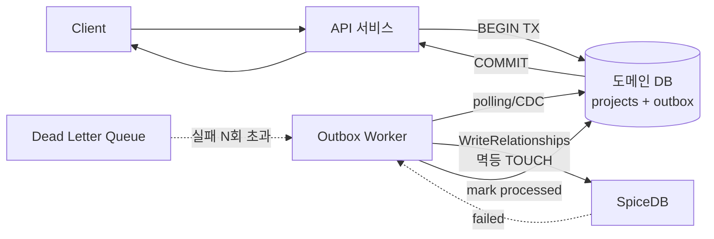
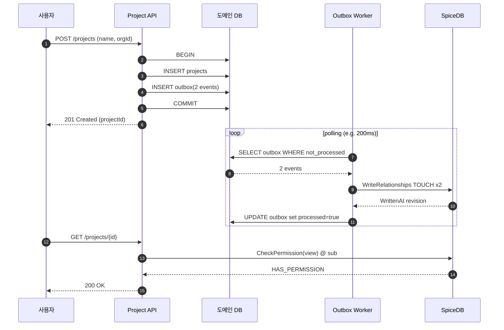

# CH12. 리소스·관계 동기화

## 학습 목표

- 도메인 DB와 SpiceDB 사이의 이중 쓰기 문제를 이해하고 Transactional Outbox로 해결한다.
- 이벤트 기반 sync에서 멱등성·순서 보장을 어떻게 확보하는지 실전 예로 익힌다.
- Watch API를 이용한 역방향 sync(SpiceDB → 검색 인덱스·캐시)의 운영 난이도를 비교한다.
- Keycloak(인증) + SpiceDB(인가) + 도메인 DB(리소스)의 3층 구조를 완성한다.

## 왜 동기화가 필요한가

프로젝트가 하나 생겼다고 하자. 애플리케이션 DB에는 `projects` 테이블에 row가 들어간다. 하지만 SpiceDB에는 `project:x#organization@organization:acme` 같은 tuple이 없다. 이 상태에서 사용자가 프로젝트에 접근하려고 하면 Check는 false를 돌려준다. "DB엔 프로젝트가 있는데 권한 없음"이라는 이상 상태다.

반대도 있다. SpiceDB에 tuple을 먼저 썼는데 DB 저장이 실패하면 "권한은 있는데 리소스는 없음" 상태가 된다. 이상 상태는 사용자 입장에서 장애와 구분되지 않고, 디버깅도 악몽이다.

그래서 "도메인 데이터의 변경"과 "SpiceDB relationship의 변경"을 **하나의 트랜잭션처럼 다루는 메커니즘**이 필요하다. 두 시스템을 진짜로 같은 트랜잭션에 넣을 수는 없으니, 패턴으로 우회한다.

## Dual Write (안티패턴)

가장 단순해 보이는 방법이다.

```go
func CreateProject(ctx context.Context, p *Project) error {
    if err := db.Save(ctx, p); err != nil {
        return err
    }
    _, err := spicedb.WriteRelationships(ctx, &pb.WriteRelationshipsRequest{
        Updates: []*pb.RelationshipUpdate{/* project#org#acme 등 */},
    })
    return err
}
```

이게 왜 나쁜가. 첫 번째 `db.Save`는 성공했는데 두 번째 `WriteRelationships`에서 네트워크 타임아웃이 나면, 프로젝트는 DB에 있는데 권한은 없는 상태가 남는다. 프로세스가 그 순간 죽으면 복구 로직조차 못 돈다.

반대 순서로 SpiceDB 먼저 써도 대칭적으로 깨진다. 두 시스템을 "순차적으로 성공하기를 바란다"는 설계는 프로덕션에서 반드시 배신한다.

::: warning Dual Write는 왜 언제나 틀리는가
네트워크가 불안정한 순간(타임아웃), 호출 프로세스가 죽는 순간(crash), 재시도가 부분적으로 성공하는 순간(멱등성 결여). 이 세 경우 중 단 하나만 발생해도 데이터 정합성이 깨진다. 분산 시스템에서 확률이 아무리 낮아도 반드시 발생한다.
:::

## Transactional Outbox 패턴 (권장)

해법은 "두 시스템에 동시에 쓰지 않는다"이다. 대신 도메인 DB의 같은 트랜잭션에 `outbox` 테이블을 두고, 거기에 "SpiceDB로 보낼 변경 이벤트"를 함께 기록한다. 별도 워커가 outbox를 폴링(또는 CDC)해 SpiceDB에 반영한다.

```
BEGIN;
  INSERT INTO projects (id, name, org_id) VALUES ('p1', 'Launch', 'acme');
  INSERT INTO outbox (id, op, payload) VALUES
    ('evt-1', 'TOUCH', '{"rel":"project:p1#organization@organization:acme"}'),
    ('evt-2', 'TOUCH', '{"rel":"project:p1#editor@user:owner"}');
COMMIT;
```

`projects` 삽입과 outbox 기록은 **같은 DB 트랜잭션**이므로 원자적이다. 둘 다 성공하거나 둘 다 실패한다. 이후 워커가 outbox 행을 읽어 SpiceDB에 `WriteRelationships`를 호출하고, 성공하면 outbox 행을 마크(또는 삭제)한다.



이 구조의 핵심 덕목은 세 가지다. **원자성**(도메인 DB와 outbox가 같이 커밋), **재시도 가능성**(SpiceDB 장애 시 worker가 나중에 다시 시도), **관찰 가능성**(outbox 테이블 자체가 아직 처리되지 않은 작업의 queue다).

CDC(Change Data Capture)를 쓰면 폴링 부하를 없앨 수 있다. Debezium으로 Postgres WAL을 읽어 outbox 삽입을 실시간 감지하고 Kafka로 흘린다.

## 이벤트 기반 (Kafka/NATS) 패턴

조직이 커지면 "권한 sync" 외에도 같은 이벤트를 듣고 싶은 소비자가 늘어난다. 검색 인덱싱·감사·알림·분석 데이터 파이프라인까지. 이때 Kafka 같은 이벤트 브로커를 중심에 놓는다.

```
Domain DB → outbox → CDC → Kafka topic: project.events
                                     ├── SpiceDB sync worker
                                     ├── Search indexer (Elasticsearch)
                                     ├── Notification service
                                     └── Analytics pipeline
```

이 방식은 **decouple이 좋고 확장이 쉽다**. 단점은 **순서 보장**과 **at-least-once 처리**가 핵심 설계 포인트가 된다는 점이다. Kafka는 파티션 내에서만 순서를 보장하므로, 같은 `resource_id`를 같은 파티션에 두는 라우팅 키 설계가 필수다. 그렇지 않으면 "생성 이벤트"가 "삭제 이벤트"보다 늦게 처리되는 악몽이 생긴다.

## 멱등성 확보

At-least-once delivery에서는 같은 이벤트가 두 번 이상 올 수 있다. 멱등하지 않으면 "같은 tuple 중복 기록"이나 "이미 삭제된 tuple을 또 삭제 시도"로 에러가 난다. 방어책은 세 가지다.

**1. SpiceDB의 TOUCH operation**

`TOUCH`는 "있으면 그대로, 없으면 생성"이다. 같은 relationship을 여러 번 TOUCH해도 결과는 한 번과 같다. 생성 이벤트 처리에서는 언제나 TOUCH가 정답이다.

**2. Precondition으로 상태 검증**

`WriteRelationshipsRequest.OptionalPreconditions`에 "이 relationship이 이미 존재하면 안 된다(`MUST_NOT_MATCH`)" 같은 조건을 넣어 중복 시도를 거절하거나, 반대로 "이미 있어야 한다(`MUST_MATCH`)"로 기대 상태를 방어한다.

**3. 외부 idempotency key 저장소**

이벤트 id를 Redis 같은 곳에 기록해 "이미 처리한 이벤트"를 skip한다. TTL은 이벤트 재전송 창 이상. 이 방식은 SpiceDB 호출 전에 한 번 더 거르므로 과부하 상황에서 특히 유용하다.

```go
func handleProjectCreated(ctx context.Context, ev ProjectCreatedEvent) error {
    // 1) 외부 idempotency 체크 (선택)
    if seen, _ := redis.SetNX(ctx, "idemp:"+ev.ID, "1", 24*time.Hour); !seen {
        return nil
    }
    // 2) SpiceDB TOUCH
    _, err := spicedb.WriteRelationships(ctx, &pb.WriteRelationshipsRequest{
        Updates: []*pb.RelationshipUpdate{
            touch("project:"+ev.ProjectID, "organization", "organization:"+ev.OrgID),
            touch("project:"+ev.ProjectID, "editor", "user:"+ev.OwnerSub),
        },
    })
    return err
}
```

## Watch를 이용한 역방향 sync

SpiceDB가 권한의 source of truth라면, 그 변경을 다른 시스템(검색 인덱스·캐시·권한 기반 알림)에 전파해야 할 때가 있다. SpiceDB의 `WatchRequest`가 그 역할을 한다. 변경 이벤트를 stream으로 받아 revision cursor를 저장해 가며 처리한다.

cursor 저장 위치에 따라 운영 난이도가 다르다.

| 저장소 | 장점 | 단점 |
| :--- | :--- | :--- |
| Postgres | 내구성, 기존 DB에 얹음 | 쓰기 부하, 트랜잭션 lock 주의 |
| Kafka offset | 자연스러운 이벤트 파이프라인 | 별도 Kafka 운영 필요 |
| Redis | 빠름 | 내구성 약함, 장애 시 cursor 유실 가능 |

처음에는 Postgres가 무난하다. watcher가 죽었다 살아나면 마지막 cursor부터 재개할 수 있도록 반드시 원자적으로 저장한다. cursor 갭이 생기면 한 windowed re-read가 가능해야 한다.

## Fail-close vs fail-open 복습

SpiceDB write가 계속 실패하면 어떻게 할 것인가. 옵션은 세 가지다.

**1. 리소스 삭제 롤백(compensating transaction)**

SpiceDB 실패 시 도메인 DB에 삽입된 `projects` row를 지운다. 이론적으로 일관성을 유지하지만 **복잡도가 지수적으로 증가**한다. 다른 테이블과의 외래키, 캐시 invalidation, 이미 전송된 알림까지 역행시켜야 한다. 권장하지 않는다.

**2. Outbox 재시도(기본)**

리소스는 그대로 두고, outbox worker가 지수 백오프로 재시도한다. N회 초과하면 Dead Letter Queue로 보내 운영자 개입. 사용자에게는 "프로젝트는 생성되었으나 권한 설정 진행 중"임을 UI에서 명확히 안내한다.

**3. 사용자에게 에스컬레이션**

일부 도메인(금융·의료)은 부분 상태가 허용되지 않는다. 이때는 SpiceDB 장애 시 요청 자체를 실패시켜 사용자가 재시도하도록 한다. 도메인 DB에도 아무것도 안 쓴다.

대부분의 SaaS는 **2번 + Dead Letter**가 합리적이다. 단 "권한 없음 상태의 리소스"는 리스트에 노출되지 않도록 애플리케이션 레벨 필터가 필요하다.

## 실전 시나리오: 프로젝트 생성

요구사항: "팀이 프로젝트를 만들면 해당 조직을 소속으로 묶고, 생성자에게 editor 권한을 부여한다."

```go
func CreateProject(ctx context.Context, req CreateProjectReq) (*Project, error) {
    project := &Project{
        ID:    uuid.NewString(),
        Name:  req.Name,
        OrgID: req.OrgID,
    }

    tx, err := db.Begin(ctx)
    if err != nil { return nil, err }
    defer tx.Rollback()

    if err := db.InsertProject(tx, project); err != nil { return nil, err }

    events := []OutboxEvent{
        {
            Op:      "TOUCH",
            Payload: fmt.Sprintf(`project:%s#organization@organization:%s`, project.ID, req.OrgID),
        },
        {
            Op:      "TOUCH",
            Payload: fmt.Sprintf(`project:%s#editor@user:%s`, project.ID, req.OwnerSub),
        },
    }
    if err := db.InsertOutboxBatch(tx, events); err != nil { return nil, err }

    if err := tx.Commit(); err != nil { return nil, err }
    return project, nil
}
```

요청 처리는 여기서 끝이다. SpiceDB 호출은 worker가 비동기로 이어받는다. 사용자가 직후에 "내 권한 확인"을 시도하면 수 초의 sync lag이 있을 수 있어, 생성 응답에는 "권한 반영까지 몇 초 걸릴 수 있습니다" 같은 힌트를 담거나, 중요 경로에서는 worker를 더 빠르게(sub-second polling) 돌린다.



## 감사와 추적

모든 outbox 이벤트에 세 가지 필드를 함께 저장한다.

- `trace_id` — 요청을 발생시킨 분산 추적 ID
- `actor_sub` — 변경을 일으킨 사용자의 Keycloak `sub`
- `reason` — 비즈니스 이유(예: "project.created", "member.added.via.invite")

이 세 축이 있으면 "2026-04-18 14:00~14:10 사이에 user:abc 권한이 늘어난 이유는 무엇이었는가"를 추적할 수 있다. 감사·규정 준수에서 반드시 요구되는 정보다.

## 안티패턴

**1. SpiceDB만 source of truth로 쓰기**

"모든 리소스 메타데이터를 SpiceDB tuple에 욱여넣으면 어차피 통합되니 편하지 않을까"라는 유혹이 있다. 하지만 SpiceDB는 **권한 그래프**에 최적화된 저장소이지 도메인 DB가 아니다. 리소스 제목·설명·타임스탬프·연관 테이블 같은 건 절대 여기에 넣지 않는다. 쿼리 기능도 부족하고, 스키마 변경 부담도 크다.

**2. SpiceDB를 이벤트 브로커로 쓰기**

Watch가 변경을 stream으로 주기 때문에 "그럼 여기서 모든 이벤트를 흘려보내자"는 유혹도 생긴다. 하지만 SpiceDB는 **권한 변경 이벤트만** 낸다. 도메인 이벤트는 Kafka에서 관리하고, SpiceDB Watch는 "권한 변경 반영"에만 쓴다.

**3. outbox 없이 애플리케이션 코드에서 retry만으로 해결**

메모리 기반 재시도는 프로세스가 죽으면 끝이다. 반드시 **내구성 있는 queue**(outbox 테이블 또는 Kafka)를 거친다.

::: info 3층 구조의 완성형
- **Keycloak** — 사용자 신원과 세션. 로그인과 SSO.
- **도메인 DB** — 리소스의 메타데이터와 비즈니스 상태.
- **SpiceDB** — 누가 무엇에 어떤 권한이 있는가의 그래프.

이 세 시스템이 각자 자기 역할만 하고, 경계 간 sync는 이벤트 기반으로 흐르는 구조가 현대 권한 시스템의 표준 모양새다.
:::

## 스터디 마무리

여기까지가 SpiceDB 스터디의 전체 여정이다. Schema 언어에서 시작해 API 전체, 실전 모델링 패턴, Caveats, 배포 토폴로지, 캐싱·관측성·마이그레이션을 지나 Keycloak 연동과 리소스 sync까지 왔다. 이 12개 챕터를 순서대로 이해하면 신규 프로젝트에 SpiceDB를 도입할 때 "어디서부터 손대야 하는가"가 보인다.

실전에서는 이론을 한 번에 적용하지 않는다. 작은 리소스 타입 하나를 골라 Schema를 그리고, 도메인 이벤트 하나를 outbox로 감싸고, Keycloak 연동을 얹고, 메트릭 대시보드를 세우는 식으로 점진 구축한다. 각 단계에서 이 스터디의 해당 챕터로 돌아와 참고 자료처럼 읽는 용도가 적합하다.

::: info 이어서 볼 자료
- [Zanzibar 스터디](/study/zanzibar/) — 개념적 뿌리. SpiceDB를 쓰다 막히는 지점은 대부분 원 논문에서 답을 얻는다.
- [Keycloak 스터디](/study/keycloak/) — 인증 서버로서의 Keycloak 운영. 특히 Group·Event SPI·Federation을 심화.
- [OAuth 스터디](/study/oauth/) — 토큰 수명·Refresh·Scope 설계를 이 스터디의 "Subject 매핑"과 맞물려 본다.
- [데이터베이스 스터디 CH16. 분산 데이터베이스](/study/database/16-distributed-db) — SpiceDB 자체도 분산 DB다. Dispatch·Consistent Hashing·Consensus 복습.
:::

::: tip 핵심 정리
- 도메인 DB와 SpiceDB를 dual write로 묶지 않는다. Transactional Outbox가 사실상 유일하게 옳은 패턴이다.
- 이벤트 기반 sync에서는 멱등성과 순서 보장이 설계의 기둥이다. TOUCH·precondition·idempotency key가 3대 도구.
- Watch API로 역방향 sync(SpiceDB → 검색·캐시)도 가능하지만 cursor 저장 전략이 운영 난이도를 결정한다.
- SpiceDB 실패 시 기본 전략은 "리소스는 두고 outbox 재시도 + DLQ". 롤백은 복잡도 폭발이므로 피한다.
- Keycloak(AuthN) + 도메인 DB(리소스) + SpiceDB(AuthZ)의 3층 구조가 현대 권한 시스템의 표준 모양이다.
:::
