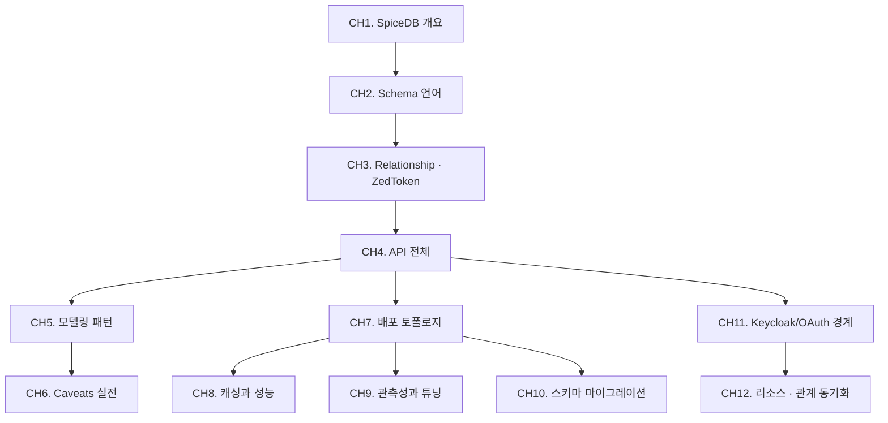

# SpiceDB 실전

SpiceDB는 [Zanzibar](/study/zanzibar/) 논문을 오픈소스로 구현한 분산 권한 데이터베이스다. Authzed가 개발을 주도하고, Schema 언어·gRPC API·분산 dispatch·여러 datastore 백엔드(Postgres/CockroachDB/Spanner/MySQL)까지 상용 품질로 제공한다.

이 스터디는 실전 도입·운영 관점에서 진행한다. Schema 작성 → API 호출 → 모델링 패턴 → 배포 → 캐싱 → 관측성 → 마이그레이션 → Keycloak과의 연동까지 한 번에 엮는다.

::: info 선행 지식
- [Zanzibar 스터디](/study/zanzibar/) — SpiceDB의 개념적 뿌리. 최소한 [CH2. 핵심 개념](/study/zanzibar/02-core-concepts)과 [CH5. Consistency와 Zookie](/study/zanzibar/05-consistency-zookie)는 선행한다.
- SpiceDB는 "분산 권한 DB"이기도 하므로 [데이터베이스 스터디 CH16. 분산 데이터베이스](/study/database/16-distributed-db)도 도움이 된다.
:::

## 학습 로드맵

## 목차

### SpiceDB 시작
1. [SpiceDB 개요](/study/spicedb/01-overview) — Zanzibar 요점 요약, Authzed와 오픈소스 차이, 설치, zed CLI
2. [Schema 언어](/study/spicedb/02-schema) — definition/relation/permission/arrow(`->`), Caveat 문법
3. [Relationship과 ZedToken](/study/spicedb/03-relationship-zedtoken) — 쓰기/읽기, consistency 옵션, Bulk Import
4. [API 전체](/study/spicedb/04-api) — Check/Expand/LookupResources/LookupSubjects/Watch

### 실전 모델링
5. [모델링 패턴](/study/spicedb/05-modeling-patterns) — Google Drive / GitHub / 멀티테넌시
6. [Caveats 실전](/study/spicedb/06-caveats) — 시간·IP·attribute 기반 동적 인가

### 운영
7. [배포 토폴로지](/study/spicedb/07-deployment) — datastore 선택, dispatch cluster, consistent hashing, 백업/DR
8. [캐싱과 성능](/study/spicedb/08-caching-performance) — hedging, 재시도, read-through cache
9. [관측성과 튜닝](/study/spicedb/09-observability) — 메트릭, 트레이싱, 프로파일링
10. [스키마 마이그레이션](/study/spicedb/10-schema-migration) — 무중단 배포, 버저닝, zero-downtime relation 변경

### 통합
11. [Keycloak/OAuth 경계](/study/spicedb/11-keycloak-integration) — 인증 vs 인가 분리, JWT → Subject 매핑
12. [리소스·관계 동기화](/study/spicedb/12-resource-sync) — 이벤트 → relationship, fail-open/close

## 관련 자료

::: info 함께 보면 좋은 자료
- [Zanzibar 스터디](/study/zanzibar/) — 개념 선행
- [SpiceDB 공식 문서](https://authzed.com/docs) — Schema Language, API Reference
- [Keycloak 스터디](/study/keycloak/) — 인증 서버로서의 Keycloak과 SpiceDB(인가) 분리 구성
- [OAuth 스터디](/study/oauth/) — JWT/Subject 개념 배경
:::
