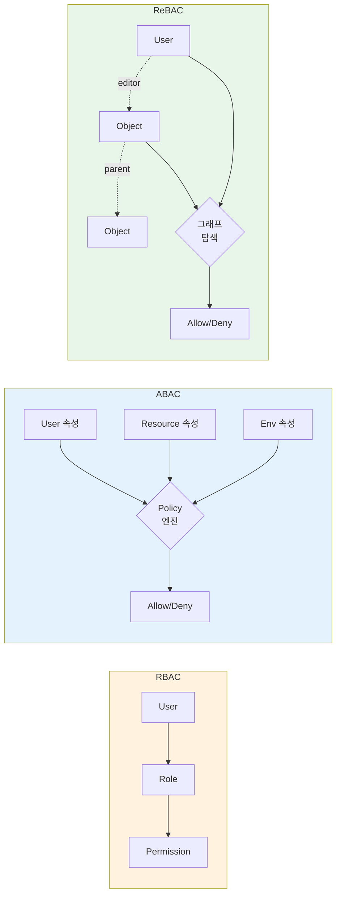
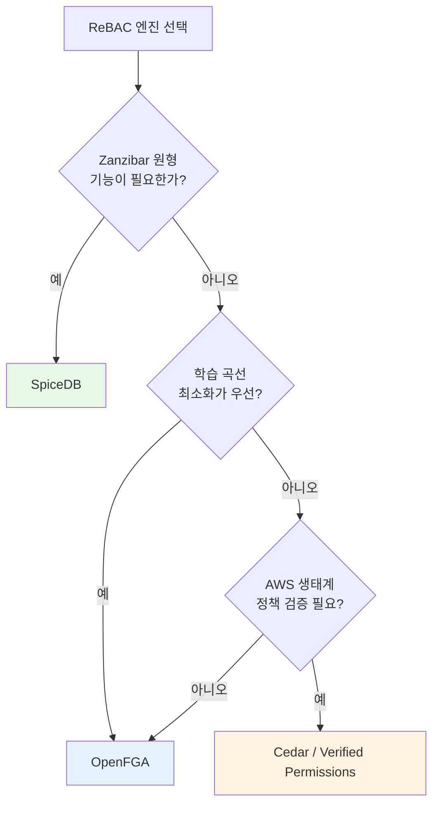

# CH1. 인가 모델과 ReBAC

::: info 학습 목표
- 인증(AuthN)과 인가(AuthZ)를 다시 구분하고, 인가의 세 가지 대표 모델(RBAC·ABAC·ReBAC)을 설명할 수 있다.
- 각 모델의 장점·한계와 적합한 사용 사례를 구분한다.
- Zanzibar가 ReBAC의 글로벌 스케일 구현체로 자리잡은 맥락을 이해한다.
- SpiceDB·OpenFGA·AWS Cedar 세 엔진의 포지셔닝과 선택 기준을 정리한다.
- 이후 챕터에서 Zanzibar 내부 구조로 들어가기 위한 용어 기반을 갖춘다.
:::

## 1. 인증과 인가를 다시 한 번

인증(AuthN)은 "너 누구냐"를 확인하는 과정이고, 인가(AuthZ)는 "그래서 뭘 할 수 있냐"를 결정하는 과정이다. Zanzibar는 철저히 후자의 문제만 다룬다. 사용자를 식별하는 일, 토큰을 검증하는 일은 이미 끝났다고 가정하고, 식별된 주체가 특정 리소스에 특정 권한을 가지고 있는지를 매우 빠르게 일관성 있게 대답하는 것이 Zanzibar의 임무다.

기초 구분은 [OAuth 스터디 CH3. 인증과 인가](/study/oauth/03-authn-vs-authz)에서 정리한 내용을 그대로 전제로 한다. 여기서는 인가 모델이 어떻게 진화해 왔는지만 짚는다.

## 2. RBAC — 역할 기반

RBAC(Role-Based Access Control)은 가장 친숙한 모델이다. 사용자에게 역할(role)을 할당하고, 역할에 권한(permission)을 묶는다.

```
user → role → permission
```

admin·editor·viewer 같은 역할 이름으로 권한을 관리하기 때문에 이해하기 쉽고, 관리자 UI도 단순하다. LDAP 그룹, 리눅스 유저 그룹, 대부분의 엔터프라이즈 시스템이 이 모델을 쓴다. [Keycloak 스터디 CH11. Role과 Group](/study/keycloak/11-role-and-group)에서 본 realm role/client role도 같은 계보다.

그러나 RBAC은 규모가 커지면 세 가지 문제에 부딪힌다.

- **Role explosion**: 리전·팀·프로젝트·리소스 등급의 조합이 늘어나면 역할 수가 폭발한다. `editor-apac-teamA-projectX` 같은 역할이 수천 개 생긴다.
- **리소스별 세분화 어려움**: "Alice는 문서 A에서는 editor지만 문서 B에서는 viewer"를 표현하려면 각 문서마다 역할을 새로 만들거나, 별도 ACL 테이블을 덧붙여야 한다.
- **그룹의 그룹, 맥락 표현 부족**: "내가 속한 팀의 내 프로젝트 문서만 볼 수 있다" 같은 관계형 맥락은 role만으로는 표현하기 어렵다.

회사 ERP에서 "프로젝트 PM은 자기 프로젝트의 모든 문서를 볼 수 있다"를 RBAC으로 모델링하려면 프로젝트마다 `pm-projectX` 역할을 만들거나, 애플리케이션 코드가 "현재 사용자의 프로젝트 목록을 먼저 조회한 뒤 필터링"하는 식으로 우회해야 한다. 결국 권한 결정이 RBAC 바깥의 비즈니스 로직으로 흘러나간다.

## 3. ABAC — 속성 기반

ABAC(Attribute-Based Access Control)은 주체·리소스·환경의 속성을 조합한 정책식으로 권한을 결정한다.

```
user.dept == resource.dept AND time < 18:00 AND user.clearance >= resource.classification
```

표준 문법으로는 XACML(eXtensible Access Control Markup Language)이 있고, AWS IAM의 `Condition` 블록, OPA/Rego도 넓게 보면 ABAC 계열이다. 매우 유연하다는 게 장점이다. 시간·위치·장치·라벨 등 어떤 속성이든 정책에 넣을 수 있다.

단, 두 가지 실전 문제가 따라붙는다.

- **역방향 조회가 어렵다**: "이 리소스에 접근 가능한 모든 사용자 목록을 내놔"라는 질문에 답하려면 모든 사용자에 대해 정책식을 재평가해야 한다. 문서 공유 UI에서 "공유된 사용자 N명" 표시 같은 단순한 기능이 비싸진다.
- **정책 문법 복잡도와 평가 비용**: XACML이나 Rego는 표현력이 뛰어난 대신 러닝커브가 크고, 정책 엔진이 매 요청마다 속성을 가져와 평가해야 한다. 수억 개 리소스, 초당 수백만 쿼리 규모에서는 부담이 된다.

ABAC은 정책이 "데이터 바깥에 규칙 형태로" 존재한다. Zanzibar의 관점에서 보면 이 점이 결정적인 차이를 만든다.

## 4. ReBAC — 관계 기반

ReBAC(Relationship-Based Access Control)은 권한을 "주체와 객체 사이의 관계"로 표현한다.

```
Alice is editor of doc:123
Engineering group is viewer of folder:2023
folder:2023 is parent of doc:123
```

이 세 줄이 ReBAC의 전부다. 권한 질의는 "Alice가 doc:123의 editor로 도달 가능한 경로가 있는가?"라는 그래프 탐색 문제로 환원된다.

ReBAC의 장점은 구조에서 온다.

- **그룹의 그룹, 계층 상속이 자연스럽다**: "폴더의 viewer는 그 폴더 하위 모든 파일의 viewer이다" 같은 규칙을 관계로 표현하면, Google Drive·Notion처럼 중첩된 워크스페이스 권한이 그대로 들어맞는다.
- **역방향 조회가 가능하다**: 관계가 데이터로 저장되므로 "doc:123의 viewer 목록"을 인덱스로 뽑을 수 있다.
- **권한 검사 = 데이터 조회**: 정책 엔진의 규칙 평가가 아니라, 그래프 탐색·인덱스 조회로 대체된다. Spanner 같은 분산 DB 위에 얹을 수 있다.

Zanzibar는 이 아이디어를 "Access Control Lists as data"라는 슬로건으로 압축한다. 권한은 규칙이 아니라 저장된 사실(fact)이다.

## 5. 세 모델 비교

| 구분 | RBAC | ABAC | ReBAC |
|------|------|------|-------|
| 기본 단위 | role | 속성·조건식 | 관계 tuple |
| 표현력 | 낮음 | 매우 높음 | 높음 (관계 그래프) |
| 역방향 조회 | 쉬움 | 어려움 | 쉬움 (인덱스) |
| 그룹의 그룹 | 제한적 | 가능하지만 비쌈 | 자연스러움 |
| 정책 위치 | 데이터 + 코드 | 규칙(정책 엔진) | 데이터 |
| 대표 구현 | LDAP, Keycloak realm role | AWS IAM Condition, OPA | Zanzibar, SpiceDB, OpenFGA |
| 약점 | role explosion | 평가 비용, 역조회 | 속성 기반 조건은 보조 필요 |

실무에서는 경계가 흐릿하다. Keycloak은 RBAC을 기본으로 쓰되 [Authorization Services](/study/keycloak/08-authz-uma)에서 ABAC 스타일 정책을 붙일 수 있고, ReBAC 엔진도 caveat/condition 같은 형태로 ABAC 요소를 수용한다. 중요한 건 "중심축이 어디냐"다.



## 6. Zanzibar의 자리

구글은 YouTube·Drive·Photos·Calendar·Cloud 같은 제품이 각자 권한 시스템을 운영하던 상황을 통합하기 위해 Zanzibar를 만들었다. 2019년 USENIX ATC에서 공개된 논문 *"Zanzibar: Google's Consistent, Global Authorization System"*이 그 결과물이다. 수조 개의 ACL tuple, 초당 수백만 쿼리, p95 10ms 목표라는 숫자가 논문의 핵심 주장이다.

Zanzibar는 ReBAC을 "Spanner 위에 올린 글로벌 인덱스"로 구현했다. 구글이 직접 만든 이 시스템은 외부에 공개되지 않지만, 논문의 설계는 그대로 오픈소스 구현으로 이식됐다.

::: info 왜 Zanzibar가 표준이 됐나
RBAC과 ABAC은 이미 표준 스펙(예: XACML)이 있었지만, ReBAC은 오랫동안 "이론적 모델"에 머물렀다. Zanzibar 논문이 "관계 그래프로 권한을 관리하는 것이 실제 구글 규모에서도 돌아간다"는 사실을 증명하면서 ReBAC은 실무 영역으로 내려왔다. SpiceDB·OpenFGA는 모두 이 논문을 재료로 설계됐다.
:::

## 7. ReBAC 엔진 선택 기준

ReBAC을 실제로 도입한다면 세 가지 오픈소스/관리형 엔진이 후보로 올라온다.

### SpiceDB

- **포지셔닝**: Zanzibar 논문을 가장 충실히 재현한 오픈소스. Authzed가 만들고 상용 지원(Serverless, Dedicated).
- **장점**: Zanzibar와 용어·모델이 1:1에 가깝다. 다중 datastore(CockroachDB, Spanner, Postgres, MySQL) 지원. Go로 작성. Watch API·Zedtoken 같은 논문 개념이 그대로 구현됐다.
- **적합**: 대규모·다중 리전·복잡한 관계 모델을 원할 때. Zanzibar 논문을 그대로 현업에 이식하려는 조직.

### OpenFGA

- **포지셔닝**: Auth0/Okta가 주도하는 CNCF 샌드박스 프로젝트. "OpenFGA is a Zanzibar-based authorization system"을 명시.
- **장점**: DSL이 짧고 읽기 쉽다. HTTP/gRPC API가 깔끔하고 SDK가 많다. 초기 학습 곡선이 낮다.
- **적합**: 빠르게 시작하고 싶은 팀, 관리형 서비스(Auth0 FGA)를 고려하는 조직.

### AWS Cedar / Verified Permissions

- **포지셔닝**: AWS가 만든 정책 언어. 엄밀히는 ABAC 가까운 문법이지만 entity + group 관계를 일급으로 지원해 ReBAC 스타일도 표현 가능.
- **장점**: 수학적 검증(formal verification)이 프로젝트 목표 중 하나. AWS 생태계 통합, Verified Permissions로 관리형 제공.
- **적합**: AWS에 이미 깊이 들어가 있고, 정책을 "코드처럼 검증"하고 싶은 조직. ABAC·ReBAC을 함께 쓰고 싶을 때.

### 의사결정 요약

| 기준 | SpiceDB | OpenFGA | Cedar |
|------|---------|---------|-------|
| 설계 철학 | Zanzibar 충실 재현 | Zanzibar 경량화 | 정책 언어 중심 |
| 주력 API | gRPC (+ HTTP) | HTTP/gRPC | 정책 평가 함수 |
| 운영 품질 | Watch, Zedtoken, 다중 datastore | 비교적 단순, 최근 확충 중 | AWS 매니지드 |
| 학습 곡선 | 높음(논문 개념 익혀야) | 낮음 | 중간(정책 언어) |
| 상용 지원 | Authzed | Auth0 FGA | AWS |



이 스터디의 후속 작업은 [SpiceDB 스터디](/study/spicedb/)에서 실전 운영까지 다룬다. Zanzibar 논문을 먼저 이해하면 SpiceDB의 모든 API·개념이 논문의 어느 페이지에 대응하는지 보이게 된다.

::: tip 핵심 정리
- RBAC은 role 중심으로 단순하지만 세분화·계층·맥락 표현이 약하다.
- ABAC은 속성·조건으로 유연하지만 역방향 조회와 대규모 평가 비용이 부담이다.
- ReBAC은 주체-객체 관계를 데이터로 저장해 그래프 탐색으로 권한을 결정한다.
- Zanzibar는 ReBAC을 글로벌 스케일로 구현한 구글의 논문이며 SpiceDB·OpenFGA의 원형이다.
- 엔진 선택은 "Zanzibar 충실성 vs 학습 곡선 vs 생태계"의 3축으로 판단한다.
:::

## 다음 챕터

[CH2. Zanzibar 핵심 개념](/study/zanzibar/02-core-concepts)에서 구글이 풀려던 문제와 다섯 가지 설계 원칙, relation tuple이라는 모든 데이터의 기본 단위를 살핀다.
