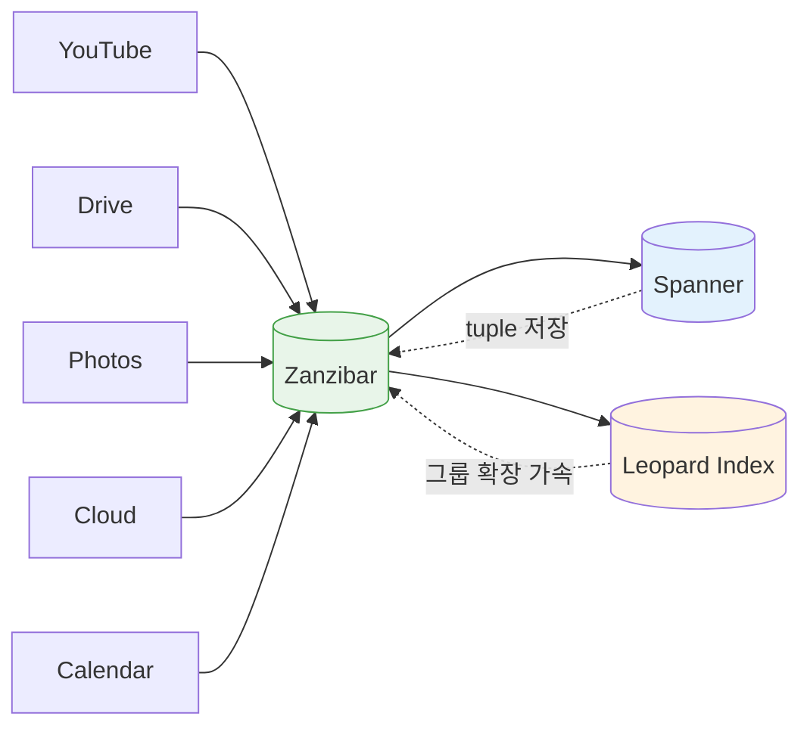
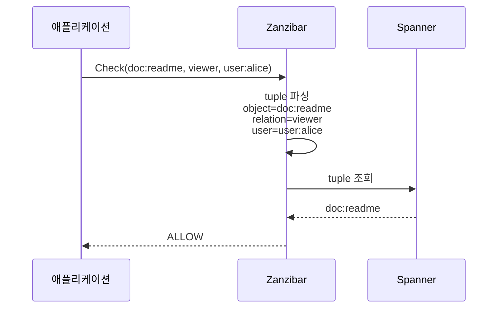

# CH2. Zanzibar 핵심 개념

::: info 학습 목표
- 구글이 Zanzibar로 풀려던 문제가 무엇인지, 기존 방식의 한계가 어디였는지 설명할 수 있다.
- Zanzibar 논문의 다섯 가지 설계 원칙(correctness·flexibility·low latency·availability·scale)을 암기·재현한다.
- "Access Control Lists as data"라는 슬로건이 구조상 어떤 함의를 갖는지 이해한다.
- relation tuple `⟨object⟩#⟨relation⟩@⟨user⟩`의 구성 요소와 의미를 해석한다.
- userset과 namespace가 왜 별도 개념으로 필요한지 파악한다.
:::

## 1. 구글이 풀려던 문제

구글 내부에는 수십 개의 대형 제품이 있다. YouTube의 동영상, Drive의 문서, Photos의 앨범, Cloud의 리소스, Calendar의 일정 — 전부 제각각의 "누가 이걸 볼 수 있는가"를 판단해야 한다. 2010년대 초중반까지는 각 제품이 권한 시스템을 자체 구현했다. 이 방식에는 세 가지 구조적 문제가 있었다.

- **일관성 불일치**: "공유 링크를 비공개로 바꿨는데 몇 초 뒤에도 외부 사용자가 볼 수 있다"는 버그가 제품마다 형태를 달리해 반복됐다. 각 제품이 자체 캐시·복제 전략을 쓰다 보니 revocation 반영 시점이 제각각이었다.
- **감사·거버넌스 단절**: 누가 누구에게 무엇을 공유했는지 통합 감사 로그를 내기가 어려웠다. 보안팀은 제품별로 따로 대응해야 했다.
- **중복된 엔지니어링**: 그룹·상속·공유 링크 같은 공통 요구가 제품마다 다시 작성됐다.

Zanzibar는 이 문제를 "모든 제품이 하나의 중앙 인가 서비스에 권한 질의를 보낸다"는 전략으로 풀었다. 대신 조건이 가혹하다. 구글 스케일에서 "이 사용자가 이 리소스를 볼 수 있는가?"라는 질문에 일관성과 낮은 지연을 보장하며 응답해야 한다.



이 중앙 집중 전략이 동작하려면 시스템이 만족해야 할 조건이 매우 까다롭다. 논문은 그 조건을 다섯 가지 설계 원칙으로 정리했다.

## 2. 다섯 가지 설계 원칙

### Correctness — 정확성

권한 검사는 애플리케이션이 아니라 보안의 영역이다. "방금 revoke한 권한이 잠깐은 남아있다"는 식의 타협은 허용되지 않는다. 특히 공유 해제 후 외부인이 접근하는 사건은 서비스 신뢰를 즉시 무너뜨린다. Zanzibar는 "client가 특정 시점 이후의 상태를 본다"는 보장을 zookie라는 토큰으로 제공한다(CH5에서 자세히).

### Flexibility — 유연성

YouTube의 공개/비공개, Drive의 문서 공유, Photos의 앨범 권한, Cloud의 IAM — 제품마다 권한 모델이 전혀 다르다. Zanzibar는 이 모든 모델을 "namespace 설정 + userset rewrite 규칙"의 조합으로 표현할 수 있게 만들어야 했다. 일반화된 그래프 모델 하나로 각 제품을 수용하는 것이 목표였다.

### Low Latency — 낮은 지연

권한 검사는 거의 모든 API 호출의 전처리 단계에 들어간다. 여기서 100ms가 더해지면 사용자 경험 전체가 무너진다. Zanzibar의 목표 수치는 공격적이다.

- p50 약 3ms
- p95 약 10ms

논문은 이 수치를 "멀티 리전, 수조 개 tuple, 초당 수천만 쿼리" 조건에서 달성한다고 보고한다.

### High Availability — 높은 가용성

Zanzibar가 다운되면 구글 전체 제품이 동시에 권한 검사를 실패한다. 논문은 99.999% 가용성을 목표로 잡고, 멀티 리전 배치·로컬 replica·graceful fallback 전략을 구성했다.

### Large Scale — 대규모

구글 Drive 하나만 해도 수십억 개 객체가 있다. YouTube·Photos를 합치면 수조 개 tuple이 필요하다. Zanzibar는 Spanner를 스토리지로 써서 수평 확장을 자연스럽게 가져왔고, Watch·Leopard 같은 보조 시스템으로 그룹 멤버십 확장 같은 특수 부하를 분산했다.

| 원칙 | 핵심 지표 | 구현 전략 |
|------|----------|----------|
| Correctness | Stale read 금지 | zookie + Spanner snapshot read |
| Flexibility | 제품별 모델 수용 | namespace config + userset rewrite |
| Low latency | p95 약 10ms | 지역 replica + 캐시 + Leopard 인덱스 |
| Availability | 99.999% | 멀티 리전, graceful degradation |
| Scale | 수조 tuple, 수천만 QPS | Spanner, Watch, Leopard |

이 다섯 원칙은 논문 전체를 관통하는 판단 기준이다. 이후 챕터에서 Zookie(CH5), Check/Expand 알고리즘(CH6), Watch/Leopard(CH7)를 다룰 때 "이게 어느 원칙을 충족시키기 위한 장치인가"로 이해하면 전체 그림이 끊기지 않는다.

## 3. Access Control Lists as Data

Zanzibar 논문의 가장 인상적인 표현 중 하나가 "ACLs as data"다. 권한을 "정책 규칙의 집합"이 아니라 "저장된 사실의 집합"으로 다룬다는 선언이다. 이 설계 선택이 갖는 함의는 크다.

- **Spanner 같은 분산 DB에 그대로 얹을 수 있다**. 권한 검사가 결국 "tuple이 존재하는지" 또는 "tuple 그래프에서 도달 가능한지"의 조회가 되기 때문이다.
- **Consistency 모델을 DB에 위임**할 수 있다. Spanner의 TrueTime + snapshot read가 그대로 Zanzibar의 일관성 보장을 떠받친다.
- **역방향 조회가 가능**하다. tuple이 인덱스 가능한 데이터이므로 "이 리소스에 접근 가능한 사용자 목록"이 단순 쿼리가 된다.
- **Audit·백업·리플리케이션이 표준적**으로 따라온다. DB가 잘하는 일을 Zanzibar가 다시 만들 필요가 없다.

::: info 대조 — 정책 엔진형 시스템
OPA/Rego, XACML 같은 정책 엔진은 권한 규칙을 코드로 표현한다. 유연하지만 평가 비용이 높고, 역방향 조회가 어렵다. Keycloak의 [Authorization Services](/study/keycloak/08-authz-uma)도 이 계열이다. Zanzibar는 반대 방향의 극단을 택했다 — "규칙을 데이터로 환원한다".
:::

## 4. Relation Tuple — 모든 것의 기본 단위

Zanzibar의 모든 권한 정보는 단 하나의 형태로 표현된다.

```
⟨tuple⟩ ::= ⟨object⟩#⟨relation⟩@⟨user⟩
```

예를 들어 `doc:readme#viewer@user:alice`는 "문서 readme에 대해 user alice가 viewer 관계를 가진다"는 사실 하나를 표현한다. 구성 요소는 세 개다.

- **object**: 권한이 붙는 대상. `doc:readme`처럼 `namespace:id` 형태.
- **relation**: object 위에 정의된 관계 이름. viewer, editor, owner, member 등.
- **user**: 이 관계를 가진 주체. 단일 user(`user:alice`)일 수도, userset일 수도 있다.

tuple은 사실상 그래프의 엣지(edge) 하나다. object 노드에서 user 노드로 relation이라는 라벨이 붙은 화살표가 있다고 보면 된다. 모든 권한 검사는 "이 그래프에서 alice로부터 doc:readme의 viewer relation까지 도달 가능한가"라는 reachability 문제로 환원된다.



실전에서는 tuple 하나로 끝나는 경우는 드물다. 보통은 그룹·상속을 거쳐 여러 tuple을 타고 들어가야 답이 나온다. 여기서 userset과 rewrite 규칙이 등장한다.

## 5. Userset — 주체의 일반화

tuple의 user 자리에는 단일 주체뿐만 아니라 userset도 올 수 있다. userset은 "어떤 object의 어떤 relation을 가진 모든 주체"를 가리키는 집합 참조다. 문법은 `{object}#{relation}`이다.

```
doc:readme#viewer@group:eng#member
```

이 tuple은 "eng 그룹의 member인 모든 주체는 doc:readme의 viewer이다"라는 규칙을 단 한 줄로 표현한다. 수백 명의 엔지니어가 추가·삭제되더라도 이 tuple은 바뀌지 않는다. 그룹 멤버십은 `group:eng#member@user:alice` 같은 별도 tuple로 관리된다.

userset 덕분에 얻는 것이 많다.

- **그룹의 그룹**: `group:backend#member@group:eng#member` 같은 tuple로 eng 그룹의 member가 backend 그룹의 member라는 계층을 표현.
- **상속**: "folder의 viewer는 그 하위 doc의 viewer이다" 같은 규칙을 userset rewrite로 표현 가능(CH4에서 구체화).
- **스케일**: 사용자 수가 늘어도 tuple 수가 그에 비례해서 늘지 않는다. 그룹 참조만 갱신하면 된다.

## 6. Namespace — 제품별 권한 정의 단위

namespace는 object type의 단위다. `doc`, `folder`, `group`, `photo` 같은 각 type마다 "어떤 relation이 있고 그 relation이 어떻게 계산되는지"를 정의한다. 예를 들어 `doc` namespace는 viewer·editor·owner relation을 가지고, editor는 owner를 포함하며, viewer는 editor를 포함한다는 식의 설정을 갖는다.

namespace 정의에는 두 가지 요소가 있다.

- **relation 목록**: 이 타입의 object가 가질 수 있는 관계 이름들.
- **userset rewrite 규칙**: 각 relation을 어떻게 계산할지. union/intersection/exclusion, tuple-to-userset 등. 이 부분이 Zanzibar의 표현력을 결정한다(CH4).

namespace는 각 제품이 자신의 권한 모델을 Zanzibar 위에 정의하는 틀이 된다. Drive 팀은 `doc`·`folder` namespace를, Calendar 팀은 `calendar`·`event` namespace를 정의해서 같은 Zanzibar 인프라 위에서 완전히 다른 권한 모델을 운영할 수 있다.

::: tip 핵심 정리
- Zanzibar는 구글 전 제품의 권한 검사를 하나의 시스템으로 통합한다. 수조 tuple, 초당 수천만 QPS, p95 10ms.
- 다섯 가지 설계 원칙: correctness·flexibility·low latency·availability·scale. 이후 모든 알고리즘은 이 원칙들의 종속물이다.
- "ACLs as data" — 권한을 규칙이 아닌 저장된 사실로 다룬다. 덕분에 Spanner 위에 얹을 수 있다.
- relation tuple `⟨object⟩#⟨relation⟩@⟨user⟩`가 모든 데이터의 기본 단위다.
- user 자리에는 단일 주체뿐만 아니라 userset이 올 수 있어 그룹·상속이 자연스럽게 표현된다.
- namespace는 object type과 그 위의 relation 집합·rewrite 규칙을 담는 설정 단위다.
:::

## 다음 챕터

[CH3. 관계 기반 데이터 모델](/study/zanzibar/03-data-model)에서 object·relation·userset 세 가지 기본 타입의 문법과 구체적인 예시(Google Drive 권한을 tuple로 표현)를 살펴본다.
