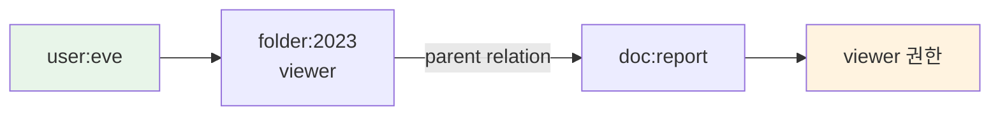
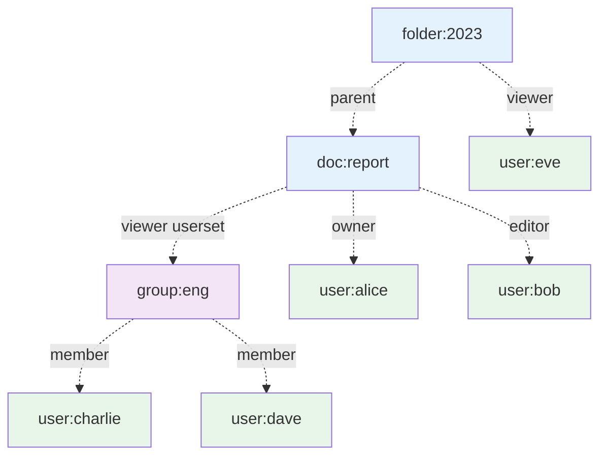

# CH3. 관계 기반 데이터 모델

::: info 학습 목표
- object, relation, user, userset 네 가지 기본 타입을 문법 수준에서 정확히 쓴다.
- `⟨object⟩#⟨relation⟩@⟨user⟩` BNF를 읽고 쓸 수 있다.
- Google Drive의 공유·상속 권한을 relation tuple 집합으로 옮겨 본다.
- 왜 이 모델이 Spanner 같은 분산 DB 위에서 우아하게 스케일하는지 이해한다.
- 다음 챕터(userset rewrite)로 넘어가기 전 tuple 자체의 문법을 완전히 분리해 익힌다.
:::

## 1. Object — 권한이 붙는 대상

Object는 Zanzibar에서 권한을 가질 수 있는 모든 대상이다. 문법은 단순하다.

```
⟨object⟩ ::= ⟨namespace⟩:⟨object_id⟩
```

- **namespace**: object의 타입. `doc`, `folder`, `group`, `photo`, `calendar`, `event` 같은 이름. 각 제품이 자신의 권한 모델을 정의하는 단위다.
- **object_id**: namespace 안에서 유일한 식별자. 보통 제품의 기본 키(UUID, 숫자 ID, slug)를 그대로 쓴다.

예시:
- `doc:readme`
- `doc:2023-report`
- `folder:engineering-shared`
- `group:eng`
- `photo:IMG_0420`

object_id는 Zanzibar 입장에서 불투명한(opaque) 문자열이다. 제품이 무엇으로 쓰든 상관하지 않는다. 다만 한 namespace 안에서 유일해야 한다. 다른 namespace라면 같은 id를 써도 무방하다(`doc:2023`과 `folder:2023`은 서로 다른 object).

## 2. Relation — object 위의 관계

Relation은 object 위에 정의된 이름 붙은 관계다. 특정 namespace 안에서만 의미를 가진다. `doc` namespace에 정의된 `viewer`와 `group` namespace에 정의된 `member`는 이름이 달라도 되고, 같아도 서로 충돌하지 않는다.

대표적인 relation 예:

| namespace | 흔히 쓰이는 relation |
|-----------|---------------------|
| doc | owner, editor, viewer, commenter |
| folder | owner, viewer, parent |
| group | member, admin |
| photo | viewer, owner |
| calendar | owner, writer, reader |

하나의 object는 여러 relation을 동시에 가질 수 있다. `doc:readme`가 Alice에게는 editor, Bob에게는 viewer, 그리고 eng 그룹에 대해 viewer일 수 있다. 각 관계는 독립적인 tuple로 저장된다.

relation 이름은 단순 레이블이다. 의미 — 예를 들어 "editor는 viewer를 포함한다" — 는 tuple이 아니라 namespace의 userset rewrite 규칙에서 정의된다. 이 부분은 [CH4. Userset Rewrite Rules](/study/zanzibar/04-userset-rewrite)에서 본격적으로 다룬다. 이번 챕터에서는 relation 자체가 "이름 붙은 관계"라는 점만 기억하면 충분하다.

## 3. User와 Userset

tuple의 세 번째 자리(주체)에는 두 가지가 올 수 있다.

### User — 단일 주체

```
user:alice
user:bob@example.com
user:123e4567
```

`user` namespace(또는 제품이 정의한 주체 namespace)의 특정 id를 가리킨다. 가장 단순한 형태이며, "Alice가 doc:readme의 viewer이다" 같은 직접적인 권한을 표현한다.

### Userset — 집합 참조

```
⟨userset⟩ ::= ⟨object⟩#⟨relation⟩
```

Userset은 "이 object의 이 relation을 가진 모든 주체"를 집합으로 가리킨다.

- `group:eng#member` → eng 그룹의 member인 모든 주체
- `folder:2023#viewer` → folder:2023의 viewer인 모든 주체
- `doc:readme#editor` → doc:readme의 editor인 모든 주체

Userset이 tuple의 user 자리에 올 수 있기 때문에 Zanzibar의 표현력이 급격히 확장된다.

```
doc:readme#viewer@group:eng#member
```

이 한 줄이 "eng 그룹의 member인 모든 사람은 doc:readme의 viewer이다"를 말한다. 그룹 멤버가 수백 명이어도 tuple은 한 줄이다. 멤버가 들어오거나 나가면 `group:eng#member@user:...` tuple만 추가·삭제하면 된다.

userset이 중요한 또 다른 이유는 **그룹의 그룹**과 **권한의 상속**을 자연스럽게 표현한다는 점이다.

```
group:backend#member@group:eng#member
```

"eng 그룹의 member는 backend 그룹의 member이다". 이렇게 userset이 userset을 참조하는 구조가 그대로 허용된다. Zanzibar는 tuple 조회를 따라가며 그래프 탐색으로 권한을 평가한다.

## 4. Relation Tuple — 문법 상세

모든 권한 정보는 tuple 하나의 형태로 저장된다.

```
⟨tuple⟩     ::= ⟨object⟩#⟨relation⟩@⟨user⟩
⟨object⟩    ::= ⟨namespace⟩:⟨object_id⟩
⟨user⟩      ::= ⟨user_id⟩ | ⟨userset⟩
⟨userset⟩   ::= ⟨object⟩#⟨relation⟩
```

구분자 세 개의 의미를 분명히 해두면 읽기가 쉽다.

- `:` — namespace와 id를 잇는다. 타입과 식별자의 경계.
- `#` — object와 relation을 잇는다. "이 object 위의 이 관계".
- `@` — "이 관계를 가진 주체". 왼쪽이 대상(object + relation), 오른쪽이 주체(user 또는 userset).

### 실전 예시 6개

```
1) doc:readme#viewer@user:alice
2) doc:readme#editor@user:bob
3) doc:readme#viewer@group:eng#member
4) group:eng#member@user:charlie
5) group:backend#member@group:eng#member
6) folder:2023#parent@doc:readme
```

각 줄을 한국어로 읽어 보면:

1. Alice는 doc:readme의 viewer다.
2. Bob은 doc:readme의 editor다.
3. eng 그룹의 모든 member는 doc:readme의 viewer다.
4. Charlie는 eng 그룹의 member다.
5. eng 그룹의 모든 member는 backend 그룹의 member다(그룹의 그룹).
6. folder:2023은 doc:readme의 parent다(상속의 뿌리).

6번이 조금 특별하다. subject 자리에 single user도 userset도 아닌 object가 들어갔다. 문법적으로는 `folder:2023`도 `{namespace}:{id}` 형태라 그대로 들어갈 수 있다. 실제로 Zanzibar는 `folder:2023`을 "...의 relation이 암묵적으로 지정되지 않은 userset"처럼 취급하는 패턴을 userset rewrite와 함께 사용한다. 구체적인 계산 방식은 CH4의 tuple-to-userset 규칙에서 설명된다. 지금은 "parent 관계를 tuple로 표현할 수 있다"는 것까지만 받아들이자.

```mermaid
flowchart LR
    subgraph Types[데이터 타입]
        OBJ[Object<br>namespace:id]
        REL[Relation<br>name]
        USR[User<br>user:id]
        USET[Userset<br>object#relation]
    end
    OBJ -->|# 연결| REL
    REL -->|@ 연결| USR
    REL -->|@ 연결| USET
    USET -.tuple 그래프 탐색.-> OBJ
    style OBJ fill:#e3f2fd
    style REL fill:#fff3e0
    style USR fill:#e8f5e9
    style USET fill:#f3e5f5
```

## 5. 구체 예시 — Google Drive 권한을 tuple로

Drive 스타일의 권한 시나리오를 tuple 집합으로 옮겨 보자. 시나리오는 다음과 같다.

- Alice가 `doc:report`의 소유자.
- Bob이 `doc:report`를 직접 editor로 공유받음.
- eng 그룹의 멤버(`charlie`, `dave`)는 `doc:report`의 viewer.
- `doc:report`는 `folder:2023` 하위에 있음.
- `folder:2023`의 viewer는 하위 문서의 viewer이기도 함(상속).
- `folder:2023`에 `user:eve`가 viewer로 지정됨.

tuple 집합:

```
doc:report#owner@user:alice
doc:report#editor@user:bob
doc:report#viewer@group:eng#member

group:eng#member@user:charlie
group:eng#member@user:dave

folder:2023#viewer@user:eve
folder:2023#parent@doc:report
```

주목할 점은 두 가지다.

- **상속의 뿌리**는 `folder:2023#parent@doc:report` 하나뿐이다. 폴더 하위에 문서를 수천 개 두더라도 parent tuple만 하나씩 추가하면 된다.
- **"folder의 viewer는 하위 doc의 viewer"라는 규칙**은 여기 tuple에는 없다. namespace 정의의 userset rewrite 규칙에서 표현된다(CH4). 데이터(tuple)와 규칙(namespace config)의 분리가 명확하다.

이 상태에서 "eve가 doc:report를 볼 수 있는가?"라는 질문은 다음과 같은 경로를 찾는 그래프 탐색 문제가 된다.



tuple 자체만 보면 eve는 폴더의 viewer일 뿐 doc:report의 viewer는 아니다. 여기서 "folder의 viewer가 하위 doc의 viewer"라는 상속 규칙이 userset rewrite로 적용될 때 eve가 doc:report의 viewer로 평가된다. 이 "평가" 단계가 CH4와 CH6의 주제다.

### 같은 시나리오를 tuple graph로



## 6. 왜 이 모델이 우아한가

Zanzibar의 데이터 모델은 세 개의 구성 요소만으로 극단적으로 단순하다. 이 단순함이 실전에서 만드는 효과가 크다.

- **권한 질의 = tuple 조회**: "Alice가 doc:readme의 viewer인가?"는 결국 tuple 집합에서 reachable edge가 있는지의 문제다. DB 쿼리와 인덱스 탐색으로 환원된다.
- **Spanner 같은 분산 DB에 그대로 올릴 수 있다**: tuple은 `(namespace, object_id, relation, user)`의 네 컬럼짜리 레코드다. 인덱스만 잘 잡으면 수평 확장이 자연스럽다.
- **역방향 조회 가능**: "doc:readme의 viewer는 누구인가?"는 인덱스 다른 방향으로 잡은 조회다. UI의 "공유된 사용자 목록" 표시가 단순 쿼리가 된다.
- **감사·백업·복제가 표준**: DB가 잘하는 모든 것을 그대로 얻는다.
- **스케일 아웃이 스토리지 문제로 위임**: 애플리케이션 레벨에서 샤딩 전략을 고민할 일이 줄어든다.

::: warning 아직 다루지 않은 것
이 챕터는 tuple의 **문법과 기본 타입**에만 집중했다. 실제 Zanzibar가 "editor는 viewer를 포함한다", "folder의 viewer는 하위 doc의 viewer다" 같은 **규칙을 어떻게 계산하는지**는 [CH4. Userset Rewrite Rules](/study/zanzibar/04-userset-rewrite)에서 본격적으로 다룬다. union·intersection·exclusion·tuple-to-userset 같은 연산이 여기서 등장한다.
:::

::: tip 핵심 정리
- Zanzibar의 데이터 모델은 object·relation·user/userset 세 개의 기본 개념으로 구성된다.
- object는 `namespace:id`, userset은 `object#relation`, tuple은 `object#relation@user` 형태.
- tuple 하나는 권한 그래프의 엣지 하나에 대응한다.
- userset 덕분에 그룹의 그룹, 권한 상속이 tuple 한 줄로 표현 가능하다.
- Google Drive 같은 실제 제품의 공유·상속 권한도 소수의 tuple로 모델링된다.
- 데이터(tuple)와 규칙(userset rewrite)의 분리가 Zanzibar 모델의 우아함과 스케일성을 동시에 만든다.
:::

## 다음 챕터

[CH4. Userset Rewrite Rules](/study/zanzibar/04-userset-rewrite)에서 "editor는 viewer를 포함한다", "folder의 viewer는 하위 doc의 viewer다" 같은 규칙을 union·intersection·exclusion·tuple-to-userset으로 표현하는 방법을 살펴본다. tuple이 데이터라면, rewrite는 그 데이터 위에서 권한을 계산하는 연산이다.
