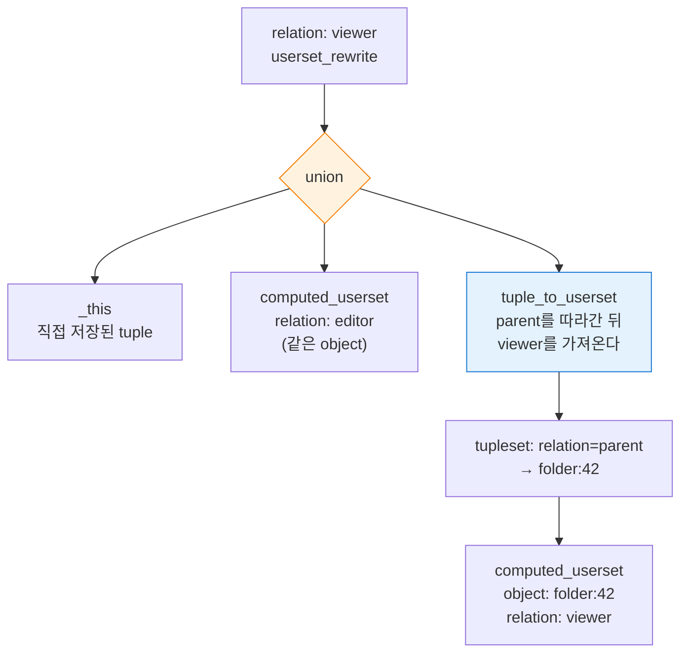
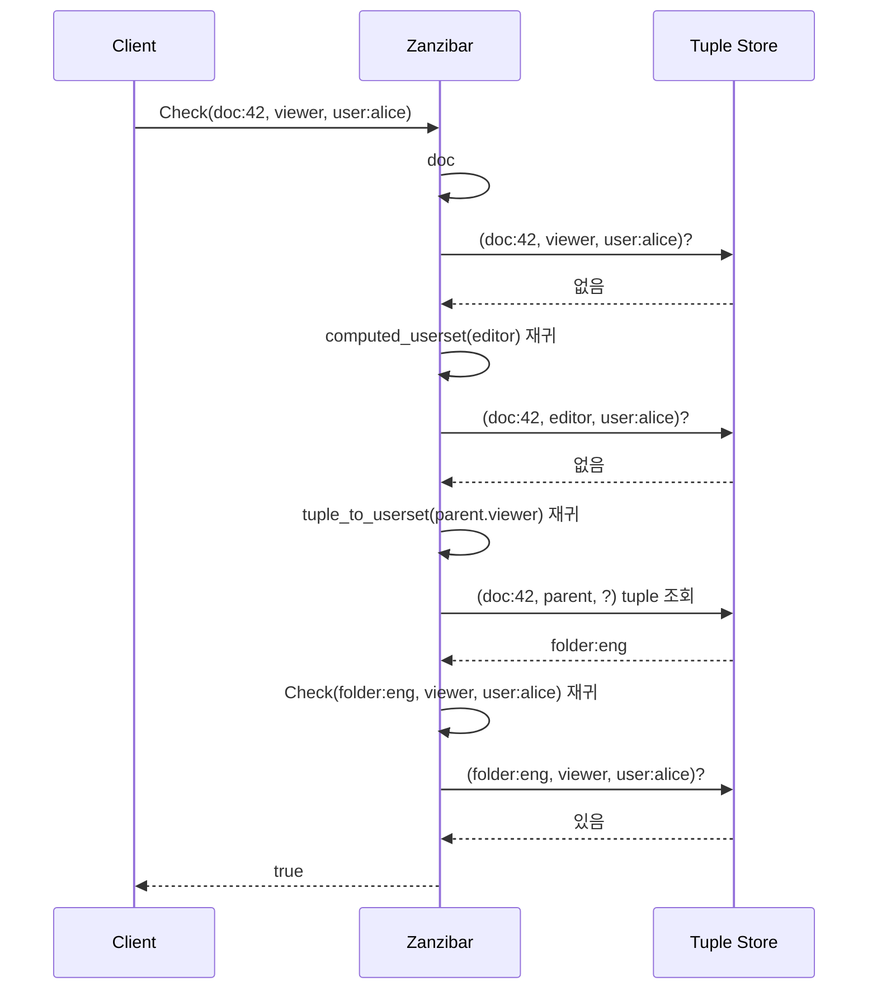

# CH4. Userset Rewrite Rules

::: info 학습 목표
- Namespace Configuration이 무엇이고, 왜 tuple과 분리된 "두 번째 축"으로 존재하는지 설명한다.
- Userset Rewrite의 세 primitive인 `_this`, `computed_userset`, `tuple_to_userset`을 구분한다.
- union / intersection / exclusion 결합자의 의미를 이해한다.
- folder → doc 상속 같은 실전 시나리오를 rewrite rule로 표현한다.
- tuple로 저장되는 "사실"과 rewrite로 계산되는 "파생 멤버"의 차이를 구별한다.
:::

## 1. Namespace Configuration — tuple 옆의 두 번째 축

CH3에서 Zanzibar의 데이터 모델은 relation tuple 하나로 끝난다고 설명했다. 하지만 그건 절반의 진실이다. tuple은 "사실의 저장소"일 뿐, 그 사실들이 어떻게 조합돼 "이 object의 이 relation의 멤버는 누구인가?"라는 질문에 답하는지를 결정하는 규칙은 별도로 존재한다. 그것이 <strong>Namespace Configuration</strong>이다.

각 namespace(`doc`, `folder`, `group`, `user` 등)는 자신이 가진 relation의 목록과, 각 relation이 "어떤 userset을 포함하는가"를 기술한 rewrite rule을 갖는다. 이 설정은 tuple 저장소와 달리 **상대적으로 드물게 변한다**. 팀이 새 권한 모델을 설계할 때 namespace config를 편집하고, 운영 중에는 tuple만 계속 추가/삭제된다.

::: tip tuple과 config의 역할 분리
- **Tuple (데이터)**: "Alice는 doc:42의 editor다" 같은 개별 사실. 매초 수천 건씩 쓰인다.
- **Namespace Config (메타데이터)**: "editor는 owner를 자동 포함하고, viewer는 editor와 parent folder의 viewer를 자동 포함한다" 같은 규칙. 배포 단위로만 변한다.
:::

이 둘을 합쳐서 **"이 질문에 대한 답이 무엇인가?"** 를 계산하는 것이 Check 알고리즘이다. CH6에서 본격적으로 다룬다.

## 2. Userset Rewrite의 세 가지 primitive

relation 하나는 "이 relation의 멤버 집합 = ?" 라는 수식을 갖는다. 그 수식의 재료가 아래 세 가지다.

### 2.1 `_this` — 직접 저장된 tuple

가장 단순하다. "이 relation에 대해 tuple 저장소에 직접 쓰인 것들"을 그대로 가져온다. rewrite rule을 쓰지 않으면 암묵적으로 `_this`가 기본값이다.

예: `doc:42#owner`의 멤버는 "`(doc:42, owner, ?)` tuple로 저장된 userset 전부".

### 2.2 `computed_userset` — 같은 object의 다른 relation

**같은 object**의 **다른 relation**을 참조한다. "editor는 자동으로 viewer에 포함된다" 같은 수직 관계를 표현한다.

예: `doc:42#viewer`의 계산에 `computed_userset { relation: "editor" }`가 포함되면, `doc:42#editor`의 모든 멤버가 `doc:42#viewer`에도 속한다. tuple을 두 번 쓸 필요 없이, 상위 권한이 하위 권한을 자동 흡수한다.

### 2.3 `tuple_to_userset` (TTU) — 다른 object를 지나 계산

가장 강력하고, 가장 Zanzibar답다. "이 object의 특정 relation으로 연결된 **다른 object**의 relation"을 가져온다.

예: `doc:42#viewer`의 계산에 "**doc의 parent folder의 viewer**"를 포함시키려면,

1. `(doc:42, parent, folder:42)` tuple을 쫓아가서 parent object를 찾고 (tupleset),
2. 그 parent object의 `viewer` relation 멤버를 가져온다 (computed_userset on the target).

**상속(inheritance)** 은 거의 전부 이 TTU로 구현된다. folder → doc, org → repo, project → resource 어느 것이든.



## 3. 결합자 (Set Operators)

세 primitive는 단독으로 쓰기도 하지만, 대개 **set operator** 로 묶여 하나의 rewrite tree를 이룬다.

- **union**: 합집합. "이 중 어느 하나라도 해당되면 멤버". 가장 흔하다.
- **intersection**: 교집합. "모두 동시에 해당돼야 멤버". 예: "관리자이면서 2FA를 켠 사용자".
- **exclusion**: 차집합. "A에는 속하고 B에는 속하지 않는 사용자". 예: "팀 멤버지만 IP 차단 목록에 있지 않은 자".

exclusion은 특히 실전에서 값지다. "관리자 권한이지만 보안 위반으로 일시 정지된 계정 제외" 같은 네거티브 규칙이 깔끔해진다.

## 4. 텍스트 예시 — Zanzibar 논문의 doc namespace

논문 섹션 2.3의 예시를 축약한 버전이다.

```
name: "doc"

relation { name: "owner" }

relation {
  name: "editor"
  userset_rewrite {
    union {
      child: { _this: {} }
      child: { computed_userset: { relation: "owner" } }
    }
  }
}

relation {
  name: "viewer"
  userset_rewrite {
    union {
      child: { _this: {} }
      child: { computed_userset: { relation: "editor" } }
      child: {
        tuple_to_userset: {
          tupleset { relation: "parent" }
          computed_userset {
            object: $TUPLE_USERSET_OBJECT
            relation: "viewer"
          }
        }
      }
    }
  }
}
```

읽어보면 이렇게 된다.

- `owner`: 규칙 없음 → 기본 `_this`. 저장된 tuple만 본다.
- `editor = _this ∪ owner`. 직접 editor로 지정된 사람 + 모든 owner.
- `viewer = _this ∪ editor ∪ (parent의 viewer)`. 직접 viewer + 모든 editor + 상위 folder의 viewer까지 포함.

세 줄 선언으로 "owner ⊂ editor ⊂ viewer" 라는 계층을 만들고, 추가로 folder 상속까지 붙였다. tuple에는 owner/editor/viewer/parent만 저장하면 된다. 나머지는 rewrite가 런타임에 계산한다.

## 5. 왜 이렇게 설계됐는가

관건은 **"권한 정책을 데이터로 표현한다"** 는 점이다. 전통적인 RBAC 구현은 관리자 권한이 포함된 역할을 DB 컬럼으로 하드코딩하고, 새 역할을 추가할 때마다 코드 마이그레이션을 했다. Zanzibar는 그 하드코딩을 namespace config라는 선언 데이터로 빼냈다.

- 새 권한(e.g. `commenter`)을 추가하려면 config만 배포.
- 권한 계층 변경(e.g. editor를 owner에서 제외)도 config만.
- 100개 서비스가 같은 엔진을 쓸 수 있다 — 각자 자기 namespace만 가지고 놀면 된다.

Check 알고리즘은 이 트리를 **재귀적으로 평가**한다. "doc:42의 viewer에 Alice가 포함되나?" 라는 질문은,

1. `doc:42#viewer`의 rewrite를 펼친다.
2. union의 자식을 하나씩 시도 — `_this`면 tuple 조회, `computed_userset`이면 같은 object의 다른 relation에 대해 재귀, TTU면 parent를 찾아가 재귀.
3. 어느 가지에서든 Alice가 발견되면 true.

이 재귀가 분산 환경에서 어떻게 돌아가는지는 CH6에서 본다.

## 6. 예시 시나리오 — folder → doc 상속

`folder:eng`의 viewer에 Alice를 추가했다. `doc:42`는 그 folder의 자식이다. Alice가 `doc:42`를 읽을 수 있는가?

저장된 tuple:

```
(doc:42, parent, folder:eng)
(folder:eng, viewer, user:alice)
```

`Check(doc:42, viewer, user:alice)` 가 호출되면 아래 순으로 평가된다.



세 가지 가지가 순서대로 탐색되고, 마지막 TTU 가지에서 parent를 타고 내려가 tuple 하나로 답이 나왔다. 실제 구현은 이 가지들을 **병렬**로 쏜다.

## 7. 주의 — TTU는 저장되지 않는다

오해하기 쉬운 부분이다. `(doc:42, viewer, user:alice)` tuple이 **새로 생기지 않는다**. TTU는 런타임 계산일 뿐, 상속으로 "파생된" 멤버십은 어떤 테이블에도 기록되지 않는다.

- 장점: folder의 viewer를 변경하면 즉시 모든 하위 doc에 반영. 캐시 무효화만 하면 된다.
- 단점: Check가 깊어지면 fanout이 커진다. 이를 위해 Zanzibar는 **Leopard 인덱스**(CH7)로 자주 평가되는 간접 멤버십을 미리 계산해둔다.

::: warning 파생 tuple을 직접 쓰지 마라
"편의를 위해" 상속 결과를 tuple로 미리 풀어 저장하는 유혹이 있다. 하지만 상위 권한을 revoke할 때 하위를 모두 정리해야 하는 지옥이 시작된다. Zanzibar가 TTU를 런타임 계산으로 유지하는 이유가 이것이다.
:::

## 핵심 정리

::: tip 핵심 정리
- **Namespace Config**는 tuple과 분리된 메타데이터다. "relation의 의미"를 정의한다.
- **`_this`**: 저장된 tuple 그대로.
- **`computed_userset`**: 같은 object의 다른 relation 참조. 수직 계층 표현.
- **`tuple_to_userset`**: 다른 object로 건너가 계산. 상속의 기반.
- **union / intersection / exclusion** 으로 세 primitive를 조합해 하나의 rewrite tree를 만든다.
- rewrite는 런타임 평가다. 파생 멤버십은 tuple로 저장되지 않는다.
- Check 알고리즘이 이 트리를 분산 재귀 평가하는 방식은 CH6에서 이어진다.
:::

## 다음 챕터

[CH5. Consistency와 Zookie](/study/zanzibar/05-consistency-zookie) — 권한 시스템에서 가장 미묘한 문제인 "New Enemy"와, Zanzibar가 Spanner의 external consistency와 zookie 토큰으로 이를 해결하는 방식을 본다.
