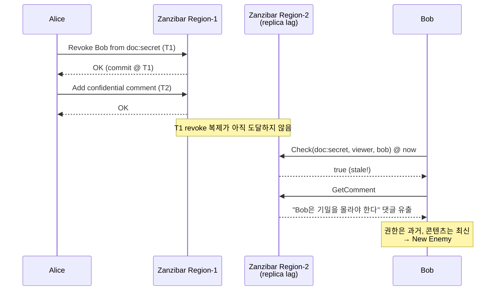
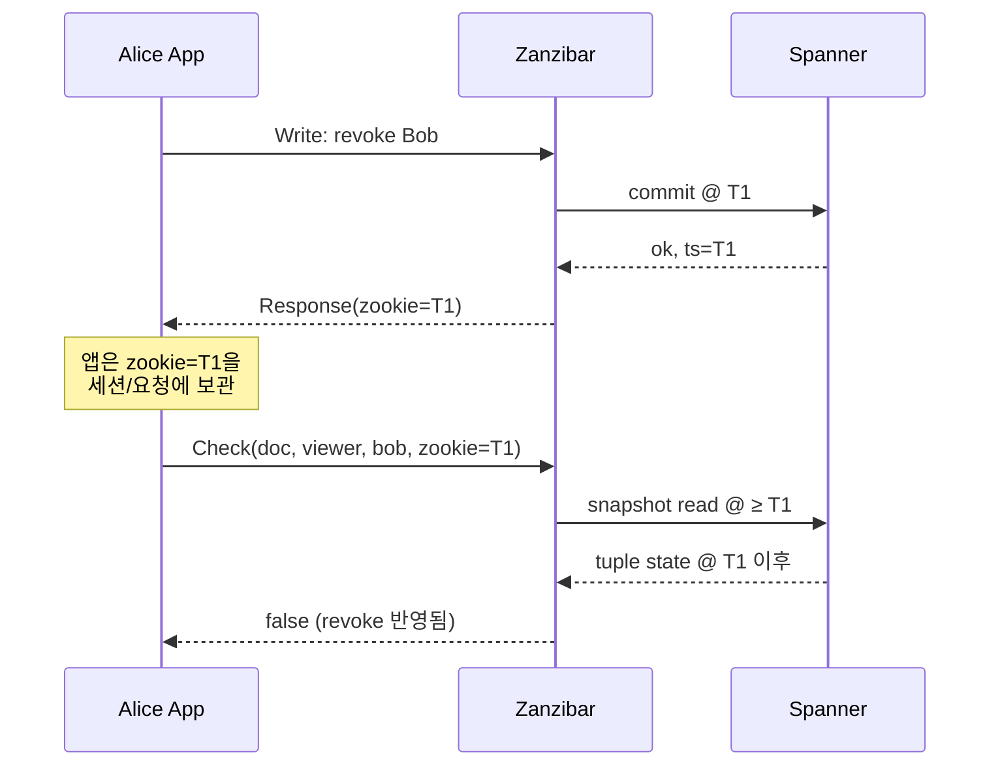

# CH5. Consistency와 Zookie

::: info 학습 목표
- 권한 시스템에서만 유독 치명적으로 드러나는 "New Enemy" 문제가 무엇인지 설명한다.
- Spanner의 external consistency(TrueTime)가 Zanzibar에 어떤 보장을 주는지 이해한다.
- Zookie가 어떤 정보를 담는 불투명 토큰이며, 쓰기와 읽기를 어떻게 인과관계로 묶는지 본다.
- Fully consistent / at-least-as-fresh / bounded staleness 세 가지 consistency 수준을 구분한다.
- SpiceDB의 ZedToken이 Zookie의 이름만 바꾼 동일 메커니즘임을 확인한다.
:::

## 1. New Enemy — 분산 권한 시스템의 고유한 악몽

분산 데이터베이스에서 "약간 오래된 데이터를 읽어도 괜찮다"는 건 흔한 타협이다. 타임라인에 댓글이 1초 늦게 보이는 건 아무도 신경 쓰지 않는다. 하지만 권한에서는 그 1초가 사고가 된다.

시나리오를 보자.

1. **시점 T1**: Alice가 `doc:secret`의 공유 목록에서 Bob을 제거한다. tuple `(doc:secret, viewer, user:bob)`이 삭제된다.
2. **시점 T2 (T1 직후)**: Alice가 문서에 **Bob을 험담하는** 새 댓글을 작성한다. "Bob은 이 기밀을 몰라야 한다"는 전제 위의 행동이다.
3. **시점 T3 (T2 직후)**: Bob이 다른 리전의 replica를 통해 문서를 조회한다. 그 replica에는 아직 T1의 revoke가 도달하지 않았다 — replication lag.
4. Bob은 여전히 viewer로 평가되고, **새로 작성된 험담 댓글까지** 읽는다.

Bob이 읽은 것은 "Bob이 권한을 가진 과거의 스냅샷"이 아니라, **"권한은 과거 스냅샷, 콘텐츠는 최신"** 이라는 **일관성이 깨진 조합**이다. 권한 엔진과 데이터 저장소가 서로 다른 시점을 바라볼 때 생기는 고전적 anomaly — Zanzibar 논문이 이것을 <strong>New Enemy Problem</strong>이라고 부른다.

이 버그는 "eventually consistent로 충분한가?" 라는 질문의 답을 바꾼다. 권한 시스템에 대해서는 **아니다**.

## 2. 요구사항 — 인과관계를 보장해야 한다

Zanzibar가 내건 조건을 논문 표현 그대로 옮기면 이렇다.

> "권한을 revoke한 이후의 어떤 시점에서 수행되는 권한 검사든, 반드시 그 revoke를 반영해야 한다."

"반드시 최신 데이터로 읽어야 한다"가 아니다. "revoke보다 **나중에** 일어난 읽기라면 revoke 이후의 상태여야 한다"는 인과관계(causality) 보장이다. 이것이 과하지 않은 최소 요구다. 일반 읽기는 여전히 약간 stale해도 된다 — latency가 중요하니까. 다만 **쓰기와 그에 이어지는 읽기 사이의 시간 순서**만은 깨지지 않아야 한다.

## 3. Spanner의 External Consistency

Zanzibar는 왜 하필 Spanner 위에 지어졌는가? 바로 이 인과관계 보장을 구현하기 위해서다.

Spanner는 TrueTime이라는 글로벌 시계 API로 **external consistency**를 제공한다. 쉽게 말해, 어떤 트랜잭션이 "commit timestamp T"로 기록되면 "T 이후의 현실 세계 시간에 시작된 모든 트랜잭션은 T 이후의 timestamp를 받는다"는 보장이다. 즉, commit timestamp가 **전역 순서**로 기능한다.

이 보장이 있으면 "revoke의 commit timestamp는 T1, 이후 임의의 읽기의 timestamp T'가 T1보다 크다면 그 읽기는 revoke를 반드시 본다"고 단언할 수 있다. Zookie가 곧 이 T1을 들고 다니는 운반체다.

## 4. Zookie — 쓰기와 읽기를 묶는 부적

Zookie는 Zanzibar가 클라이언트에게 발급하는 **불투명(opaque) consistency token**이다. 내부적으로는 최소한 하나의 timestamp를 담고 있다.

동작은 두 단계다.

1. **쓰기 연산**이 끝나면 Zanzibar는 commit timestamp를 담은 zookie를 응답에 포함시킨다.
2. 클라이언트는 이후의 **읽기(Check/Read/Expand)** 요청에 그 zookie를 붙인다. Zanzibar는 "zookie의 timestamp 이상인 스냅샷"으로 평가를 수행한다.

기본 Check는 최신 스냅샷을 기다리지 않는다. 수 초 이내로 살짝 stale한 snapshot을 읽어 latency를 낮춘다. 그러나 **zookie가 붙은 순간** 그 timestamp 이상의 스냅샷으로 끌어올린다. 따라서 쓰기의 인과 효과는 절대 잃지 않는다.

::: info zookie는 왜 opaque인가
클라이언트는 zookie 내부 구조를 알 필요가 없고, 알아서도 안 된다. Zanzibar 구현이 훗날 timestamp 외 정보를 추가할 수 있도록 바이트 배열로 통일했다. 덕분에 호환성을 깨지 않고 내부 표현을 진화시킬 수 있다.
:::

## 5. Consistency 수준 세 가지

Zanzibar의 읽기 API는 세 가지 consistency 모드를 제공한다.

- **Fully consistent**: 항상 최신. 모든 읽기가 외부 일관 — 가장 안전하지만 latency/비용 최대. 실전에서는 거의 안 쓴다.
- **At-least-as-fresh** (zookie 기반, **권장**): "내가 본 마지막 쓰기 이후"의 상태. 인과관계만 지키고 나머지는 최적화.
- **Bounded staleness**: "최근 N초 이내의 아무 스냅샷". zookie 없이 가장 빠르다. 관리 대시보드처럼 **절대 직전의 내 쓰기를 되읽을 필요가 없는** 조회에만.

실무 규칙은 간단하다.

::: tip 실전 규칙
- **내가 방금 쓴 tuple에 의존하는 Check** → 반드시 zookie(at-least-as-fresh)로.
- **세션/요청 로그 조회 같은 파생 조회** → bounded staleness로 latency 이득.
- **감사/규제 목적의 정확한 스냅샷** → fully consistent.
:::

SpiceDB는 같은 메커니즘을 **ZedToken**이라 부른다. 이름만 다를 뿐 의미는 같다 — zookie든 zedtoken이든 "이 시점 이후의 상태를 보여다오"라는 부적이다.

## 6. 실전 사용 패턴

애플리케이션이 zookie를 어떻게 다뤄야 하는지는 꽤 중요하다. 대략 세 가지 흐름이 있다.

1. **쓰기 직후 Check**: API 계층에서 쓰기 응답의 zookie를 꺼내, 같은 요청 처리 안의 후속 Check에 전달한다. 가장 흔한 패턴.
2. **사용자 세션 단위**: 사용자 로그인부터 로그아웃까지 "이 사용자가 본 최신 zookie"를 세션에 저장. 다음 페이지로 이동해도 revoke가 반영된다.
3. **요청 체인 단위**: 마이크로서비스 호출 체인을 통해 zookie를 헤더(`consistency-token`)로 전파. 어느 서비스가 Check를 하든 같은 시점 이상으로 평가된다.

핵심은 **"사용자 액션의 경계"** 에 맞춰 zookie를 주고받는 것이다. 아무 읽기에나 zookie를 꽂으면 전부 fully consistent처럼 되어 latency가 악화된다.

## 7. Content Versioning과 권한 스냅샷

논문은 `content_change_logs`라는 개념도 소개한다. 문서 같은 리소스의 버전마다 **그 시점의 권한 스냅샷**을 기록해, 과거 버전을 읽을 때 "그 버전이 만들어졌을 당시의 권한"으로 평가하는 장치다.

예를 들어 문서의 revision 42가 작성된 시각이 T_42라면, 그 revision을 읽는 요청은 zookie=T_42 로 Check를 돈다. 지금 내가 그 문서의 viewer에서 빠졌더라도 **그때는 viewer였으니 revision 42까지는 볼 수 있다**는 식의 정책을 구현할 수 있다. 역으로, 그때 viewer가 아니었다면 지금 viewer라도 revision 42는 못 본다.

이 스터디 수준에서는 "zookie가 과거의 권한 스냅샷을 지정할 수 있다"는 사실만 알아두면 된다. 상세한 스키마는 논문 본문에서 확인한다.

## 핵심 정리

::: tip 핵심 정리
- 권한 시스템에서는 eventually consistent만으로 부족하다. **New Enemy** 문제가 보안 사고로 드러난다.
- 최소 요구는 "전체 최신"이 아니라 **"인과관계 보장"** 이다. revoke 이후의 읽기는 revoke를 반드시 본다.
- Zanzibar는 Spanner의 **external consistency(TrueTime)** 로 commit timestamp를 전역 순서로 삼는다.
- **Zookie는 쓰기와 읽기 사이의 인과관계를 기록하는 부적이다.** 쓰기 응답에서 발급, 읽기 요청에 전달.
- Consistency 수준은 fully consistent / at-least-as-fresh(zookie) / bounded staleness 세 가지. 실전은 at-least-as-fresh가 기본.
- SpiceDB의 **ZedToken**은 zookie와 같은 개념이다.
- 애플리케이션은 **사용자 액션의 흐름** 단위로 zookie를 보관/전파해야 한다.
:::

## 다음 챕터

[CH6. Check/Expand 평가 알고리즘](/study/zanzibar/06-check-expand) — rewrite 트리(CH4)와 consistency 기반(CH5)이 준비됐다. 이제 Zanzibar가 어떻게 실제로 "Alice는 doc:42의 viewer인가?" 질문을 분산 환경에서 재귀 평가하는지 본다.
