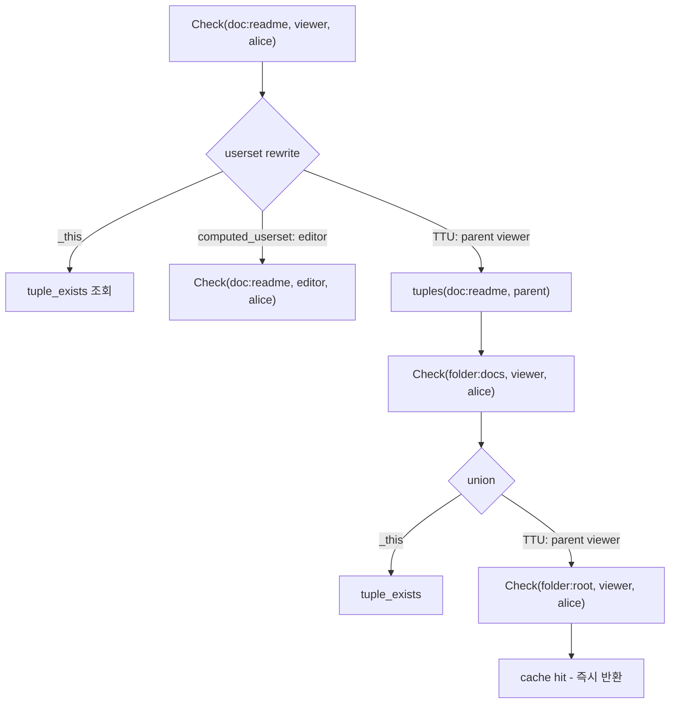
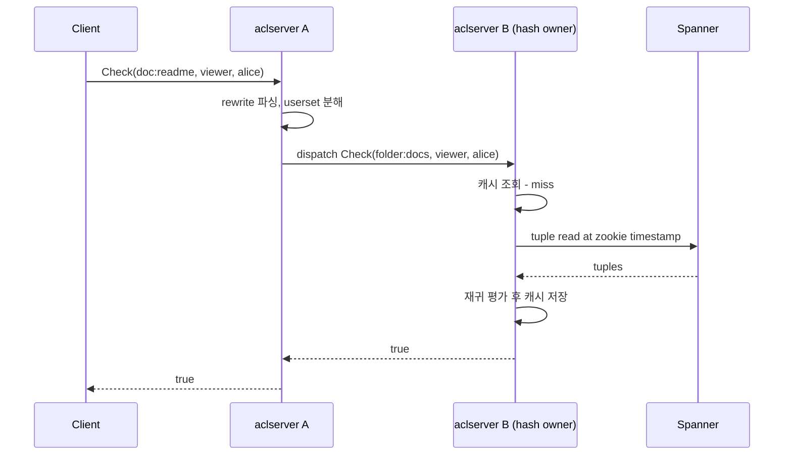

# CH6. Check/Expand 평가 알고리즘

## 학습 목표

- Check API가 어떤 질문에 답하는지, 왜 권한 시스템의 핵심 호출인지 이해한다.
- userset rewrite 규칙이 포함된 relation을 재귀적으로 평가하는 의사 알고리즘을 구조로 잡는다.
- pointer chasing과 분산 dispatch가 어떻게 hotspot을 피하고 캐시를 재사용하는지 그림으로 떠올린다.
- Expand API가 Check와 어떻게 다른지, 어떤 UI 시나리오에서 쓰이는지 구분한다.
- 논문이 보고한 p50 3ms / p95 10ms 수치가 어떤 최적화의 결과인지 설명한다.

## Check API의 의미

Check는 Zanzibar에서 가장 많이 호출되는 API이다. 입력은 `(object, relation, user)` 세 값이고 출력은 boolean 하나다. 예를 들면 다음과 같다.

```
Check(object = "doc:readme", relation = "viewer", user = "user:alice") -> true/false
```

이 호출이 뜻하는 것은 "Alice는 doc:readme에 대한 viewer인가?"라는 질문이다. 문서를 열 때, API를 호출할 때, 검색 결과를 필터링할 때, 실질적으로 모든 권한 판단은 이 질문으로 환원된다. 그래서 Zanzibar의 성능 엔지니어링은 사실상 Check를 얼마나 빠르고 정확하게 평가하느냐에 집중된다.

Check 한 번이 항상 DB를 한 번 읽는 것은 아니다. relation이 rewrite를 갖고 있으면, 실제로는 다른 relation을 또 묻게 되고, 그 relation이 또 다른 relation을 참조하는 연쇄가 발생한다.

## 재귀 평가의 필요성

CH4에서 정리한 것처럼 relation의 `userset_rewrite`는 `_this`, `computed_userset`, `tuple_to_userset` 같은 연산을 union/intersection/exclusion으로 결합한다. 이 중 computed_userset과 tuple_to_userset(TTU)은 다른 userset을 참조하는 포인터이기 때문에, Check 하나를 풀기 위해서는 규칙 트리를 따라 내려가며 여러 번의 하위 Check를 수행해야 한다.

예를 들어 아래 relation 정의를 보자.

```
relation viewer:
  union:
    - _this
    - computed_userset: editor
    - tuple_to_userset:
        tupleset: parent
        computed_userset: viewer
```

`Check(doc:readme, viewer, alice)`는 세 가지 경로 중 하나라도 true면 true가 된다. 각각이 내부적으로 또 하위 Check를 유발한다.

1. `_this` - `doc:readme#viewer@user:alice` tuple이 직접 존재하는지 조회
2. `computed_userset: editor` - `Check(doc:readme, editor, alice)` 재귀 호출
3. `tuple_to_userset{parent, viewer}` - `doc:readme#parent@folder:X`를 읽고 각 X에 대해 `Check(folder:X, viewer, alice)` 재귀 호출

이 재귀 구조는 단순 조인이 아닌 트리 탐색이기 때문에, "userset tree 재귀 평가"라고 부른다.

## 의사 알고리즘

아래 의사코드가 Zanzibar Check의 본질이다. 실제 구현은 캐시, 배치, 짧은 회로 평가 같은 최적화가 얹히지만, 뼈대는 그대로다.

```
check(object, relation, user):
  config = namespace_config(object.namespace)
  rewrite = config.relation(relation).userset_rewrite
  return evaluate(rewrite, object, user)

evaluate(_this, object, user):
  return tuple_exists(object, relation, user)

evaluate(computed_userset{rel}, object, user):
  return check(object, rel, user)

evaluate(tuple_to_userset{tupleset, ttu}, object, user):
  for each tuple in tuples(object, tupleset.relation):
    if check(tuple.userset.object, ttu.relation, user):
      return true
  return false

evaluate(union{children}, object, user):
  return any(evaluate(c, object, user) for c in children)

evaluate(intersection{children}, object, user):
  return all(evaluate(c, object, user) for c in children)

evaluate(exclusion{base, sub}, object, user):
  return evaluate(base, object, user) && !evaluate(sub, object, user)
```

짚을 포인트가 몇 가지 있다.

- `_this`는 leaf 노드이며 Spanner(또는 Leopard 인덱스)에서 tuple 존재 여부를 직접 확인한다.
- `computed_userset`은 같은 object에서 다른 relation으로 재귀한다. 즉 object가 바뀌지 않는다.
- `tuple_to_userset`은 object를 바꾸면서(보통 parent로) 재귀한다. 실제 pointer chasing이 일어나는 곳이다.
- union/intersection/exclusion은 단락 평가(short-circuit)가 가능하다. union에서 하나가 true면 나머지는 평가하지 않는다.

## Pointer chasing

TTU가 있는 관계에서는 object가 계속 바뀌며 체인이 길어진다. 전형적인 그림은 이렇다.

```
doc:readme --parent--> folder:docs --parent--> folder:root
                                                  |
                                                  +--viewer--> user:alice
```

`Check(doc:readme, viewer, alice)`는 doc의 부모 folder로 넘어가고, 또 그 부모 folder로 넘어가며 각 단계에서 viewer 검사를 해본다. 이것이 pointer chasing이다. 단일 서버가 이 전체 체인을 처리하면 두 가지 문제가 생긴다.

- 체인의 어느 단계에서 hotspot(예: 루트 폴더)이 생기면, 그 object를 맡은 서버에 부하가 집중된다.
- 캐시 재사용이 어렵다. 같은 `(folder:root, viewer, alice)` 질의가 여러 문서의 Check에서 등장하는데, 서버마다 독립적으로 계산하면 낭비가 크다.

그래서 Zanzibar는 이 재귀를 분산 dispatch로 처리한다.

## 분산 dispatch

Zanzibar의 aclserver(논문에서는 그냥 Zanzibar server라고 부르는 노드)들은 consistent hashing을 통해 `(object, relation)` 키를 특정 노드로 라우팅한다. Check 재귀 중 하위 Check가 필요하면, 그 하위 Check는 현재 노드가 직접 수행하지 않고 hash가 가리키는 노드로 dispatch 된다.

이 구조의 핵심 이점은 세 가지다.

- **부하 분산** - 하나의 깊은 체인이 여러 노드로 쪼개져 실행된다.
- **캐시 localization** - 같은 `(object, relation)`에 대한 Check는 항상 같은 노드로 가서, 그 노드의 인메모리 캐시가 재사용된다.
- **병렬성** - union 하위 Check들은 서로 다른 노드에서 동시에 실행될 수 있다.

::: info dispatch는 RPC로 구현된다
aclserver 간 dispatch는 gRPC 호출이다. 즉 한 Check가 내부적으로 여러 RPC 홉을 만들어낼 수 있다. 그런데도 p95 10ms를 유지하는 이유는 (1) Spanner local replica read, (2) 노드별 캐시 hit rate가 높음, (3) hedging으로 tail latency 컷이기 때문이다.
:::



## Hedging

tail latency를 줄이기 위해 Zanzibar는 hedged request를 쓴다. 한 dispatch가 일정 시간 안에 응답하지 않으면 같은 요청을 다른 replica 또는 다른 노드에 복제로 보내고, 먼저 돌아온 응답을 채택한다. p99 스파이크를 완화하는 일반적 기법으로, Jeff Dean의 "The Tail at Scale" 논문에서 제안한 기법을 그대로 적용했다.

::: tip Hedging의 비용
hedging은 요청 수를 일시적으로 늘리기 때문에 비용이 든다. Zanzibar는 "적정 확률로만" hedge를 발사한다 - 보통 p95 지연을 초과했을 때에만 복제를 띄운다. 전체 요청의 일부만 중복 실행되므로 CPU 오버헤드가 크지 않다.
:::

## Expand API

Expand는 Check와 형제 관계이지만 목적이 다르다. Check는 boolean 하나를 반환하는 반면, Expand는 "이 relation의 멤버 userset 트리"를 반환한다.

```
Expand(doc:readme, viewer)
  -> userset tree:
       union
       ├── _this: [user:alice, user:bob]
       ├── computed_userset(editor)
       │     └── _this: [user:carol]
       └── tuple_to_userset(parent -> viewer)
             └── folder:docs
                   └── (folder:docs#viewer 서브트리)
```

Expand가 필요한 상황은 UI 쪽이다. "이 문서를 볼 수 있는 사람 목록을 보여줘"라는 화면은 개별 user에 대해 Check를 N번 호출하는 대신 Expand로 트리를 한 번 받아와 렌더링한다. 공유 대화상자, 접근 감사 화면, 권한 디버거 등이 대표적이다.

Expand는 트리를 펴지 않는다. computed_userset과 TTU가 **가지**로 보존된다. 클라이언트가 필요에 따라 더 파고들거나 멈출 수 있도록 Zanzibar는 고의적으로 중간 단계에서 평가를 끊어 반환한다. 이렇게 해야 대규모 그룹에서도 응답이 터지지 않는다.

::: info 실제 API 호출은 SpiceDB 스터디에서
Zanzibar 스터디는 개념과 알고리즘에 집중한다. gRPC 엔드포인트, 요청/응답 페이로드 형식, 클라이언트 라이브러리 사용은 SpiceDB 스터디에서 다룬다. 자세한 API 구조가 궁금하다면 [SpiceDB CH4. API 전체](/study/spicedb/04-api)로 넘어가면 된다.
:::

## 성능 수치

논문이 보고한 Zanzibar Check의 latency는 p50 3ms, p95 10ms다. 이 수치가 나오는 이유는 단일 기법이 아니라 여러 겹의 최적화가 결합된 결과다.

- **분산 dispatch + consistent hashing** - 같은 질의가 같은 노드로 가 캐시가 재사용된다.
- **인메모리 캐시** - aclserver는 `(object, relation, user)` 결과와 중간 userset을 메모리에 캐싱한다. 캐시 hit rate가 매우 높다.
- **Spanner local replica read** - 지리적으로 가까운 replica에서 읽어 네트워크 홉을 줄인다. zookie로 snapshot timestamp를 고정해 stale read도 안전하게 허용한다.
- **Leopard 인덱스** - 간접 멤버십이 깊은 그룹 체인은 별도 인덱스에서 O(1)에 가까운 조회로 해결한다. CH7에서 자세히 본다.
- **Hedging** - p99 tail을 의도적으로 깎는다.
- **Short-circuit 평가** - union에서 하나가 true면 나머지를 평가하지 않는다.



위 sequenceDiagram이 말하는 것은 단순하다. Check 한 번이 **내부적으로 여러 RPC 홉**을 만들지만, 각 홉은 캐시와 local read로 매우 빠르게 끝난다. 클라이언트에서 보면 여전히 수 ms 내 boolean 하나가 돌아오는 API다.

## 핵심 정리

::: tip 핵심 정리
- Check는 `(object, relation, user)`에 대해 boolean을 반환하는 Zanzibar의 가장 핵심적인 API이다.
- relation에 userset rewrite가 있으면 Check는 단순 DB 조회가 아닌 userset tree의 재귀 평가가 된다.
- `_this`는 leaf 조회, `computed_userset`은 같은 object에서 다른 relation으로, `tuple_to_userset`은 object를 바꾸며 pointer chasing한다.
- 재귀는 consistent hashing 기반 dispatch로 여러 aclserver에 분산된다. 같은 `(object, relation)`은 같은 노드로 가서 캐시가 재사용된다.
- Expand는 Check와 달리 userset 트리를 반환하며, UI에서 멤버 목록을 그릴 때 쓴다.
- p50 3ms / p95 10ms는 분산 dispatch + 캐시 + Spanner local read + Leopard + hedging이 결합된 결과다.
:::

## 다음 챕터

권한 변경을 어떻게 스트리밍으로 외부에 알리고, 깊은 그룹 체인을 어떻게 precompute해 빠르게 답하는지는 다음 챕터에서 다룬다.

- [CH7. Watch와 Leopard 인덱스](/study/zanzibar/07-watch-leopard)
