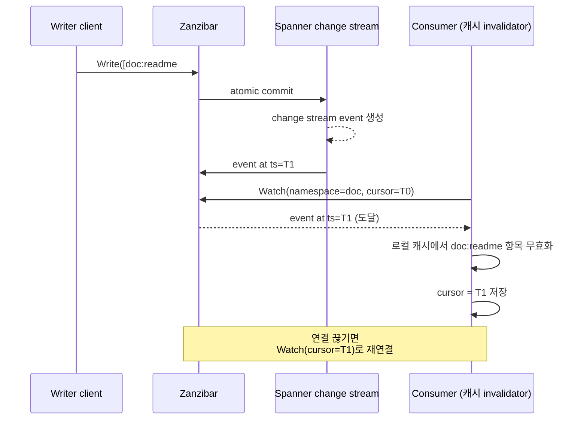
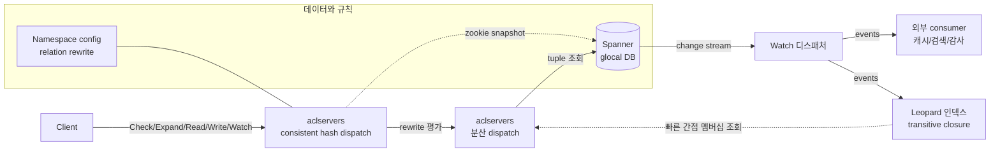

# CH7. Watch와 Leopard 인덱스

## 학습 목표

- Watch API가 어떤 이벤트를 어떻게 스트리밍하는지, 재연결 시 cursor 관리가 어떻게 되는지 이해한다.
- Watch 스트림이 외부 검색 인덱스와 애플리케이션 캐시 무효화에 어떻게 쓰이는지 그림을 잡는다.
- Leopard 인덱스가 풀려는 문제("간접 멤버십을 빠르게 답하기")와 precompute transitive closure의 아이디어를 이해한다.
- Watch가 Zanzibar 내부(Leopard)와 외부(애플리케이션) 모두의 통합 주춧돌이라는 점을 정리한다.
- 지금까지 배운 모든 구성 요소(tuple, namespace config, check/dispatch, zookie, watch, leopard, spanner)가 하나의 시스템으로 어떻게 결합되는지 한눈에 그린다.

## Watch API 개요

Watch는 tuple 변경 이벤트를 순서 보장된 스트림으로 구독하는 API다. namespace 단위로, 또는 전체에 대해 열어둘 수 있고, 클라이언트는 각 이벤트를 소비하면서 자신의 상태를 갱신한다.

전형적인 사용처는 셋이다.

- **외부 검색 인덱스 권한 sync** - Elasticsearch 같은 검색 시스템에 문서 접근 권한 필터를 태워두는 경우, 권한이 바뀔 때마다 인덱스를 갱신해야 한다. Watch로 변경 이벤트를 받아 필드만 재계산한다.
- **애플리케이션 권한 캐시 무효화** - 프론트엔드 앞단의 권한 캐시(예: Redis)에 "alice는 doc:readme에 viewer" 같은 항목을 저장해 두었다면, tuple이 삭제될 때 캐시를 지워야 한다. Watch가 invalidation 신호를 제공한다.
- **이벤트 기반 워크플로우** - 권한 부여 시 알림 전송, 감사 로그 적재, 워크플로우 트리거. "이벤트 소싱"처럼 Zanzibar를 이벤트 소스로 쓴다.

## Watch 스트림의 특성

Watch 스트림은 atomic commit 단위로 이벤트를 전달한다. 하나의 Write 호출이 여러 tuple을 원자적으로 바꿨다면, 그 전부가 하나의 이벤트 묶음으로 묶여 나온다. 이 원자성 덕분에 소비자는 "반만 반영된 중간 상태"를 절대 보지 않는다.

각 이벤트에는 Spanner commit timestamp가 붙어 있다. 클라이언트가 연결을 끊었다가 다시 붙을 때는 마지막으로 처리한 timestamp를 cursor로 넘기면, Zanzibar는 그 시점 이후의 이벤트부터 순서대로 재전송한다. 즉 gap 없이 이어 받을 수 있다.

::: info Watch의 신뢰성
Watch는 "at-least-once"다. 연결 끊김/재시도 상황에서 같은 이벤트가 중복 전달될 수 있다. 소비자는 cursor(timestamp)를 기준으로 idempotent하게 처리해야 한다. 즉 이미 본 timestamp의 이벤트는 버리거나 멱등 연산으로 반영해야 한다.
:::

## 구현

내부적으로 Watch는 Spanner의 change stream 기반이다. Spanner는 테이블 단위로 변경 사항을 스트리밍으로 내보낼 수 있는데, Zanzibar가 이를 구독해 클라이언트가 요청한 namespace 필터에 맞게 라우팅한다.

클라이언트가 관리해야 하는 상태는 cursor 하나뿐이다. 보통은 마지막으로 성공적으로 처리한 이벤트의 timestamp를 자신의 DB에 함께 저장해 두고, 프로세스가 죽었다 살아나면 그 timestamp부터 Watch를 다시 연다.



## Leopard 인덱스가 풀려는 문제

Zanzibar의 기본 구조만으로는 해결이 어려운 한 가지 시나리오가 있다. **간접 멤버십이 깊을 때의 Check**다.

예를 들어 다음 구조를 보자.

```
group:company#member@group:eng
group:eng#member@group:backend
group:backend#member@group:platform
group:platform#member@user:alice
```

이 상태에서 `Check(group:company, member, alice)`를 물으면, 단일 tuple lookup은 O(1)이지만 실제로는 네 단계의 TTU pointer chasing이 필요하다. 각 단계가 dispatch RPC를 만들면 4 홉이 된다. 그룹이 수백 개 중첩된 조직에서는 더 나빠진다.

더 큰 문제는 Expand다. "이 그룹의 모든 멤버를 전개해라"가 깊은 그룹 트리를 만나면 수천 번의 하위 Check가 발생하고, 응답 latency도 응답 크기도 감당이 어려워진다.

## Leopard의 아이디어

Leopard는 "group 체인을 미리 플랫하게 만들어 저장하자"는 인덱스 시스템이다. 위 예시에서 Leopard는 다음 쌍들을 precompute해 저장한다.

```
(group:company, user:alice)
(group:company, group:eng)
(group:company, group:backend)
(group:company, group:platform)
(group:eng, user:alice)
(group:eng, group:backend)
...
```

즉 transitive closure를 flat table로 펼쳐둔다. 이러면 `Check(group:company, member, alice)`는 한 번의 인덱스 조회로 끝난다. pointer chasing 없이 "해당 쌍이 존재하는가"만 보면 된다.

당연히 공간이 늘어난다. N 개 그룹과 M 개 멤버십이 있을 때, 최악의 경우 closure 크기는 N * M까지 커질 수 있다. 그래서 Leopard는 모든 관계가 아니라 **그룹 멤버십처럼 넓게 퍼지고 자주 조회되는 특정 패턴**에 대해서만 인덱스를 만든다.

## 인덱스 빌드 방식

Leopard는 두 가지 갱신 경로를 함께 쓴다.

- **Offline 전체 빌드** - 주기적으로 Spanner에서 tuple 전체를 읽어 closure를 재계산한다. MapReduce 스타일의 배치 작업이다. 이 과정은 느리지만 정확하다.
- **Incremental update** - 실시간으로는 Watch 이벤트를 소비해 인덱스를 업데이트한다. tuple이 추가되면 영향받는 closure를 확장하고, 삭제되면 역으로 좁힌다.

두 경로를 결합하기 때문에 Leopard 인덱스의 freshness는 millisecond에서 second 단위의 eventual consistency다. Check 경로에서 Leopard를 쓸 때는 zookie로 "이 시점 이후의 인덱스여야 한다"를 명시해, 인덱스가 따라잡지 못했으면 fallback으로 원래의 재귀 평가로 떨어진다.

::: warning Leopard는 선택적 최적화
Leopard는 모든 Check에 관여하지 않는다. 얕은 관계는 원래의 dispatch 평가가 충분히 빠르고, 깊은 group membership 같은 특정 패턴에서만 Leopard가 답한다. 언제 쓸지는 namespace config와 쿼리 패턴에 따라 결정된다.
:::

## Watch와 Leopard의 관계

Leopard는 Watch 이벤트의 **대표적인 소비자**다. Watch가 외부 통합용이라고만 생각하면 반만 맞는 얘기다. Zanzibar 내부의 Leopard 인덱스가 Watch를 소비해서 자기 자신을 최신 상태로 유지한다. 즉 Watch는 Zanzibar의 외부 API인 동시에, 내부 서브시스템 간 통합 버스이기도 하다.

이 구조가 의미하는 바는 단순하다. 새로운 Zanzibar 확장 기능(예: 실시간 감사 파이프라인, 추가 인덱스 시스템)을 붙이고 싶다면, 항상 Watch에서 출발하면 된다. Write path를 건드리지 않고 독립적으로 파생 데이터를 만들 수 있다.

## 외부 통합 예

Watch가 실전에서 어떻게 쓰이는지 짧게 정리한다.

- **권한 캐시 invalidate** - 애플리케이션 서버가 자체 권한 캐시를 가지고 있고, 매 요청마다 Zanzibar를 호출하지 않는다. 대신 Watch로 관련 tuple 변경을 구독해 캐시를 선별적으로 무효화한다. 일반 요청의 latency를 줄이면서도 stale 권한은 막는다.
- **감사 로그** - "누가 누구에게 무슨 권한을 언제 주었나"를 BigQuery 같은 분석 스토리지에 적재. 보안 감사, 규정 준수 대응.
- **검색 결과 필터** - 검색 엔진이 문서별로 `viewers: [...]` 필드를 갖고 있어야 접근 제어가 가능한데, 이 필드를 Watch 이벤트로 계속 갱신한다.

## Zanzibar의 모든 구성 요소 결합

여기까지 온 것을 하나의 그림으로 묶어 보자.



이 다이어그램이 말하는 것은 Zanzibar를 구성하는 다섯 축이다.

1. **데이터(tuple)** - Spanner에 저장된 `object#relation@user` 튜플. CH3에서 다룬 데이터 모델.
2. **규칙(namespace config + rewrite)** - 어떤 relation이 어떻게 파생되는지 정의. CH4.
3. **빠른 질의(Check/Expand + 분산 dispatch)** - userset tree 재귀 평가를 여러 노드에 쪼개어 캐시와 함께 수행. CH6.
4. **최신성(zookie)** - 인과적 일관성을 보장하는 Spanner TrueTime 기반 토큰. CH5.
5. **변경성(Watch + Leopard)** - 변경 이벤트 스트리밍과 간접 멤버십 precompute. 이 챕터.

이 다섯이 돌아갈 때 비로소 "수천억 tuple을 전 세계에서 p95 10ms에 Check"라는 논문의 수치가 가능해진다.

## 다음 단계

지금까지 다룬 개념들이 **실제 오픈소스 구현**에서 어떻게 드러나는지 궁금해지는 지점이다. SpiceDB는 Zanzibar를 기반으로 설계된 오픈소스 permission database이고, 이 스터디의 다음 시리즈에서 다룬다. Zanzibar의 namespace config는 Schema 언어로, Check/Expand는 gRPC API로, zookie는 ZedToken으로, Watch는 Watch API로 각각 구현되어 있다.

- [SpiceDB 스터디 목차](/study/spicedb/)에서 CH1부터 이어 가자.

## 핵심 정리

::: tip 핵심 정리
- Watch는 tuple 변경을 순서 보장된 스트림으로 내보내는 API이며, atomic commit 단위로 이벤트가 묶여 전달된다.
- 클라이언트는 Spanner commit timestamp를 cursor로 관리해 연결이 끊겨도 gap 없이 이어 받을 수 있다. 신뢰성은 at-least-once이므로 소비자는 idempotent하게 처리해야 한다.
- Leopard는 간접 멤버십을 precompute한 transitive closure 인덱스다. 깊은 그룹 체인의 Check를 한 번의 조회로 바꾼다.
- Leopard는 Watch 이벤트를 소비해 incremental update된다. 즉 Watch는 외부 통합 API인 동시에 Zanzibar 내부 통합 버스다.
- Zanzibar 전체 = 데이터(tuple) + 규칙(rewrite) + 빠른 질의(check/dispatch) + 최신성(zookie) + 변경성(watch+leopard) + 저장(Spanner).
- 다음 단계는 Zanzibar의 오픈소스 구현인 SpiceDB를 통해 이 개념들이 Schema / gRPC API / 배포에서 어떻게 드러나는지 확인하는 것이다.
:::

## 다음 챕터

Zanzibar 스터디는 여기서 마무리된다. 실제 구현을 살펴보며 같은 개념을 다른 각도로 다시 만나보자.

- [SpiceDB CH1. SpiceDB 소개](/study/spicedb/01-intro)
