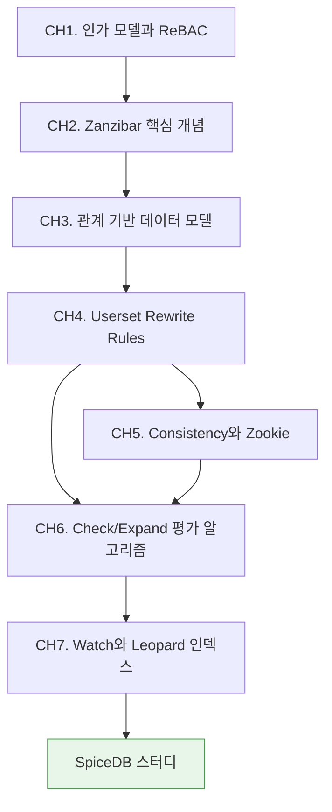

# Zanzibar 이해하기

구글의 Zanzibar는 YouTube·Drive·Photos·Cloud 등 수많은 서비스의 권한 검사를 초당 수천만 건 단위로 처리하는 글로벌 인가 시스템이다. 2019년 발표된 논문 *"Zanzibar: Google's Consistent, Global Authorization System"*은 관계 기반 접근 제어(ReBAC) 모델의 사실상 표준이 됐다. SpiceDB·OpenFGA 같은 오픈소스 구현은 모두 이 논문을 재료로 삼는다.

이 스터디는 Zanzibar 논문을 읽어내는 데 목적이 있다. **개념과 알고리즘**에 집중하고, 실제 API 호출이나 배포는 후속 스터디인 [SpiceDB](/study/spicedb/)에서 다룬다.

::: info 선행 지식
- [OAuth 스터디 CH3. 인증과 인가](/study/oauth/03-authn-vs-authz)에서 인증(AuthN)과 인가(AuthZ)의 구분을 선행한다.
- [Keycloak 스터디 CH8. Authorization Services와 UMA](/study/keycloak/08-authz-uma)가 대조군이다. Keycloak은 정책 엔진 기반, Zanzibar는 관계 그래프 기반.
:::

## 학습 로드맵

## 목차

### Zanzibar 기초
1. [인가 모델과 ReBAC](/study/zanzibar/01-authz-models) — RBAC/ABAC/ReBAC 비교와 SpiceDB/OpenFGA/Cedar 선택 기준
2. [Zanzibar 핵심 개념](/study/zanzibar/02-core-concepts) — 구글이 풀려던 문제, relation tuple, 설계 원칙
3. [관계 기반 데이터 모델](/study/zanzibar/03-data-model) — object, relation, userset

### 아키텍처
4. [Userset Rewrite Rules](/study/zanzibar/04-userset-rewrite) — union/intersection/exclusion, tuple-to-userset
5. [Consistency와 Zookie](/study/zanzibar/05-consistency-zookie) — New Enemy 문제, Spanner snapshot read
6. [Check/Expand 평가 알고리즘](/study/zanzibar/06-check-expand) — 분산 질의 평가, 재귀 pointer chasing
7. [Watch와 Leopard 인덱스](/study/zanzibar/07-watch-leopard) — 변경 감지, 간접 멤버십 가속

## 다음 스터디

Zanzibar의 개념을 실제 오픈소스 구현에 적용하려면 [SpiceDB 스터디](/study/spicedb/)로 이어진다. Schema 언어 작성, API 호출, 배포 토폴로지, 운영 튜닝까지 구현자와 운영자 시각에서 다룬다.

## 관련 자료

::: info 함께 보면 좋은 자료
- [Zanzibar 논문 (USENIX ATC '19)](https://research.google/pubs/pub48190/) — 원문
- [SpiceDB 스터디](/study/spicedb/) — Zanzibar 구현체로 실전 운영까지
- [Keycloak 스터디 CH8. Authorization Services와 UMA](/study/keycloak/08-authz-uma) — 정책 기반 인가와의 대조
- [OAuth 스터디](/study/oauth/) — 인증/인가 기본 개념
:::
